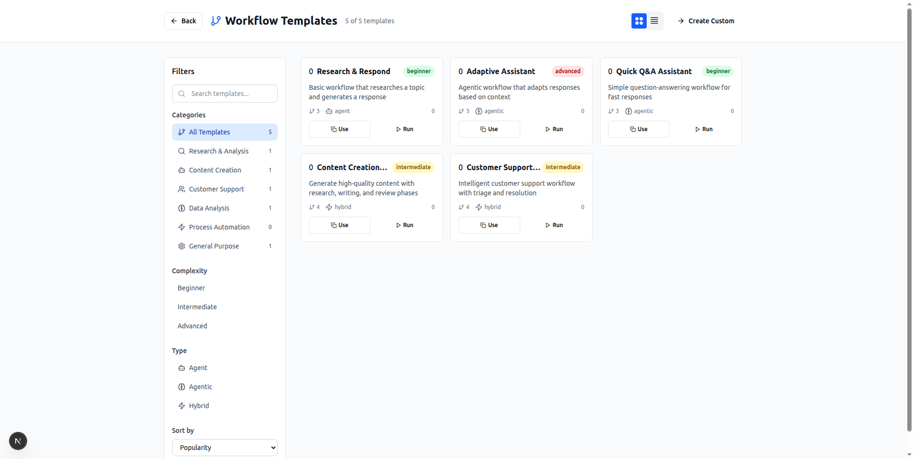

<div align="center">

# 🔥 Crawlplexity

**Enhanced AI-Powered Search Platform with Advanced Agent Orchestration**

A major fork and reconstruction of the original Crawlplexity search engine, now featuring comprehensive agent orchestration, team collaboration, workflow automation, and enterprise-grade management. This enhanced version combines the original's Google search and web scraping foundation with advanced SmallTalk AI agents, collaborative teams, and professional workflow management.


*Clean, intuitive interface with powerful AI search capabilities and advanced agent orchestration*

</div>

---

## ✨ What Makes This Enhanced Crawlplexity Different

This isn't just the original Crawlplexity search tool - it's a major reconstruction featuring a complete AI-powered research and automation platform with advanced agent orchestration:

### 🚀 **Major Enhancements Over Original Crawlplexity**
- **🤖 SmallTalk Agent Integration** - Complete agent orchestration system with 4 specialized AI agents
- **🤝 Team Collaboration** - Pre-built agent teams for complex collaborative workflows  
- **⚡ Workflow Automation** - Visual workflow builder with template gallery
- **⚙️ Enterprise Settings** - Multi-language support and comprehensive configuration
- **🎛️ Advanced Parameter Control** - 32 configurable AI parameters across 8 categories
- **📊 Team Analytics** - Performance monitoring and reporting dashboards

*Built on the solid foundation of the original Crawlplexity's Google search and web scraping capabilities*

### 🔍 **Multi-Modal Search Experience**

<div align="center">


*Smart search with multiple modes: Basic, Deep Research, Agent Orchestration, and Agent Groups*

</div>

- **Basic Search** - Fast, Google-powered results with AI summarization
- **Deep Research** - Comprehensive analysis with multi-source synthesis  
- **Agent Orchestration** - SmallTalk AI agents that intelligently route queries
- **Agent Groups** - Collaborative AI teams for complex tasks

### 🤖 **Advanced Agent Management**

<div align="center">


*Comprehensive agent management with 4 specialized AI agents ready to work*

</div>

This enhanced Crawlplexity comes with a built-in SmallTalk agent ecosystem:

- **Research Assistant** - Specialized for thorough analysis and data gathering
- **Coding Assistant** - Expert programming support and debugging
- **Conversation Manager** - Orchestrates multi-agent interactions
- **Custom Agents** - Create your own specialized AI assistants

### 🤝 **Team Collaboration System**

<div align="center">


*Pre-built agent teams with 4 specialized teams and 9 total agents working together*

</div>

Ready-to-use collaborative agent teams:

- **Analysis Team** - Data analysis and insights generation (1 agent)
- **Development Team** - Software development and coding assistance (2 agents)
- **Full Stack Team** - Complete agent ensemble for complex tasks (4 agents)
- **Research Team** - Specialized team for research tasks (2 agents)
- **Sequential Execution** - Teams coordinate agents in intelligent workflows
- **Team Analytics** - Performance monitoring and reporting tools

### ⚡ **Workflow Automation Engine**

<div align="center">


*Visual workflow builder with template gallery and execution monitoring*

</div>

Build complex automation workflows with:
- **Visual Workflow Builder** - Drag-and-drop workflow creation
- **Template Gallery** - Pre-built workflows for common tasks
- **Real-time Monitoring** - Track workflow execution and performance
- **Team Collaboration** - Share and collaborate on workflows

### 🛠️ **Professional Control Panel**

<div align="center">


*Complete control over AI parameters, agents, workflows, and system settings*

</div>

Full control over your AI experience:
- **32 AI Parameters** - Fine-tune model behavior with precision
- **Multi-Provider Support** - OpenAI, Anthropic, Groq, Google AI, Ollama
- **Quick Presets** - Precise, Balanced, Creative configuration modes
- **Advanced Debugging** - Detailed logging and performance monitoring

### ⚙️ **Enterprise Settings Management**

<div align="center">


*Comprehensive settings with 6 categories: Profile, Security, Notifications, Appearance, System, Integrations*

</div>

Professional configuration management:
- **Multi-Language Support** - English, Spanish, French, German, Chinese
- **Global Timezone Configuration** - 10+ timezone options worldwide
- **Security Management** - Authentication, API keys, access controls
- **Notification System** - Customizable alerts and updates
- **Appearance Customization** - Theme, layout, and UI preferences
- **System Integration** - Third-party service connections

---

## 🚀 Core Features

### 🔍 **Intelligent Search Engine**
- **Multi-Provider Integration** - Google Search via Serper API with smart filtering
- **Advanced Web Scraping** - Self-hosted Crawl4AI with JavaScript rendering
- **Real-time Citations** - Every response backed by verified source content
- **Smart Caching** - Redis-powered performance optimization

### 🤖 **AI Agent Orchestration**
- **SmallTalk Integration** - Advanced agent orchestration and routing
- **Multi-Agent Collaboration** - Agents work together on complex tasks
- **Custom Agent Creation** - Build specialized AI assistants
- **Pre-Built Agent Teams** - 4 ready-to-use collaborative teams (Analysis, Development, Full Stack, Research)
- **Sequential Execution** - Teams coordinate agents in intelligent workflows

### 🔄 **Workflow Automation**
- **Visual Workflow Builder** - Create complex automation pipelines
- **Template Library** - Research, analysis, content creation templates
- **Execution Monitoring** - Real-time workflow status and logging
- **Team Workflows** - Collaborative automation across your organization

### 🎛️ **Professional Configuration**
- **32 Configurable Parameters** - Complete control over AI behavior
- **Multi-Model Support** - Switch between providers and models seamlessly
- **Enterprise Settings** - 6 categories (Profile, Security, Notifications, Appearance, System, Integrations)
- **Multi-Language Support** - 5 languages with global timezone configuration
- **Advanced Debugging** - Comprehensive logging and monitoring tools
- **Responsive Design** - Works perfectly on desktop and mobile

---

## 🏗️ Architecture

Crawlplexity combines multiple services for optimal performance and scalability:

```
User Query → Search Engine → Web Scraping → Agent Orchestration → AI Processing → Cached Results
     ↓              ↓              ↓               ↓                ↓              ↓
   Frontend    Serper API    Crawl4AI      SmallTalk         LiteLLM        Redis
```

**Core Services:**
- **Frontend**: Next.js 15 + TypeScript + Tailwind CSS
- **Search**: Serper API for cost-effective Google search results  
- **Scraping**: Self-hosted Crawl4AI with JavaScript support
- **Agent AI**: SmallTalk orchestration engine for multi-agent workflows
- **Team Management**: Pre-built collaborative agent teams with analytics
- **LLM Proxy**: LiteLLM unified interface for multiple AI providers
- **Settings**: Enterprise-grade configuration and user management
- **Caching**: Redis for high-performance data caching
- **Workflows**: Custom automation engine with visual builder

---

## 📋 Template Gallery

<div align="center">



*Comprehensive template library with categories, complexity levels, and smart filtering*

</div>

Ready-to-use workflow templates:
- **Research & Analysis** - Market research, competitive analysis, data gathering
- **Content Creation** - Blog posts, documentation, social media content  
- **Customer Support** - Automated responses, ticket routing, FAQ generation
- **Data Analysis** - Report generation, trend analysis, insights extraction
- **Process Automation** - Task scheduling, notification systems, integrations

---

## 🚀 Quick Start

### Prerequisites
- Docker and Docker Compose
- Node.js 18+
- API keys (see setup below)

### 1. Clone & Install
```bash
git clone https://github.com/mendableai/crawlplexity.git
cd crawlplexity
npm install
```

### 2. Set Up Environment
```bash
cp .env.example .env.local
```

Add required API keys to `.env.local`:
```env
# Required: Serper API for Google search
SERPER_API_KEY=your-serper-api-key

# Optional LLM providers (add any combination):
OPENAI_API_KEY=sk-your-openai-key
ANTHROPIC_API_KEY=sk-ant-your-anthropic-key  
GROQ_API_KEY=gsk_your-groq-key
GOOGLE_GENERATIVE_AI_API_KEY=your-google-ai-key

# Optional: Local LLM support (no API key needed)
OLLAMA_BASE_URL=http://localhost:11434
```

### 3. Start Services
```bash
# Start required Docker services
docker run -d -p 11235:11235 unclecode/crawl4ai:latest
docker run -d -p 14782:4000 ghcr.io/berriai/litellm:main-latest  
docker run -d -p 29674:6379 redis:alpine
```

### 4. Launch Crawlplexity
```bash
npm run dev
```

Visit **http://localhost:18563** and start exploring! 🎉

---

## 🎯 Use Cases

### 🔬 **Research & Analysis**
- Market research with multi-source data gathering
- Competitive analysis with automated reporting
- Academic research with citation management
- Due diligence with structured data extraction

### 💼 **Business Intelligence** 
- Automated industry monitoring
- Customer sentiment analysis
- Trend identification and forecasting
- Risk assessment and compliance checking

### 📝 **Content & Documentation**
- Technical documentation generation
- Blog post research and writing
- Social media content planning
- Knowledge base maintenance

### 🤝 **Team Collaboration**
- **4 Pre-Built Teams** - Analysis, Development, Full Stack, Research teams
- **Sequential Agent Execution** - Teams coordinate multiple agents automatically
- **Team Analytics** - Performance monitoring and reporting dashboards
- **Shared Workflow Templates** - Collaborative automation projects
- **Multi-User Management** - Profile, security, and access controls
- **Global Configuration** - Multi-language and timezone support

---

## ⚙️ Configuration

### Service Ports
- **Frontend**: http://localhost:18563
- **Crawl4AI**: http://localhost:11235  
- **LiteLLM**: http://localhost:14782
- **Redis**: localhost:29674

### AI Parameters
Crawlplexity provides 32 configurable parameters across 8 categories:
- **Core Parameters** - Model selection and message configuration
- **Generation Control** - Temperature, tokens, sampling parameters
- **Output & Streaming** - Response format and streaming options
- **Repetition Control** - Frequency penalties and repetition handling
- **Function Calling** - Tool usage and function execution
- **System & LiteLLM** - Provider-specific configurations
- **Advanced Options** - Expert-level model tuning
- **Metadata & Tracking** - Usage analytics and monitoring

---

## 🔧 API Keys Setup

### Required APIs
1. **Serper API** (Google Search)
   - Get key at: https://serper.dev
   - Free tier: 2,500 searches/month
   - Cost: ~$5 per 1,000 searches

### Optional LLM Providers
Choose any combination (or use only Ollama for completely free setup):
- **OpenAI**: https://platform.openai.com/api-keys
- **Anthropic**: https://console.anthropic.com/settings/keys  
- **Groq**: https://console.groq.com/keys
- **Google AI**: https://aistudio.google.com/app/apikey
- **Ollama**: Local LLM inference (free, no API key needed)

---

## 🐳 Docker Compose Setup (Recommended)

Create a `docker-compose.yml` for easier service management:

```yaml
version: '3.8'
services:
  crawl4ai:
    image: unclecode/crawl4ai:latest
    ports:
      - "11235:11235"
    restart: unless-stopped

  litellm:
    image: ghcr.io/berriai/litellm:main-latest
    ports:
      - "14782:4000"
    environment:
      - OPENAI_API_KEY=${OPENAI_API_KEY}
      - ANTHROPIC_API_KEY=${ANTHROPIC_API_KEY}
      - GROQ_API_KEY=${GROQ_API_KEY}
    restart: unless-stopped

  redis:
    image: redis:alpine
    ports:
      - "29674:6379"
    restart: unless-stopped
```

Then run: `docker-compose up -d`

---

## 🚀 Deployment

### Vercel (Recommended)
1. Deploy to Vercel: `npx vercel`
2. Set environment variables in Vercel dashboard
3. Ensure Docker services are accessible (use cloud hosting for production)

### Self-Hosted
1. Build: `npm run build`
2. Start: `npm start`  
3. Use reverse proxy (nginx/Apache) for SSL and domain routing

---

## 🛠️ Tech Stack

### Backend Services
- **Serper API** - Google search results
- **Crawl4AI** - Self-hosted web scraping with JavaScript support
- **SmallTalk** - Agent orchestration and multi-agent workflows
- **LiteLLM** - Multi-provider LLM proxy (OpenAI, Anthropic, Groq, Google, Ollama)
- **Redis** - High-performance caching and session storage

### Frontend
- **Next.js 15** - React framework with App Router and server components
- **TypeScript** - Type-safe development with strict mode
- **Tailwind CSS v4** - Utility-first styling with HSL color system
- **Radix UI** - Accessible component primitives
- **Vercel AI SDK** - Streaming AI responses and chat interfaces
- **Sonner** - Beautiful toast notifications

### Key Features
- **Server-Sent Events** - Real-time streaming responses
- **Progressive Enhancement** - Works with and without JavaScript
- **Responsive Design** - Mobile-first, container-based layouts
- **Dark/Light Mode** - System preference detection with manual override
- **Error Boundaries** - Graceful error handling and recovery
- **Smart Caching** - Multi-layer caching for optimal performance

---

## 🔍 Advanced Usage

### Agent Orchestration Modes
- **Auto Mode** - Let SmallTalk intelligently route queries to the best agent
- **Direct Agent** - Communicate directly with a specific agent
- **Agent Groups** - Collaborate with multiple agents simultaneously
- **Pre-Built Teams** - Use specialized teams (Analysis, Development, Full Stack, Research)
- **Sequential Execution** - Teams automatically coordinate agents in workflows
- **Custom Workflows** - Build complex multi-agent automation pipelines

### Workflow Templates
- **Research & Respond** - Automated research with formatted responses
- **Content Creation** - Multi-step content generation workflows  
- **Data Analysis** - Structured data processing and reporting
- **Process Automation** - Custom business process automation

### Custom LLM Configuration
```env
# Model Selection
LITELLM_MODEL=gpt-4o-mini          # OpenAI
LITELLM_MODEL=claude-3-sonnet      # Anthropic  
LITELLM_MODEL=mixtral-8x7b-32768   # Groq
```

### Local LLM Setup (Completely Free)
1. Install Ollama: https://ollama.ai
2. Pull a model: `ollama pull llama3.1`
3. Set `OLLAMA_BASE_URL=http://localhost:11434`
4. Select "ollama" provider in Crawlplexity

---

## 🔧 Troubleshooting

### Service Health Checks
Crawlplexity includes built-in health monitoring:
- **Crawl4AI**: `GET /health` endpoint monitoring
- **LiteLLM**: Multi-provider availability checking  
- **Redis**: Connection and performance testing
- **SmallTalk**: Agent availability and response testing

### Common Issues
1. **Services not starting**: Check `docker ps` to verify containers are running
2. **Search failing**: Verify Serper API key is valid and has credits
3. **No AI responses**: Ensure at least one LLM provider is configured
4. **Agent errors**: Check SmallTalk configuration and model availability
5. **Slow responses**: Verify Redis cache and increase parallel processing

### Debug Mode
Enable comprehensive logging:
```env
DEBUG=true
LOG_LEVEL=debug
NODE_ENV=development
```

---

## 🤝 Contributing

We welcome contributions to this enhanced Crawlplexity fork! Here's how to get started:

1. **Fork the repository**
2. **Create a feature branch**: `git checkout -b feature/amazing-feature`
3. **Make your changes** with proper TypeScript types
4. **Add tests** if applicable (we use Jest + Testing Library)
5. **Update documentation** including README and CLAUDE.md
6. **Submit a pull request** with a clear description

### Development Guidelines
- Follow TypeScript strict mode conventions
- Use existing UI components from `/components/ui/`
- Maintain responsive design principles
- Add proper error handling and loading states
- Test with multiple LLM providers

---

## 📄 License

MIT License - see [LICENSE](LICENSE) for details.

---

## 🙏 Acknowledgments

Special thanks to these amazing projects that make this enhanced Crawlplexity possible:

- **[Crawl4AI](https://crawl4ai.com)** - Advanced web scraping with JavaScript support
- **[Serper](https://serper.dev)** - Cost-effective Google search API
- **[LiteLLM](https://litellm.ai)** - Multi-provider LLM proxy and management
- **[SmallTalk](https://github.com/smalltalk-ai/smalltalk)** - Agent orchestration framework
- **[Next.js](https://nextjs.org)** - The React framework for production
- **[Vercel](https://vercel.com)** - Platform for frontend developers
- **[Tailwind CSS](https://tailwindcss.com)** - Utility-first CSS framework
- **[Radix UI](https://radix-ui.com)** - Low-level UI primitives

---

<div align="center">

**🔥 Crawlplexity** - *The Enhanced AI-Powered Search Platform You Control*

[**🚀 Get Started**](#-quick-start) • [**📖 Documentation**](docs/) • [**🐛 Report Issues**](https://github.com/mendableai/crawlplexity/issues) • [**💬 Discussions**](https://github.com/mendableai/crawlplexity/discussions)

[](https://github.com/mendableai/crawlplexity)
[](https://opensource.org/licenses/MIT)
[](https://www.typescriptlang.org/)
[](https://nextjs.org/)

</div>