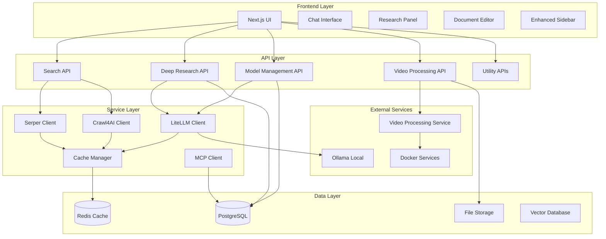
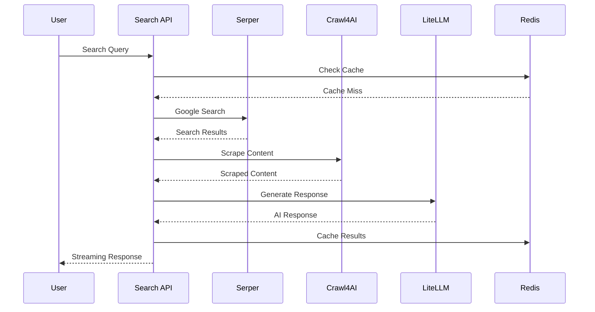
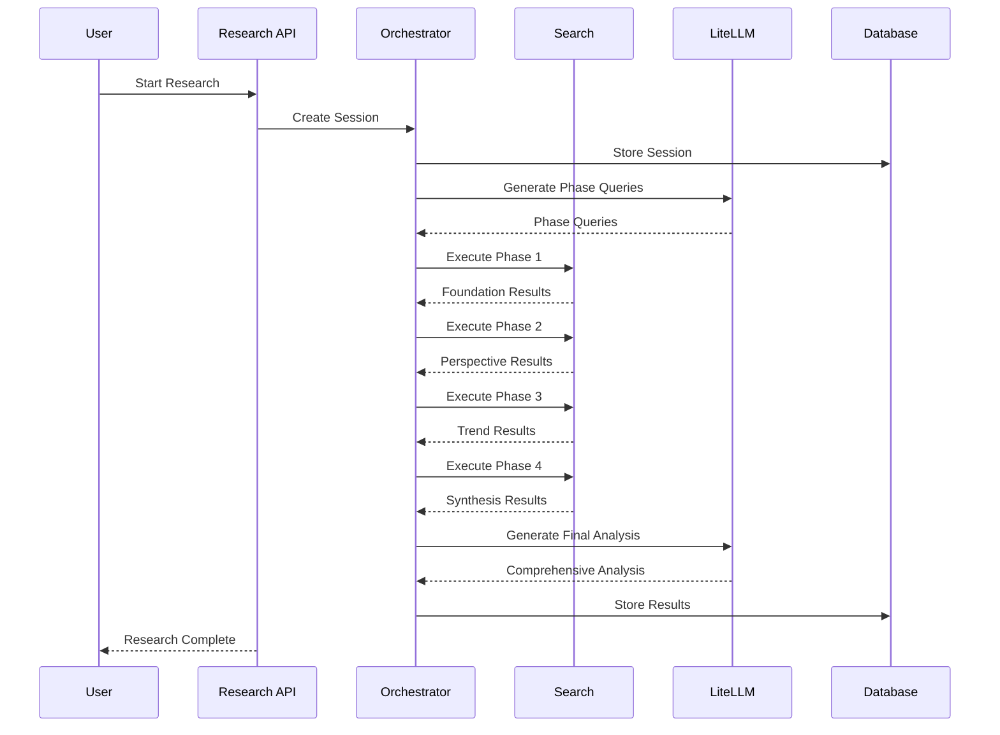
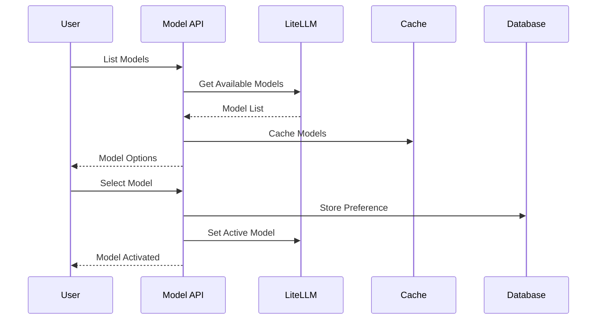

# System Patterns

## Architecture Overview

### High-Level Architecture



## Core Design Patterns

### 1. Multi-Service Architecture

**Pattern**: Microservices with Docker containerization
**Purpose**: Enable independent scaling and deployment of different components
**Implementation**:
- Crawl4AI service for web scraping
- LiteLLM service for AI model management
- Video processing service for multimedia analysis
- Redis for caching and session management

**Benefits**:
- Independent scaling of components
- Fault isolation
- Technology flexibility
- Easy deployment and updates

### 2. API-First Design

**Pattern**: RESTful APIs with TypeScript interfaces
**Purpose**: Provide clean, consistent interfaces for all functionality
**Implementation**:
```typescript
// Consistent API structure
interface APIResponse<T> {
  success: boolean;
  data?: T;
  error?: string;
  metadata?: {
    timestamp: string;
    processingTime: number;
    cacheStatus: 'hit' | 'miss';
  };
}
```

**Benefits**:
- Consistent error handling
- Easy integration and testing
- Clear interface contracts
- Version control and backward compatibility

### 3. Caching Strategy

**Pattern**: Multi-level caching with Redis
**Purpose**: Optimize performance and reduce external API calls
**Implementation**:
- Search result caching (TTL: 1 hour)
- AI response caching (TTL: 24 hours)
- Session data caching (TTL: 1 week)
- Research session caching (TTL: 1 month)

**Benefits**:
- Reduced latency
- Lower API costs
- Better user experience
- Improved reliability

### 4. Streaming Response Pattern

**Pattern**: Server-Sent Events (SSE) for real-time updates
**Purpose**: Provide immediate feedback during long-running operations
**Implementation**:
```typescript
// Streaming response for AI generation
export async function* generateStreamingResponse(prompt: string) {
  const stream = await litellmClient.stream(prompt);
  
  for await (const chunk of stream) {
    yield {
      type: 'content',
      data: chunk.content,
      done: false
    };
  }
  
  yield {
    type: 'complete',
    data: null,
    done: true
  };
}
```

**Benefits**:
- Immediate user feedback
- Better perceived performance
- Progressive content loading
- Real-time collaboration support

### 5. Deep Research Pattern

**Pattern**: Multi-phase research with orchestration
**Purpose**: Provide comprehensive, structured research results
**Implementation**:
```typescript
interface ResearchPhase {
  phase: 'foundation' | 'perspective' | 'trend' | 'synthesis';
  queries: string[];
  results: SearchResult[];
  analysis: string;
}

class ResearchOrchestrator {
  async executeResearch(query: string): Promise<ResearchResult> {
    const phases = await this.generatePhases(query);
    const results = await this.executePhases(phases);
    return await this.synthesizeResults(results);
  }
}
```

**Benefits**:
- Comprehensive coverage
- Structured analysis
- Multi-perspective insights
- Actionable recommendations

## Component Relationships

### 1. Search Orchestration



### 2. Deep Research Flow



### 3. Model Management



## Data Flow Patterns

### 1. Search Data Flow

```typescript
interface SearchDataFlow {
  // Input
  query: string;
  options: SearchOptions;
  
  // Processing
  searchResults: SerperResult[];
  scrapedContent: ScrapedContent[];
  aiResponse: AIResponse;
  
  // Output
  finalResponse: SearchResponse;
  cacheKey: string;
  metadata: SearchMetadata;
}
```

### 2. Research Data Flow

```typescript
interface ResearchDataFlow {
  // Input
  query: string;
  researchType: ResearchType;
  
  // Processing
  phases: ResearchPhase[];
  phaseResults: PhaseResult[];
  synthesis: SynthesisResult;
  
  // Output
  finalAnalysis: ResearchAnalysis;
  sessionId: string;
  recommendations: Recommendation[];
}
```

### 3. Model Data Flow

```typescript
interface ModelDataFlow {
  // Input
  prompt: string;
  modelConfig: ModelConfig;
  
  // Processing
  modelResponse: ModelResponse;
  processingTime: number;
  
  // Output
  finalResponse: string;
  metadata: ModelMetadata;
  usage: UsageStats;
}
```

## Error Handling Patterns

### 1. Graceful Degradation

**Pattern**: Fallback strategies for service failures
**Implementation**:
```typescript
class ServiceManager {
  async executeWithFallback<T>(
    primaryService: () => Promise<T>,
    fallbackService: () => Promise<T>
  ): Promise<T> {
    try {
      return await primaryService();
    } catch (error) {
      console.warn('Primary service failed, using fallback:', error);
      return await fallbackService();
    }
  }
}
```

### 2. Circuit Breaker Pattern

**Pattern**: Prevent cascading failures
**Implementation**:
```typescript
class CircuitBreaker {
  private failures = 0;
  private lastFailureTime = 0;
  private readonly threshold = 5;
  private readonly timeout = 60000; // 1 minute
  
  async execute<T>(operation: () => Promise<T>): Promise<T> {
    if (this.isOpen()) {
      throw new Error('Circuit breaker is open');
    }
    
    try {
      const result = await operation();
      this.onSuccess();
      return result;
    } catch (error) {
      this.onFailure();
      throw error;
    }
  }
}
```

### 3. Retry Pattern

**Pattern**: Automatic retry for transient failures
**Implementation**:
```typescript
class RetryManager {
  async executeWithRetry<T>(
    operation: () => Promise<T>,
    maxRetries = 3,
    delay = 1000
  ): Promise<T> {
    for (let i = 0; i <= maxRetries; i++) {
      try {
        return await operation();
      } catch (error) {
        if (i === maxRetries) throw error;
        await this.delay(delay * Math.pow(2, i)); // Exponential backoff
      }
    }
  }
}
```

## Security Patterns

### 1. API Key Management

**Pattern**: Secure storage and rotation of API keys
**Implementation**:
- Environment variable storage
- Key rotation mechanisms
- Usage monitoring and alerts
- Rate limiting per key

### 2. Input Validation

**Pattern**: Comprehensive input sanitization
**Implementation**:
```typescript
class InputValidator {
  validateSearchQuery(query: string): boolean {
    return query.length > 0 && 
           query.length < 1000 && 
           !this.containsMaliciousContent(query);
  }
  
  validateResearchQuery(query: string): boolean {
    return this.validateSearchQuery(query) && 
           this.isResearchAppropriate(query);
  }
}
```

### 3. Rate Limiting

**Pattern**: Prevent abuse and ensure fair usage
**Implementation**:
- Per-user rate limiting
- Per-IP rate limiting
- Service-specific limits
- Dynamic adjustment based on load

## Performance Patterns

### 1. Parallel Processing

**Pattern**: Concurrent execution of independent operations
**Implementation**:
```typescript
class ParallelProcessor {
  async processSearchResults(results: SearchResult[]): Promise<ProcessedResult[]> {
    const chunks = this.chunkArray(results, 5); // Process 5 at a time
    const processedChunks = await Promise.all(
      chunks.map(chunk => this.processChunk(chunk))
    );
    return processedChunks.flat();
  }
}
```

### 2. Lazy Loading

**Pattern**: Load content on demand
**Implementation**:
- Pagination for large result sets
- Progressive loading of research phases
- On-demand model loading
- Lazy initialization of services

### 3. Connection Pooling

**Pattern**: Efficient database and external service connections
**Implementation**:
- Redis connection pooling
- Database connection pooling
- HTTP connection reuse
- Service connection management

## Monitoring Patterns

### 1. Health Checks

**Pattern**: Continuous monitoring of service health
**Implementation**:
```typescript
class HealthMonitor {
  async checkServiceHealth(): Promise<HealthStatus> {
    const checks = [
      this.checkSerperAPI(),
      this.checkCrawl4AI(),
      this.checkLiteLLM(),
      this.checkRedis(),
      this.checkDatabase()
    ];
    
    const results = await Promise.all(checks);
    return this.aggregateHealthStatus(results);
  }
}
```

### 2. Metrics Collection

**Pattern**: Comprehensive performance and usage metrics
**Implementation**:
- Response time tracking
- Error rate monitoring
- Usage statistics
- Resource utilization
- Custom business metrics

### 3. Logging Strategy

**Pattern**: Structured logging for debugging and monitoring
**Implementation**:
- Structured JSON logging
- Log levels (debug, info, warn, error)
- Request correlation IDs
- Performance timing logs
- Error context preservation

These patterns provide the foundation for a scalable, maintainable, and reliable system that can handle the complex requirements of intelligent research and knowledge management. 