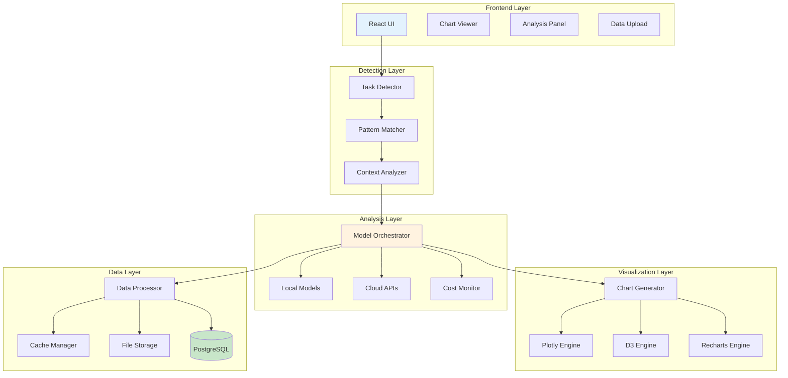

# AI Scientist 3.0 - Product Requirements Document

## 📋 Executive Summary

**Release Name**: AI Scientist 3.0  
**Release Date**: Q2 2024  
**Primary Features**: Automated Data Analysis + Chart Generation + Scientific Research + Multi-Model Orchestration  
**Target Users**: Data Scientists, Researchers, Analysts, Business Intelligence Teams  

### Feature Overview
AI Scientist 3.0 transforms Crawlplexity into an intelligent data analysis platform that automatically detects data analysis requests, generates appropriate visualizations, and provides comprehensive insights. This feature mimics the successful stock ticker detection pattern but extends it to cover all types of data analysis tasks, from statistical analysis to machine learning insights.

---

## 🎯 Core Features

### 1. Intelligent Task Detection
- **Pattern Recognition**: Detect data analysis requests from natural language
- **Task Classification**: Categorize requests (statistical, ML, visualization, research)
- **Context Awareness**: Understand data types and analysis requirements
- **Multi-Modal Input**: Support text, file uploads, and API data sources

### 2. Automated Chart Generation
- **Smart Chart Selection**: Choose optimal visualization based on data and query
- **Interactive Charts**: Generate Plotly, D3.js, and Recharts visualizations
- **Custom Styling**: Apply consistent theming and branding
- **Export Capabilities**: PNG, SVG, PDF, and interactive HTML exports

### 3. Multi-Model Analysis Engine
- **Model Orchestration**: Route tasks to optimal AI models (local, cloud, hybrid)
- **Cost Optimization**: Balance accuracy vs. cost for different analysis types
- **Fallback Strategies**: Automatic model switching on failures
- **Performance Monitoring**: Track model performance and costs

### 4. Data Processing Pipeline
- **Data Cleaning**: Automatic data validation and cleaning
- **Feature Engineering**: Intelligent feature extraction and transformation
- **Statistical Analysis**: Comprehensive statistical testing and validation
- **ML Pipeline**: Automated model training, validation, and deployment

### 5. Research Integration
- **Literature Review**: Search and analyze relevant research papers
- **Methodology Comparison**: Compare different analytical approaches
- **Best Practices**: Suggest optimal methods based on data characteristics
- **Citation Management**: Track sources and provide proper attribution

---

## 🏗️ Technical Architecture

### System Overview



### Database Schema

```sql
-- AI Scientist analysis sessions
CREATE TABLE ai_scientist_sessions (
    id UUID PRIMARY KEY DEFAULT gen_random_uuid(),
    user_id UUID REFERENCES users(id),
    query TEXT NOT NULL,
    detected_task_type VARCHAR(50) NOT NULL,
    data_source JSONB,
    analysis_config JSONB NOT NULL,
    results JSONB NOT NULL,
    charts JSONB,
    model_usage JSONB,
    cost_tracking JSONB,
    status VARCHAR(50) DEFAULT 'pending',
    created_at TIMESTAMP DEFAULT NOW(),
    completed_at TIMESTAMP,
    expires_at TIMESTAMP
);

-- Task detection patterns
CREATE TABLE task_detection_patterns (
    id UUID PRIMARY KEY DEFAULT gen_random_uuid(),
    pattern_type VARCHAR(50) NOT NULL,
    pattern_regex TEXT NOT NULL,
    task_category VARCHAR(50) NOT NULL,
    confidence_score DECIMAL(3,2) DEFAULT 0.8,
    priority INTEGER DEFAULT 1,
    is_active BOOLEAN DEFAULT TRUE,
    created_at TIMESTAMP DEFAULT NOW()
);

-- Chart templates and configurations
CREATE TABLE chart_templates (
    id UUID PRIMARY KEY DEFAULT gen_random_uuid(),
    name VARCHAR(100) NOT NULL,
    chart_type VARCHAR(50) NOT NULL,
    data_requirements JSONB NOT NULL,
    config_template JSONB NOT NULL,
    theme_config JSONB,
    is_default BOOLEAN DEFAULT FALSE,
    created_at TIMESTAMP DEFAULT NOW()
);

-- Model performance tracking
CREATE TABLE model_performance (
    id UUID PRIMARY KEY DEFAULT gen_random_uuid(),
    model_name VARCHAR(100) NOT NULL,
    task_type VARCHAR(50) NOT NULL,
    accuracy_score DECIMAL(5,4),
    cost_per_request DECIMAL(10,6),
    response_time_ms INTEGER,
    success_rate DECIMAL(5,4),
    usage_count INTEGER DEFAULT 0,
    last_used TIMESTAMP DEFAULT NOW(),
    created_at TIMESTAMP DEFAULT NOW()
);

-- Cost tracking
CREATE TABLE cost_tracking (
    id UUID PRIMARY KEY DEFAULT gen_random_uuid(),
    session_id UUID REFERENCES ai_scientist_sessions(id),
    model_name VARCHAR(100) NOT NULL,
    tokens_used INTEGER,
    cost_usd DECIMAL(10,6),
    task_type VARCHAR(50),
    timestamp TIMESTAMP DEFAULT NOW()
);
```

---

## 🔍 Task Detection System

### Pattern Detection (Mimicking Stock Ticker Detection)

```typescript
// Data analysis keywords that indicate AI Scientist tasks
const dataAnalysisKeywords = [
  // Statistical Analysis
  'statistical', 'statistics', 'mean', 'median', 'mode', 'variance', 'standard deviation',
  'correlation', 'regression', 'hypothesis', 'p-value', 'confidence interval', 't-test',
  'anova', 'chi-square', 'distribution', 'normal', 'skewed', 'outlier',
  
  // Machine Learning
  'machine learning', 'ml', 'ai', 'artificial intelligence', 'model', 'training',
  'prediction', 'classification', 'clustering', 'regression', 'neural network',
  'deep learning', 'random forest', 'svm', 'k-means', 'decision tree',
  
  // Data Visualization
  'chart', 'graph', 'plot', 'visualization', 'histogram', 'scatter plot',
  'bar chart', 'line chart', 'pie chart', 'heatmap', 'box plot', 'violin plot',
  'trend', 'pattern', 'distribution', 'comparison',
  
  // Data Processing
  'data analysis', 'data processing', 'data cleaning', 'feature engineering',
  'data mining', 'exploratory data analysis', 'eda', 'data science',
  'analytics', 'insights', 'trends', 'patterns',
  
  // Research Keywords
  'research', 'study', 'analysis', 'investigation', 'examination', 'evaluation',
  'assessment', 'review', 'survey', 'experiment', 'trial', 'test'
]

// Task detection patterns (similar to stock ticker patterns)
const taskDetectionPatterns = [
  // Statistical analysis patterns
  /analyze\s+(?:the\s+)?(?:statistics?|data)\s+(?:for|of|in)\s+(\w+)/i,
  /what\s+(?:are\s+)?(?:the\s+)?(?:statistics?|trends?)\s+(?:for|of)\s+(\w+)/i,
  /show\s+(?:me\s+)?(?:a\s+)?(?:chart|graph|plot)\s+(?:of|for)\s+(\w+)/i,
  
  // Machine learning patterns
  /train\s+(?:a\s+)?(?:model|ml|ai)\s+(?:for|on)\s+(\w+)/i,
  /predict\s+(?:the\s+)?(\w+)\s+(?:using|with)\s+(?:ml|ai|machine\s+learning)/i,
  /classify\s+(?:the\s+)?(\w+)\s+(?:into|as)/i,
  
  // Data visualization patterns
  /visualize\s+(?:the\s+)?(?:data|results)\s+(?:for|of)\s+(\w+)/i,
  /create\s+(?:a\s+)?(?:chart|graph|plot)\s+(?:showing|of)\s+(\w+)/i,
  /plot\s+(?:the\s+)?(\w+)\s+(?:data|results)/i,
  
  // Research patterns
  /research\s+(?:the\s+)?(\w+)\s+(?:trends?|patterns?|analysis)/i,
  /study\s+(?:the\s+)?(\w+)\s+(?:data|results|performance)/i,
  /investigate\s+(?:the\s+)?(\w+)\s+(?:patterns?|trends?|correlations?)/i
]

// Function to detect AI Scientist tasks (similar to detectCompanyTicker)
export function detectAIScientistTask(text: string): AIScientistTask | null {
  const lowerText = text.toLowerCase()
  
  // Check if the query is actually about data analysis
  const isDataAnalysisQuery = dataAnalysisKeywords.some(keyword => 
    lowerText.includes(keyword)
  )
  
  if (!isDataAnalysisQuery) {
    return null
  }
  
  // Check for specific task patterns
  for (const pattern of taskDetectionPatterns) {
    const match = text.match(pattern)
    if (match) {
      const taskType = determineTaskType(pattern, match)
      const dataSource = extractDataSource(text)
      const analysisConfig = generateAnalysisConfig(taskType, text)
      
      return {
        type: taskType,
        dataSource,
        config: analysisConfig,
        confidence: calculateConfidence(pattern, match),
        originalQuery: text
      }
    }
  }
  
  // Check for general analysis patterns
  const generalPatterns = [
    /analyze\s+(.+)/i,
    /research\s+(.+)/i,
    /study\s+(.+)/i,
    /investigate\s+(.+)/i
  ]
  
  for (const pattern of generalPatterns) {
    const match = text.match(pattern)
    if (match) {
      return {
        type: 'general_analysis',
        dataSource: extractDataSource(text),
        config: generateAnalysisConfig('general_analysis', text),
        confidence: 0.6,
        originalQuery: text
      }
    }
  }
  
  return null
}

// Task type determination
function determineTaskType(pattern: RegExp, match: RegExpMatchArray): string {
  const patternStr = pattern.source.toLowerCase()
  
  if (patternStr.includes('statistic') || patternStr.includes('mean') || patternStr.includes('correlation')) {
    return 'statistical_analysis'
  } else if (patternStr.includes('train') || patternStr.includes('predict') || patternStr.includes('ml')) {
    return 'machine_learning'
  } else if (patternStr.includes('chart') || patternStr.includes('graph') || patternStr.includes('plot')) {
    return 'data_visualization'
  } else if (patternStr.includes('research') || patternStr.includes('study') || patternStr.includes('investigate')) {
    return 'research_analysis'
  }
  
  return 'general_analysis'
}
```

### Task Types and Configurations

```typescript
interface AIScientistTask {
  type: 'statistical_analysis' | 'machine_learning' | 'data_visualization' | 'research_analysis' | 'general_analysis'
  dataSource: DataSource
  config: AnalysisConfig
  confidence: number
  originalQuery: string
}

interface DataSource {
  type: 'text' | 'file' | 'api' | 'database' | 'url'
  content?: string
  filePath?: string
  apiEndpoint?: string
  databaseQuery?: string
  url?: string
}

interface AnalysisConfig {
  // Statistical Analysis
  statisticalTests?: string[]
  confidenceLevel?: number
  sampleSize?: number
  
  // Machine Learning
  algorithm?: string
  hyperparameters?: Record<string, any>
  validationMethod?: string
  targetVariable?: string
  
  // Data Visualization
  chartType?: string
  dimensions?: string[]
  metrics?: string[]
  colorScheme?: string
  
  // General
  outputFormat?: string
  includeInsights?: boolean
  includeRecommendations?: boolean
}
```

---

## 🤖 Model Orchestration System

### Multi-Model Architecture

```typescript
class ModelOrchestrator {
  private models: Map<string, AIModel> = new Map()
  private costMonitor: CostMonitor
  private performanceTracker: PerformanceTracker
  
  constructor() {
    this.initializeModels()
    this.costMonitor = new CostMonitor()
    this.performanceTracker = new PerformanceTracker()
  }
  
  private initializeModels() {
    // Local Models (Free)
    this.models.set('llama-2-7b', {
      name: 'llama-2-7b',
      type: 'local',
      cost: 0,
      capabilities: ['text_analysis', 'basic_statistics'],
      maxTokens: 4096,
      performance: 0.7
    })
    
    this.models.set('mistral-7b', {
      name: 'mistral-7b', 
      type: 'local',
      cost: 0,
      capabilities: ['text_analysis', 'code_generation'],
      maxTokens: 8192,
      performance: 0.75
    })
    
    // Affordable Cloud APIs
    this.models.set('gpt-3.5-turbo', {
      name: 'gpt-3.5-turbo',
      type: 'cloud',
      cost: 0.002, // per 1K tokens
      capabilities: ['text_analysis', 'statistics', 'basic_ml'],
      maxTokens: 4096,
      performance: 0.85
    })
    
    this.models.set('claude-3-haiku', {
      name: 'claude-3-haiku',
      type: 'cloud', 
      cost: 0.00025, // per 1K tokens
      capabilities: ['text_analysis', 'statistics'],
      maxTokens: 200000,
      performance: 0.8
    })
    
    // Advanced Models (Higher Cost)
    this.models.set('gpt-4', {
      name: 'gpt-4',
      type: 'cloud',
      cost: 0.03, // per 1K tokens
      capabilities: ['text_analysis', 'statistics', 'advanced_ml', 'research'],
      maxTokens: 8192,
      performance: 0.95
    })
    
    this.models.set('claude-3-opus', {
      name: 'claude-3-opus',
      type: 'cloud',
      cost: 0.015, // per 1K tokens
      capabilities: ['text_analysis', 'statistics', 'advanced_ml', 'research'],
      maxTokens: 200000,
      performance: 0.92
    })
  }
  
  async selectOptimalModel(task: AIScientistTask, budget?: number): Promise<AIModel> {
    const suitableModels = this.getSuitableModels(task)
    const performanceScores = await this.performanceTracker.getScores(suitableModels, task.type)
    
    // Score each model based on performance, cost, and task requirements
    const scoredModels = suitableModels.map(model => {
      const performanceScore = performanceScores.get(model.name) || 0.5
      const costScore = this.calculateCostScore(model, task, budget)
      const capabilityScore = this.calculateCapabilityScore(model, task)
      
      const totalScore = (performanceScore * 0.4) + (costScore * 0.3) + (capabilityScore * 0.3)
      
      return { model, score: totalScore }
    })
    
    // Return the best scoring model
    return scoredModels.sort((a, b) => b.score - a.score)[0].model
  }
  
  private getSuitableModels(task: AIScientistTask): AIModel[] {
    return Array.from(this.models.values()).filter(model => {
      return this.modelCanHandleTask(model, task)
    })
  }
  
  private modelCanHandleTask(model: AIModel, task: AIScientistTask): boolean {
    switch (task.type) {
      case 'statistical_analysis':
        return model.capabilities.includes('statistics')
      case 'machine_learning':
        return model.capabilities.includes('basic_ml') || model.capabilities.includes('advanced_ml')
      case 'research_analysis':
        return model.capabilities.includes('research')
      default:
        return model.capabilities.includes('text_analysis')
    }
  }
  
  private calculateCostScore(model: AIModel, task: AIScientistTask, budget?: number): number {
    if (model.cost === 0) return 1.0 // Free models get perfect cost score
    
    const estimatedTokens = this.estimateTokenUsage(task)
    const estimatedCost = (estimatedTokens / 1000) * model.cost
    
    if (budget && estimatedCost > budget) return 0.0
    
    // Lower cost = higher score
    return Math.max(0, 1 - (estimatedCost / 0.1)) // Normalize to 0.1 max cost
  }
  
  private calculateCapabilityScore(model: AIModel, task: AIScientistTask): number {
    const requiredCapabilities = this.getRequiredCapabilities(task)
    const matchingCapabilities = requiredCapabilities.filter(cap => 
      model.capabilities.includes(cap)
    )
    
    return matchingCapabilities.length / requiredCapabilities.length
  }
  
  private getRequiredCapabilities(task: AIScientistTask): string[] {
    switch (task.type) {
      case 'statistical_analysis':
        return ['statistics', 'text_analysis']
      case 'machine_learning':
        return ['basic_ml', 'text_analysis']
      case 'data_visualization':
        return ['text_analysis']
      case 'research_analysis':
        return ['research', 'text_analysis']
      default:
        return ['text_analysis']
    }
  }
  
  private estimateTokenUsage(task: AIScientistTask): number {
    // Rough estimation based on task complexity
    const baseTokens = 1000
    const complexityMultiplier = this.getTaskComplexity(task)
    return Math.round(baseTokens * complexityMultiplier)
  }
  
  private getTaskComplexity(task: AIScientistTask): number {
    switch (task.type) {
      case 'statistical_analysis':
        return 1.5
      case 'machine_learning':
        return 3.0
      case 'data_visualization':
        return 1.0
      case 'research_analysis':
        return 2.5
      default:
        return 1.0
    }
  }
}
```

---

## 📊 Chart Generation System

### Smart Chart Selection

```typescript
class ChartGenerator {
  private chartTemplates: Map<string, ChartTemplate> = new Map()
  private dataAnalyzer: DataAnalyzer
  
  constructor() {
    this.initializeChartTemplates()
    this.dataAnalyzer = new DataAnalyzer()
  }
  
  private initializeChartTemplates() {
    // Statistical Charts
    this.chartTemplates.set('histogram', {
      name: 'Histogram',
      type: 'histogram',
      dataRequirements: ['numerical_data', 'single_variable'],
      config: {
        xaxis: { title: 'Values' },
        yaxis: { title: 'Frequency' },
        bargap: 0.1
      }
    })
    
    this.chartTemplates.set('scatter_plot', {
      name: 'Scatter Plot',
      type: 'scatter',
      dataRequirements: ['numerical_data', 'two_variables'],
      config: {
        mode: 'markers',
        marker: { size: 8 }
      }
    })
    
    this.chartTemplates.set('line_chart', {
      name: 'Line Chart',
      type: 'scatter',
      dataRequirements: ['time_series', 'numerical_data'],
      config: {
        mode: 'lines+markers',
        line: { width: 2 }
      }
    })
    
    this.chartTemplates.set('bar_chart', {
      name: 'Bar Chart',
      type: 'bar',
      dataRequirements: ['categorical_data', 'numerical_data'],
      config: {
        bargap: 0.2
      }
    })
    
    this.chartTemplates.set('box_plot', {
      name: 'Box Plot',
      type: 'box',
      dataRequirements: ['numerical_data', 'distribution_analysis'],
      config: {
        boxpoints: 'outliers'
      }
    })
    
    this.chartTemplates.set('heatmap', {
      name: 'Heatmap',
      type: 'heatmap',
      dataRequirements: ['correlation_matrix', 'two_dimensional'],
      config: {
        colorscale: 'Viridis'
      }
    })
  }
  
  async generateChart(data: any, task: AIScientistTask): Promise<ChartResult> {
    // Analyze the data to understand its characteristics
    const dataCharacteristics = await this.dataAnalyzer.analyze(data)
    
    // Select the most appropriate chart type
    const chartType = this.selectChartType(dataCharacteristics, task)
    const template = this.chartTemplates.get(chartType)
    
    if (!template) {
      throw new Error(`No template found for chart type: ${chartType}`)
    }
    
    // Generate the chart using the appropriate engine
    const chartEngine = this.getChartEngine(chartType)
    const chartData = await chartEngine.generate(data, template)
    
    return {
      type: chartType,
      data: chartData,
      config: template.config,
      metadata: {
        dataCharacteristics,
        generatedAt: new Date(),
        engine: chartEngine.name
      }
    }
  }
  
  private selectChartType(characteristics: DataCharacteristics, task: AIScientistTask): string {
    const { dataType, dimensions, hasTimeSeries, hasCategorical } = characteristics
    
    // Task-specific chart selection
    switch (task.type) {
      case 'statistical_analysis':
        if (characteristics.hasDistribution) return 'histogram'
        if (characteristics.hasCorrelation) return 'scatter_plot'
        if (characteristics.hasOutliers) return 'box_plot'
        break
        
      case 'data_visualization':
        if (hasTimeSeries) return 'line_chart'
        if (hasCategorical) return 'bar_chart'
        if (dimensions === 2) return 'scatter_plot'
        break
        
      case 'machine_learning':
        if (characteristics.hasCorrelation) return 'heatmap'
        if (characteristics.hasDistribution) return 'histogram'
        return 'scatter_plot'
    }
    
    // Default selection based on data characteristics
    if (hasTimeSeries) return 'line_chart'
    if (hasCategorical) return 'bar_chart'
    if (dimensions === 2) return 'scatter_plot'
    if (characteristics.hasDistribution) return 'histogram'
    
    return 'bar_chart' // Fallback
  }
  
  private getChartEngine(chartType: string): ChartEngine {
    // Use Plotly for complex interactive charts
    if (['scatter_plot', 'line_chart', 'heatmap', 'box_plot'].includes(chartType)) {
      return new PlotlyEngine()
    }
    
    // Use Recharts for simple charts (better React integration)
    if (['bar_chart', 'pie_chart'].includes(chartType)) {
      return new RechartsEngine()
    }
    
    // Use D3.js for custom visualizations
    if (chartType === 'custom') {
      return new D3Engine()
    }
    
    return new PlotlyEngine() // Default
  }
}

// Chart engines
class PlotlyEngine implements ChartEngine {
  name = 'plotly'
  
  async generate(data: any, template: ChartTemplate): Promise<any> {
    // Generate Plotly chart configuration
    return {
      data: [{
        type: template.type,
        ...this.transformData(data, template),
        ...template.config
      }],
      layout: {
        title: template.name,
        xaxis: { title: 'X Axis' },
        yaxis: { title: 'Y Axis' },
        template: 'plotly_white'
      },
      config: {
        responsive: true,
        displayModeBar: true
      }
    }
  }
  
  private transformData(data: any, template: ChartTemplate): any {
    // Transform data based on chart type
    switch (template.type) {
      case 'scatter':
        return {
          x: data.x || data.index,
          y: data.y || data.values
        }
      case 'bar':
        return {
          x: data.categories || data.x,
          y: data.values || data.y
        }
      case 'histogram':
        return {
          x: data.values
        }
      default:
        return data
    }
  }
}

class RechartsEngine implements ChartEngine {
  name = 'recharts'
  
  async generate(data: any, template: ChartTemplate): Promise<any> {
    // Generate Recharts component configuration
    return {
      component: this.getComponent(template.type),
      props: {
        data: this.transformData(data, template),
        ...template.config
      }
    }
  }
  
  private getComponent(chartType: string): string {
    const componentMap = {
      'bar': 'BarChart',
      'line': 'LineChart',
      'pie': 'PieChart',
      'area': 'AreaChart'
    }
    return componentMap[chartType] || 'BarChart'
  }
  
  private transformData(data: any, template: ChartTemplate): any[] {
    // Transform data for Recharts format
    if (Array.isArray(data)) return data
    
    // Convert object to array format
    return Object.keys(data).map(key => ({
      name: key,
      value: data[key]
    }))
  }
}
```

---

## 🔧 API Specifications

### AI Scientist API

```typescript
// AI Scientist API endpoints
interface AIScientistAPI {
  // Start analysis session
  POST /api/ai-scientist/analyze
  {
    query: string;
    data?: any;
    config?: AnalysisConfig;
    budget?: number;
  }
  
  // Get analysis progress
  GET /api/ai-scientist/sessions/:sessionId
  
  // Get analysis results
  GET /api/ai-scientist/sessions/:sessionId/results
  
  // Get generated charts
  GET /api/ai-scientist/sessions/:sessionId/charts
  
  // Export analysis
  POST /api/ai-scientist/sessions/:sessionId/export
  {
    format: 'pdf' | 'html' | 'json' | 'python';
    includeCharts?: boolean;
    includeCode?: boolean;
  }
}

// Server-Sent Events for AI Scientist
interface AIScientistEvents {
  // Task detection
  'task_detected': {
    session_id: string;
    task_type: string;
    confidence: number;
    config: AnalysisConfig;
  };
  
  // Model selection
  'model_selected': {
    session_id: string;
    model_name: string;
    reason: string;
    estimated_cost: number;
  };
  
  // Analysis progress
  'analysis_progress': {
    session_id: string;
    phase: string;
    progress: number;
    message: string;
  };
  
  // Chart generation
  'chart_generated': {
    session_id: string;
    chart_type: string;
    chart_data: any;
    chart_config: any;
  };
  
  // Results ready
  'results_ready': {
    session_id: string;
    analysis_results: any;
    insights: string[];
    recommendations: string[];
  };
  
  // Cost update
  'cost_update': {
    session_id: string;
    current_cost: number;
    model_usage: Record<string, number>;
  };
}
```

---

## 🎨 User Experience Design

### AI Scientist Interface

```typescript
interface AIScientistInterfaceProps {
  session: AIScientistSession;
  onNewAnalysis: (query: string, data?: any) => void;
  onExport: (format: string) => void;
}

const AIScientistInterface: React.FC<AIScientistInterfaceProps> = ({
  session,
  onNewAnalysis,
  onExport
}) => {
  return (
    <div className="ai-scientist-interface">
      {/* Header */}
      <div className="ai-scientist-header">
        <h2>AI Scientist 3.0</h2>
        <div className="cost-indicator">
          <span>Cost: ${session.currentCost.toFixed(4)}</span>
          <span>Model: {session.selectedModel}</span>
        </div>
      </div>
      
      {/* Analysis Input */}
      <div className="analysis-input">
        <textarea
          placeholder="Describe your data analysis task... (e.g., 'Analyze the correlation between sales and marketing spend')"
          onChange={(e) => setQuery(e.target.value)}
        />
        <button onClick={() => onNewAnalysis(query)}>
          Start Analysis
        </button>
      </div>
      
      {/* Progress Tracking */}
      {session.status === 'processing' && (
        <div className="progress-tracker">
          <div className="progress-bar">
            <div 
              className="progress-fill" 
              style={{ width: `${session.progress}%` }}
            />
          </div>
          <p>{session.currentPhase}</p>
        </div>
      )}
      
      {/* Results Display */}
      {session.status === 'completed' && (
        <div className="results-display">
          {/* Insights */}
          <div className="insights-panel">
            <h3>Key Insights</h3>
            {session.insights.map((insight, index) => (
              <div key={index} className="insight-item">
                {insight}
              </div>
            ))}
          </div>
          
          {/* Charts */}
          <div className="charts-panel">
            <h3>Generated Charts</h3>
            {session.charts.map((chart, index) => (
              <div key={index} className="chart-container">
                <ChartViewer chart={chart} />
                <div className="chart-controls">
                  <button onClick={() => downloadChart(chart, 'png')}>
                    Download PNG
                  </button>
                  <button onClick={() => downloadChart(chart, 'svg')}>
                    Download SVG
                  </button>
                </div>
              </div>
            ))}
          </div>
          
          {/* Recommendations */}
          <div className="recommendations-panel">
            <h3>Recommendations</h3>
            {session.recommendations.map((rec, index) => (
              <div key={index} className="recommendation-item">
                {rec}
              </div>
            ))}
          </div>
          
          {/* Export Options */}
          <div className="export-panel">
            <h3>Export Analysis</h3>
            <div className="export-buttons">
              <button onClick={() => onExport('pdf')}>Export PDF</button>
              <button onClick={() => onExport('html')}>Export HTML</button>
              <button onClick={() => onExport('python')}>Export Python Code</button>
            </div>
          </div>
        </div>
      )}
    </div>
  );
};
```

---

## 📊 Success Metrics & KPIs

### User Engagement Metrics
- **Task Detection Accuracy**: Percentage of correctly detected analysis tasks
- **Chart Generation Success Rate**: Percentage of successful chart generations
- **Model Selection Efficiency**: Average cost per analysis session
- **User Satisfaction**: Ratings of analysis quality and insights
- **Export Usage**: Number of analyses exported per user

### Performance Metrics
- **Analysis Completion Time**: Average time from query to results
- **Model Response Time**: Average response time per model type
- **Cost Efficiency**: Cost per analysis session vs. budget
- **Chart Generation Speed**: Time to generate and render charts
- **System Uptime**: Availability of AI Scientist services

### Quality Metrics
- **Analysis Accuracy**: User ratings of analysis correctness
- **Chart Relevance**: User ratings of chart appropriateness
- **Insight Quality**: User ratings of generated insights
- **Recommendation Usefulness**: User ratings of recommendations
- **Code Quality**: Quality of generated Python/R code

---

## 🚀 Implementation Timeline

### Phase 1: Core Detection & Orchestration (Weeks 1-3)
- [ ] Task detection system implementation
- [ ] Pattern matching and classification
- [ ] Model orchestration framework
- [ ] Cost monitoring system
- [ ] Basic API endpoints

### Phase 2: Chart Generation (Weeks 4-5)
- [ ] Chart template system
- [ ] Plotly integration
- [ ] Recharts integration
- [ ] D3.js integration
- [ ] Chart selection logic

### Phase 3: Analysis Engines (Weeks 6-8)
- [ ] Statistical analysis engine
- [ ] Machine learning pipeline
- [ ] Data processing utilities
- [ ] Research integration
- [ ] Multi-model support

### Phase 4: User Interface (Weeks 9-10)
- [ ] AI Scientist interface components
- [ ] Real-time progress tracking
- [ ] Chart viewer components
- [ ] Export functionality
- [ ] Cost monitoring UI

### Phase 5: Testing & Optimization (Weeks 11-12)
- [ ] Performance testing and optimization
- [ ] Cost optimization algorithms
- [ ] User acceptance testing
- [ ] Documentation and training
- [ ] Production deployment

---

## 🔒 Security Considerations

### Data Security
- **Data Encryption**: Encrypt all uploaded data and analysis results
- **Access Control**: Granular permissions for analysis sessions
- **Data Retention**: Automatic cleanup of sensitive data
- **Audit Logging**: Track all analysis activities and data access

### Model Security
- **API Key Management**: Secure storage and rotation of API keys
- **Rate Limiting**: Prevent abuse of expensive models
- **Input Validation**: Validate all inputs to prevent injection attacks
- **Output Sanitization**: Sanitize all generated outputs

---

## 📈 Future Enhancements

### Phase 2.1 Features
- **Advanced ML Models**: Integration with specialized ML platforms
- **Real-time Data**: Support for streaming data analysis
- **Collaborative Analysis**: Multi-user analysis sessions
- **Custom Models**: User-defined model training and deployment

### Phase 2.2 Features
- **Enterprise Integration**: SSO, LDAP, and enterprise data sources
- **Advanced Visualizations**: 3D charts, interactive dashboards
- **Automated Reporting**: Scheduled analysis and reporting
- **API Marketplace**: Third-party analysis tool integrations

---

## 🔑 Key Implementation Notes

### Task Detection Integration Points
1. **Query Analysis**: Integrate with existing search query processing
2. **Pattern Matching**: Use regex patterns similar to stock ticker detection
3. **Context Awareness**: Leverage conversation history for better detection
4. **Fallback Strategies**: Graceful degradation when detection fails

### Model Orchestration Features
1. **Cost Optimization**: Automatic model selection based on budget and performance
2. **Performance Tracking**: Monitor and learn from model performance
3. **Fallback Mechanisms**: Automatic switching to alternative models
4. **Resource Management**: Efficient allocation of computational resources

### Chart Generation System
1. **Smart Selection**: Choose optimal chart type based on data characteristics
2. **Interactive Features**: Support for zoom, pan, and data exploration
3. **Export Capabilities**: Multiple format support (PNG, SVG, PDF, HTML)
4. **Customization**: User-defined styling and branding options

### Cost Management
1. **Budget Controls**: Set and enforce cost limits per session
2. **Cost Tracking**: Real-time monitoring of API usage and costs
3. **Optimization**: Automatic selection of cost-effective models
4. **Reporting**: Detailed cost breakdowns and usage analytics

---

## 📝 Conclusion

AI Scientist 3.0 represents a significant evolution of Crawlplexity's capabilities, transforming it from a search tool into a comprehensive data analysis platform. By mimicking the successful stock ticker detection pattern and extending it to cover all types of data analysis tasks, this feature provides users with intelligent, automated analysis capabilities.

The multi-model orchestration system ensures optimal performance while maintaining cost efficiency, making advanced data analysis accessible to users with varying budgets and requirements. The smart chart generation system automatically creates appropriate visualizations, while the comprehensive analysis engine provides deep insights and actionable recommendations.

Key success factors include:
- Accurate task detection that understands user intent
- Cost-effective model selection that balances performance and expense
- High-quality chart generation that enhances data understanding
- Comprehensive analysis that provides actionable insights
- Seamless integration with existing Crawlplexity workflows

This feature set positions Crawlplexity as a leading platform for intelligent data analysis, suitable for researchers, data scientists, business analysts, and anyone seeking automated insights from their data. 