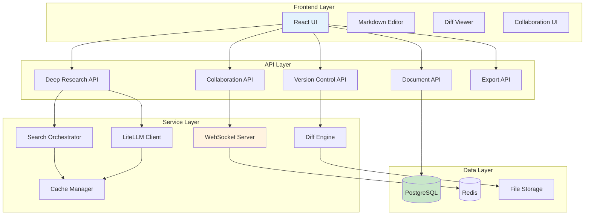

# Crawlplexity Document Builder v2.0 - Product Requirements Document

## 📋 Executive Summary

**Release Name**: Crawlplexity Document Builder v2.0  
**Release Date**: Q2 2024  
**Primary Features**: Deep Research + Document Building + Version Control + Collaboration  
**Target Users**: Researchers, Content Creators, Teams, Knowledge Workers  

### Feature Overview
Crawlplexity Document Builder v2.0 combines advanced deep research capabilities with comprehensive document management, featuring real-time collaboration, version control, and intelligent content organization. This release transforms Crawlplexity from a search tool into a complete knowledge management platform.

---

## 🎯 Core Features

### 1. Deep Research Engine
- **Multi-Pass Analysis**: 4-phase research methodology
- **Comprehensive Coverage**: Foundation, Perspectives, Trends, Synthesis
- **Intelligent Query Generation**: Context-aware search strategies
- **Rich Output**: Structured analysis with citations and recommendations

### 2. Document Builder
- **Markdown-First**: Native markdown editing with live preview
- **Thread Organization**: Hierarchical content structure
- **Rich Media Support**: Images, charts, code blocks, embeds
- **Template System**: Pre-built templates for common document types

### 3. Version Control System
- **Git-Like Diffs**: Visual change tracking and comparison
- **Branch Management**: Multiple document versions and experiments
- **Commit History**: Detailed change logs with author attribution
- **Rollback Capability**: Restore previous versions instantly

### 4. Real-Time Collaboration
- **Live Editing**: Multiple users editing simultaneously
- **Comment System**: Inline comments and discussions
- **Presence Indicators**: Show who's currently editing
- **Conflict Resolution**: Smart merge strategies for concurrent edits

### 5. Export & Sharing
- **Multiple Formats**: PDF, Word, HTML, Markdown
- **Public Sharing**: Generate shareable links
- **Embedding**: Embed documents in external websites
- **API Access**: Programmatic document access

---

## 🏗️ Technical Architecture

### System Overview



### Database Schema

```sql
-- Documents table
CREATE TABLE documents (
    id UUID PRIMARY KEY DEFAULT gen_random_uuid(),
    title VARCHAR(255) NOT NULL,
    content TEXT NOT NULL,
    markdown_content TEXT NOT NULL,
    metadata JSONB DEFAULT '{}',
    created_at TIMESTAMP DEFAULT NOW(),
    updated_at TIMESTAMP DEFAULT NOW(),
    created_by UUID REFERENCES users(id),
    is_public BOOLEAN DEFAULT FALSE,
    template_id UUID REFERENCES document_templates(id),
    status VARCHAR(50) DEFAULT 'draft'
);

-- Document versions table
CREATE TABLE document_versions (
    id UUID PRIMARY KEY DEFAULT gen_random_uuid(),
    document_id UUID REFERENCES documents(id) ON DELETE CASCADE,
    version_number INTEGER NOT NULL,
    content TEXT NOT NULL,
    markdown_content TEXT NOT NULL,
    diff_data JSONB,
    commit_message TEXT,
    created_at TIMESTAMP DEFAULT NOW(),
    created_by UUID REFERENCES users(id),
    UNIQUE(document_id, version_number)
);

-- Document threads (sections)
CREATE TABLE document_threads (
    id UUID PRIMARY KEY DEFAULT gen_random_uuid(),
    document_id UUID REFERENCES documents(id) ON DELETE CASCADE,
    title VARCHAR(255) NOT NULL,
    content TEXT,
    markdown_content TEXT,
    order_index INTEGER NOT NULL,
    parent_thread_id UUID REFERENCES document_threads(id),
    created_at TIMESTAMP DEFAULT NOW(),
    updated_at TIMESTAMP DEFAULT NOW()
);

-- Collaboration sessions
CREATE TABLE collaboration_sessions (
    id UUID PRIMARY KEY DEFAULT gen_random_uuid(),
    document_id UUID REFERENCES documents(id) ON DELETE CASCADE,
    user_id UUID REFERENCES users(id),
    session_token VARCHAR(255) UNIQUE NOT NULL,
    last_active TIMESTAMP DEFAULT NOW(),
    cursor_position JSONB,
    is_active BOOLEAN DEFAULT TRUE
);

-- Comments
CREATE TABLE document_comments (
    id UUID PRIMARY KEY DEFAULT gen_random_uuid(),
    document_id UUID REFERENCES documents(id) ON DELETE CASCADE,
    thread_id UUID REFERENCES document_threads(id),
    user_id UUID REFERENCES users(id),
    content TEXT NOT NULL,
    position JSONB,
    created_at TIMESTAMP DEFAULT NOW(),
    updated_at TIMESTAMP DEFAULT NOW()
);

-- Deep research results
CREATE TABLE deep_research_sessions (
    id UUID PRIMARY KEY DEFAULT gen_random_uuid(),
    document_id UUID REFERENCES documents(id),
    query TEXT NOT NULL,
    search_passes JSONB NOT NULL,
    results JSONB NOT NULL,
    analysis TEXT,
    created_at TIMESTAMP DEFAULT NOW(),
    completed_at TIMESTAMP
);
```

---

## 🔧 API Specifications

### Document Management API

```typescript
// Document CRUD Operations
interface DocumentAPI {
  // Create new document
  POST /api/documents
  {
    title: string;
    content?: string;
    template_id?: string;
    is_public?: boolean;
  }
  
  // Get document
  GET /api/documents/:id
  Response: {
    id: string;
    title: string;
    content: string;
    markdown_content: string;
    metadata: object;
    created_at: string;
    updated_at: string;
    created_by: string;
    is_public: boolean;
    threads: Thread[];
    versions: Version[];
  }
  
  // Update document
  PUT /api/documents/:id
  {
    title?: string;
    content?: string;
    markdown_content?: string;
    metadata?: object;
  }
  
  // Delete document
  DELETE /api/documents/:id
  
  // List documents
  GET /api/documents?page=1&limit=20&filter=my
}

// Version Control API
interface VersionAPI {
  // Get version history
  GET /api/documents/:id/versions
  
  // Create new version
  POST /api/documents/:id/versions
  {
    content: string;
    markdown_content: string;
    commit_message: string;
  }
  
  // Get specific version
  GET /api/documents/:id/versions/:versionNumber
  
  // Compare versions
  GET /api/documents/:id/versions/compare?from=1&to=2
  
  // Restore version
  POST /api/documents/:id/versions/:versionNumber/restore
}

// Collaboration API
interface CollaborationAPI {
  // Join collaboration session
  POST /api/documents/:id/collaborate
  {
    session_token: string;
  }
  
  // Update cursor position
  PUT /api/documents/:id/collaborate/cursor
  {
    position: { line: number; ch: number };
  }
  
  // Add comment
  POST /api/documents/:id/comments
  {
    content: string;
    position?: { line: number; ch: number };
    thread_id?: string;
  }
  
  // Get comments
  GET /api/documents/:id/comments
}

// Deep Research API
interface DeepResearchAPI {
  // Start deep research
  POST /api/documents/:id/deep-research
  {
    query: string;
    research_type: 'foundation' | 'perspective' | 'trend' | 'synthesis';
  }
  
  // Get research progress
  GET /api/documents/:id/deep-research/:sessionId
  
  // Get research results
  GET /api/documents/:id/deep-research/:sessionId/results
}

// Export API
interface ExportAPI {
  // Export document
  POST /api/documents/:id/export
  {
    format: 'pdf' | 'docx' | 'html' | 'markdown';
    include_comments?: boolean;
    include_versions?: boolean;
  }
  
  // Generate shareable link
  POST /api/documents/:id/share
  {
    expires_at?: string;
    permissions: 'read' | 'write' | 'comment';
  }
}
```

### WebSocket Events

```typescript
interface WebSocketEvents {
  // Document changes
  'document:update': {
    document_id: string;
    content: string;
    markdown_content: string;
    updated_at: string;
    user_id: string;
  };
  
  // Cursor movements
  'cursor:update': {
    document_id: string;
    user_id: string;
    position: { line: number; ch: number };
    username: string;
  };
  
  // Comments
  'comment:add': {
    document_id: string;
    comment: Comment;
  };
  
  // User presence
  'presence:update': {
    document_id: string;
    users: Array<{
      user_id: string;
      username: string;
      last_active: string;
    }>;
  };
  
  // Deep research progress
  'research:progress': {
    session_id: string;
    phase: number;
    total_phases: number;
    message: string;
  };
}
```

---

## 🧠 Deep Research System Prompt

### Primary Deep Research Prompt

```typescript
const DEEP_RESEARCH_SYSTEM_PROMPT = `You are an expert research analyst conducting comprehensive deep research using Crawlplexity's multi-pass analysis system.

RESEARCH METHODOLOGY:
You will receive information from multiple search passes, each designed to uncover different aspects of the topic:

PASS 1 - FOUNDATION RESEARCH:
- Broad overview and basic facts
- Academic and scholarly sources
- Industry reports and white papers
- Historical context and background

PASS 2 - PERSPECTIVE ANALYSIS:
- Pro arguments and supporting evidence
- Con arguments and counterpoints
- Neutral analysis and balanced viewpoints
- Expert opinions and stakeholder perspectives

PASS 3 - TREND ANALYSIS:
- Recent developments and news
- Future predictions and forecasts
- Market trends and industry shifts
- Emerging technologies or methodologies

PASS 4 - SYNTHESIS & RECOMMENDATIONS:
- Comprehensive expert analysis
- Comparative studies and benchmarks
- Best practices and case studies
- Strategic recommendations

OUTPUT STRUCTURE:
Your response must follow this comprehensive structure:

# Executive Summary
- 2-3 sentence overview of key findings
- Most important insights and conclusions
- Critical recommendations

# Detailed Analysis

## Background & Context
- Historical development and current state
- Key definitions and terminology
- Scope and boundaries of the topic

## Current State Analysis
- Comprehensive overview of current situation
- Key players, technologies, or methodologies
- Market size, adoption rates, or relevant metrics
- Recent developments and breakthroughs

## Multi-Perspective Analysis
- Pro arguments and supporting evidence
- Con arguments and counterpoints
- Neutral analysis and balanced viewpoints
- Expert consensus and disagreements

## Trend Analysis & Future Outlook
- Recent trends and developments
- Future predictions and forecasts
- Emerging opportunities and challenges
- Market dynamics and competitive landscape

## Comparative Analysis
- Comparison with alternatives or competitors
- Benchmarking against industry standards
- Case studies and real-world examples
- Success factors and failure modes

# Strategic Insights

## Key Findings
- 5-7 most important discoveries
- Surprising insights or counterintuitive findings
- Gaps in current knowledge or research

## Recommendations
- Strategic recommendations for different stakeholders
- Implementation considerations
- Risk assessment and mitigation strategies
- Priority actions and timelines

## Future Directions
- Emerging opportunities and threats
- Research gaps and unanswered questions
- Predictions for next 1-3 years
- Long-term implications and considerations

# Technical Appendix
- Methodology and data sources
- Limitations and assumptions
- Additional resources and references
- Glossary of key terms

RESPONSE REQUIREMENTS:
- Be comprehensive but well-structured
- Include specific examples and case studies
- Provide actionable insights and recommendations
- Use markdown formatting for readability
- Include inline citations [1], [2], etc. for all claims
- Maintain academic rigor while being accessible
- Focus on practical implications and real-world applications
- Include both quantitative and qualitative analysis
- Address potential biases and limitations
- Provide multiple viewpoints and perspectives

CITATION FORMAT:
- Use [1], [2], [3] format for inline citations
- Citations should correspond to source order
- Include page numbers or sections when available
- Distinguish between primary and secondary sources

QUALITY STANDARDS:
- Fact-check all claims against multiple sources
- Acknowledge uncertainties and limitations
- Provide balanced perspectives on controversial topics
- Include both positive and negative aspects
- Consider ethical implications and societal impact
- Focus on evidence-based conclusions
- Avoid speculation without supporting evidence

SPECIAL CONSIDERATIONS:
- For technical topics: Include implementation details and code examples
- For business topics: Include market analysis and competitive landscape
- For scientific topics: Include methodology and peer-reviewed sources
- For policy topics: Include stakeholder analysis and implementation challenges
- For emerging technologies: Include adoption barriers and future potential

Remember: This is deep research - be thorough, comprehensive, and provide insights that go beyond surface-level analysis. Your goal is to be the definitive resource on this topic.`;
```

### Multi-Pass Query Generation Prompts

```typescript
const FOUNDATION_QUERY_PROMPT = `Generate 5 diverse search queries for foundational research on: "${query}"

Focus on:
- Broad overview and basic facts
- Academic and scholarly sources
- Industry reports and white papers
- Historical context and background

Queries should be:
- Specific enough to find relevant content
- Broad enough to capture different aspects
- Include academic, industry, and general sources
- Cover historical development and current state

Return only the queries, one per line, no numbering.`;

const PERSPECTIVE_QUERY_PROMPT = `Generate 6 search queries for multi-perspective analysis on: "${query}"

Create 2 queries each for:
1. PRO arguments and supporting evidence
2. CON arguments and counterpoints  
3. NEUTRAL analysis and expert opinions

Queries should:
- Capture different viewpoints and stakeholder perspectives
- Include expert opinions and case studies
- Cover both theoretical and practical aspects
- Address controversies and disagreements

Return only the queries, one per line, no numbering.`;

const TREND_QUERY_PROMPT = `Generate 5 search queries for trend analysis on: "${query}"

Focus on:
- Recent developments and news (last 6 months)
- Future predictions and forecasts
- Market trends and industry shifts
- Emerging technologies or methodologies

Queries should:
- Include time-based terms (recent, latest, emerging, future)
- Cover market dynamics and competitive landscape
- Address technological or methodological advances
- Include expert predictions and industry reports

Return only the queries, one per line, no numbering.`;

const SYNTHESIS_QUERY_PROMPT = `Generate 4 search queries for comprehensive synthesis on: "${query}"

Focus on:
- Expert analysis and comprehensive studies
- Comparative research and benchmarking
- Best practices and implementation guides
- Strategic recommendations and case studies

Queries should:
- Target high-quality, authoritative sources
- Include "comprehensive", "analysis", "expert" terms
- Cover implementation and practical applications
- Address strategic implications and recommendations

Return only the queries, one per line, no numbering.`;
```

---

## 🎨 User Experience Design

### Document Editor Interface

```typescript
interface DocumentEditorProps {
  document: Document;
  onSave: (content: string, markdown: string) => void;
  onVersionCreate: (commitMessage: string) => void;
  collaborators: Collaborator[];
  comments: Comment[];
  researchSessions: DeepResearchSession[];
}

// Main editor layout
const DocumentEditor: React.FC<DocumentEditorProps> = ({
  document,
  onSave,
  onVersionCreate,
  collaborators,
  comments,
  researchSessions
}) => {
  return (
    <div className="document-editor">
      {/* Header */}
      <DocumentHeader 
        title={document.title}
        collaborators={collaborators}
        onSave={onSave}
        onVersionCreate={onVersionCreate}
      />
      
      {/* Main content area */}
      <div className="editor-content">
        {/* Thread navigation */}
        <ThreadSidebar threads={document.threads} />
        
        {/* Markdown editor */}
        <MarkdownEditor
          content={document.markdown_content}
          onChange={onSave}
          comments={comments}
          collaborators={collaborators}
        />
        
        {/* Research panel */}
        <ResearchPanel sessions={researchSessions} />
      </div>
      
      {/* Version history */}
      <VersionHistory documentId={document.id} />
    </div>
  );
};
```

### Deep Research Integration

```typescript
// Research panel component
const ResearchPanel: React.FC<{ sessions: DeepResearchSession[] }> = ({
  sessions
}) => {
  return (
    <div className="research-panel">
      <div className="research-header">
        <h3>Deep Research</h3>
        <button onClick={startNewResearch}>New Research</button>
      </div>
      
      {sessions.map(session => (
        <ResearchSession
          key={session.id}
          session={session}
          onInsertResults={insertResearchResults}
        />
      ))}
    </div>
  );
};

// Research session component
const ResearchSession: React.FC<{
  session: DeepResearchSession;
  onInsertResults: (results: any) => void;
}> = ({ session, onInsertResults }) => {
  return (
    <div className="research-session">
      <div className="session-header">
        <span className="query">{session.query}</span>
        <span className="status">{session.status}</span>
      </div>
      
      {session.status === 'completed' && (
        <div className="research-results">
          <div className="executive-summary">
            {session.analysis.executiveSummary}
          </div>
          
          <div className="detailed-analysis">
            {session.analysis.detailedAnalysis.map(section => (
              <div key={section.title} className="analysis-section">
                <h4>{section.title}</h4>
                <div dangerouslySetInnerHTML={{ __html: section.content }} />
                <button onClick={() => onInsertResults(section)}>
                  Insert into Document
                </button>
              </div>
            ))}
          </div>
          
          <div className="sources">
            <h4>Sources</h4>
            {session.results.map((source, index) => (
              <div key={index} className="source">
                <a href={source.url}>{source.title}</a>
                <span className="citation">[{index + 1}]</span>
              </div>
            ))}
          </div>
        </div>
      )}
    </div>
  );
};
```

---

## 🔍 Version Control Implementation

### Diff Engine

```typescript
class DiffEngine {
  /**
   * Generate diff between two markdown documents
   */
  generateDiff(oldContent: string, newContent: string): DiffResult {
    const oldLines = oldContent.split('\n');
    const newLines = newContent.split('\n');
    
    const diff = this.computeDiff(oldLines, newLines);
    
    return {
      additions: diff.additions,
      deletions: diff.deletions,
      modifications: diff.modifications,
      summary: this.generateSummary(diff),
      html: this.generateHtmlDiff(diff),
      raw: diff
    };
  }
  
  /**
   * Compute line-by-line diff using Myers algorithm
   */
  private computeDiff(oldLines: string[], newLines: string[]): LineDiff {
    // Implementation of Myers diff algorithm
    // Returns array of operations: 'add', 'delete', 'equal'
  }
  
  /**
   * Generate human-readable summary
   */
  private generateSummary(diff: LineDiff): DiffSummary {
    const additions = diff.filter(op => op.type === 'add').length;
    const deletions = diff.filter(op => op.type === 'delete').length;
    const modifications = diff.filter(op => op.type === 'modify').length;
    
    return {
      additions,
      deletions,
      modifications,
      totalChanges: additions + deletions + modifications
    };
  }
  
  /**
   * Generate HTML diff for display
   */
  private generateHtmlDiff(diff: LineDiff): string {
    return diff.map(operation => {
      switch (operation.type) {
        case 'add':
          return `<div class="diff-add">+ ${operation.content}</div>`;
        case 'delete':
          return `<div class="diff-delete">- ${operation.content}</div>`;
        case 'equal':
          return `<div class="diff-equal">  ${operation.content}</div>`;
        case 'modify':
          return `
            <div class="diff-modify">
              <div class="diff-old">- ${operation.oldContent}</div>
              <div class="diff-new">+ ${operation.newContent}</div>
            </div>
          `;
      }
    }).join('\n');
  }
}
```

### Version Management

```typescript
class VersionManager {
  /**
   * Create new version
   */
  async createVersion(
    documentId: string,
    content: string,
    markdownContent: string,
    commitMessage: string,
    userId: string
  ): Promise<DocumentVersion> {
    // Get current version number
    const currentVersion = await this.getCurrentVersion(documentId);
    const newVersionNumber = currentVersion + 1;
    
    // Generate diff
    const diffEngine = new DiffEngine();
    const diff = diffEngine.generateDiff(
      currentVersion.content,
      content
    );
    
    // Create version record
    const version = await this.db.documentVersions.create({
      document_id: documentId,
      version_number: newVersionNumber,
      content,
      markdown_content: markdownContent,
      diff_data: diff.raw,
      commit_message: commitMessage,
      created_by: userId
    });
    
    // Update document
    await this.db.documents.update({
      where: { id: documentId },
      data: {
        content,
        markdown_content: markdownContent,
        updated_at: new Date()
      }
    });
    
    return version;
  }
  
  /**
   * Compare two versions
   */
  async compareVersions(
    documentId: string,
    fromVersion: number,
    toVersion: number
  ): Promise<DiffResult> {
    const [fromDoc, toDoc] = await Promise.all([
      this.db.documentVersions.findOne({
        where: { document_id: documentId, version_number: fromVersion }
      }),
      this.db.documentVersions.findOne({
        where: { document_id: documentId, version_number: toVersion }
      })
    ]);
    
    const diffEngine = new DiffEngine();
    return diffEngine.generateDiff(fromDoc.content, toDoc.content);
  }
  
  /**
   * Restore to previous version
   */
  async restoreVersion(
    documentId: string,
    versionNumber: number,
    userId: string
  ): Promise<void> {
    const version = await this.db.documentVersions.findOne({
      where: { document_id: documentId, version_number: versionNumber }
    });
    
    // Create new version with restored content
    await this.createVersion(
      documentId,
      version.content,
      version.markdown_content,
      `Restored to version ${versionNumber}`,
      userId
    );
  }
}
```

---

## 🤝 Collaboration System

### Real-Time Collaboration

```typescript
class CollaborationManager {
  private io: SocketIO.Server;
  private sessions: Map<string, CollaborationSession> = new Map();
  
  constructor(io: SocketIO.Server) {
    this.io = io;
    this.setupEventHandlers();
  }
  
  /**
   * Setup WebSocket event handlers
   */
  private setupEventHandlers() {
    this.io.on('connection', (socket) => {
      // Join document collaboration
      socket.on('join-document', async (data) => {
        const { documentId, userId, sessionToken } = data;
        
        await this.joinDocument(socket, documentId, userId, sessionToken);
      });
      
      // Handle cursor updates
      socket.on('cursor-update', (data) => {
        const { documentId, position } = data;
        this.broadcastCursorUpdate(documentId, socket.id, position);
      });
      
      // Handle document changes
      socket.on('document-change', async (data) => {
        const { documentId, content, markdownContent } = data;
        await this.handleDocumentChange(documentId, content, markdownContent, socket.id);
      });
      
      // Handle comments
      socket.on('add-comment', async (data) => {
        const { documentId, content, position } = data;
        await this.addComment(documentId, content, position, socket.id);
      });
      
      // Handle disconnection
      socket.on('disconnect', () => {
        this.handleDisconnect(socket.id);
      });
    });
  }
  
  /**
   * Join document collaboration session
   */
  private async joinDocument(
    socket: Socket,
    documentId: string,
    userId: string,
    sessionToken: string
  ) {
    // Validate session token
    const session = await this.validateSession(documentId, userId, sessionToken);
    if (!session) {
      socket.emit('error', { message: 'Invalid session' });
      return;
    }
    
    // Join socket room
    socket.join(documentId);
    
    // Add to active sessions
    this.sessions.set(socket.id, {
      documentId,
      userId,
      sessionToken,
      socket
    });
    
    // Send current document state
    const document = await this.getDocument(documentId);
    socket.emit('document-state', document);
    
    // Broadcast user joined
    socket.to(documentId).emit('user-joined', {
      userId,
      username: await this.getUsername(userId)
    });
    
    // Send current collaborators
    const collaborators = await this.getActiveCollaborators(documentId);
    socket.emit('collaborators-update', collaborators);
  }
  
  /**
   * Handle document changes
   */
  private async handleDocumentChange(
    documentId: string,
    content: string,
    markdownContent: string,
    socketId: string
  ) {
    // Update document in database
    await this.updateDocument(documentId, content, markdownContent);
    
    // Broadcast to other collaborators
    const session = this.sessions.get(socketId);
    if (session) {
      this.io.to(documentId).emit('document-update', {
        content,
        markdownContent,
        updatedAt: new Date(),
        userId: session.userId
      });
    }
  }
  
  /**
   * Broadcast cursor updates
   */
  private broadcastCursorUpdate(
    documentId: string,
    socketId: string,
    position: CursorPosition
  ) {
    const session = this.sessions.get(socketId);
    if (session) {
      this.io.to(documentId).emit('cursor-update', {
        userId: session.userId,
        username: session.username,
        position,
        timestamp: new Date()
      });
    }
  }
}
```

---

## 📊 Success Metrics & KPIs

### User Engagement Metrics
- **Document Creation Rate**: Number of documents created per user per month
- **Collaboration Rate**: Percentage of documents with multiple collaborators
- **Version Control Usage**: Average number of versions per document
- **Deep Research Usage**: Percentage of documents using deep research features
- **Export Rate**: Number of documents exported per month

### Quality Metrics
- **Document Completion Rate**: Percentage of documents marked as complete
- **Collaboration Effectiveness**: Time to complete collaborative documents
- **Research Quality Score**: User ratings of deep research results
- **Version Control Efficiency**: Time saved through version management

### Performance Metrics
- **Real-Time Sync Latency**: Average time for changes to sync across collaborators
- **Document Load Time**: Time to load document with full history
- **Deep Research Completion Time**: Average time for research completion
- **Export Generation Time**: Time to generate exports in various formats

---

## 🚀 Implementation Timeline

### Phase 1: Core Infrastructure (Weeks 1-3)
- [ ] Database schema implementation
- [ ] Basic document CRUD operations
- [ ] Markdown editor integration
- [ ] Version control system
- [ ] Basic API endpoints

### Phase 2: Deep Research Integration (Weeks 4-5)
- [ ] Deep research engine implementation
- [ ] Research panel UI components
- [ ] Research result integration
- [ ] Citation management system

### Phase 3: Collaboration Features (Weeks 6-8)
- [ ] WebSocket server implementation
- [ ] Real-time collaboration system
- [ ] Cursor tracking and presence indicators
- [ ] Comment system
- [ ] Conflict resolution

### Phase 4: Advanced Features (Weeks 9-10)
- [ ] Thread organization system
- [ ] Template system
- [ ] Export functionality
- [ ] Public sharing features
- [ ] Advanced diff visualization

### Phase 5: Testing & Optimization (Weeks 11-12)
- [ ] Performance testing and optimization
- [ ] Security audit and testing
- [ ] User acceptance testing
- [ ] Documentation and training materials
- [ ] Production deployment

---

## 🔒 Security Considerations

### Access Control
- **Document Permissions**: Granular read/write/comment permissions
- **Session Management**: Secure session tokens with expiration
- **API Rate Limiting**: Prevent abuse of deep research features
- **Data Encryption**: Encrypt sensitive document content

### Collaboration Security
- **Real-Time Validation**: Validate changes before broadcasting
- **Conflict Resolution**: Handle concurrent edit conflicts gracefully
- **Audit Logging**: Track all document changes and access
- **Backup Systems**: Automatic backup of document versions

---

## 📈 Future Enhancements

### Phase 2.1 Features
- **AI-Powered Suggestions**: Intelligent content recommendations
- **Advanced Templates**: Industry-specific document templates
- **Integration APIs**: Connect with external tools and services
- **Mobile Support**: Responsive design for mobile devices

### Phase 2.2 Features
- **Advanced Analytics**: Document usage and collaboration analytics
- **Workflow Automation**: Automated document review and approval
- **Multi-Language Support**: Internationalization and localization
- **Enterprise Features**: SSO, LDAP integration, advanced permissions

---

## 🔑 Key Implementation Notes

### Deep Research Integration Points
1. **Query Detection**: Automatically detect `@query` or `/deepresearch query` patterns
2. **Multi-Pass Execution**: Run 4 distinct search passes with different strategies
3. **Result Synthesis**: Combine results from all passes into comprehensive analysis
4. **Document Integration**: Allow users to insert research results directly into documents

### Version Control Features
1. **Git-Like Workflow**: Commit, branch, merge, and rollback capabilities
2. **Visual Diffs**: Side-by-side comparison with syntax highlighting
3. **Change Tracking**: Detailed logs of all modifications with author attribution
4. **Conflict Resolution**: Smart merging for concurrent edits

### Collaboration System
1. **Real-Time Sync**: WebSocket-based live collaboration
2. **Presence Indicators**: Show who's currently editing
3. **Comment System**: Inline comments and threaded discussions
4. **Conflict Handling**: Automatic conflict detection and resolution

### Export & Sharing
1. **Multiple Formats**: PDF, Word, HTML, Markdown export
2. **Public Links**: Generate shareable URLs with configurable permissions
3. **Embedding**: Embed documents in external websites
4. **API Access**: Programmatic access for integrations

---

## 📝 Conclusion

This comprehensive PRD provides a complete roadmap for implementing Crawlplexity Document Builder v2.0, combining deep research capabilities with advanced document management, version control, and real-time collaboration features. The implementation is designed to be production-ready and scalable for enterprise use.

The system architecture leverages existing Crawlplexity infrastructure while adding sophisticated document management capabilities that rival commercial solutions like Perplexity's document builder. The deep research integration provides users with comprehensive, multi-perspective analysis that can be directly incorporated into their documents.

Key success factors include:
- Seamless integration between research and document creation
- Real-time collaboration that enhances team productivity
- Version control that preserves document history and enables experimentation
- Export capabilities that support various use cases and workflows

This feature set positions Crawlplexity as a comprehensive knowledge management platform suitable for researchers, content creators, and enterprise teams. 