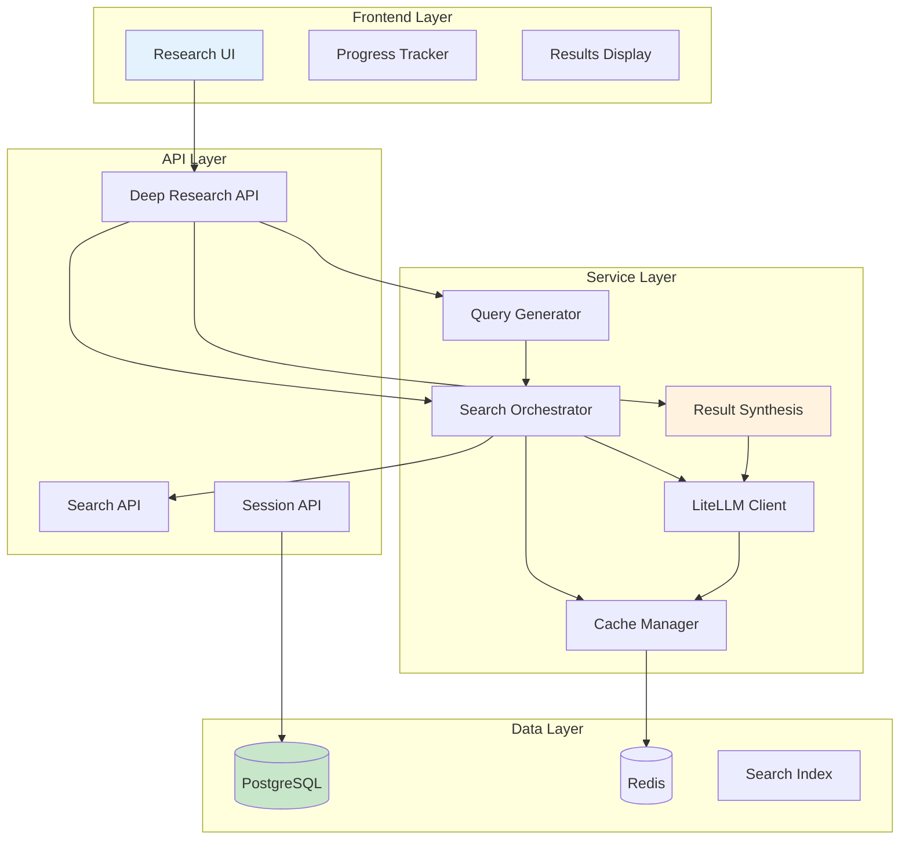

# Deep Research Engine - Product Requirements Document

## 📋 Executive Summary

**Release Name**: Deep Research Engine  
**Release Date**: Q2 2024  
**Primary Features**: Multi-Pass Analysis + Intelligent Query Generation + Comprehensive Synthesis  
**Target Users**: Researchers, Analysts, Content Creators, Knowledge Workers  

### Feature Overview
The Deep Research Engine transforms Crawlplexity's search capabilities into a comprehensive research platform using a sophisticated 4-phase analysis methodology. This system provides users with thorough, multi-perspective research results that go beyond surface-level information gathering.

---

## 🎯 Core Features

### 1. Multi-Pass Analysis System
- **Foundation Research**: Broad overview, academic sources, industry reports
- **Perspective Analysis**: Pro/con arguments, expert opinions, stakeholder views
- **Trend Analysis**: Recent developments, future predictions, market dynamics
- **Synthesis & Recommendations**: Comprehensive analysis, strategic insights

### 2. Intelligent Query Generation
- **Context-Aware Queries**: Automatically generate diverse search strategies
- **Phase-Specific Optimization**: Tailored queries for each research phase
- **Source Diversity**: Academic, industry, news, and expert sources
- **Query Refinement**: Iterative improvement based on initial results

### 3. Comprehensive Result Synthesis
- **Structured Analysis**: Executive summary, detailed analysis, recommendations
- **Citation Management**: Proper attribution and source tracking
- **Multi-Perspective Integration**: Balanced viewpoints and conflicting evidence
- **Actionable Insights**: Strategic recommendations and implementation guidance

### 4. Research Session Management
- **Session Tracking**: Monitor research progress and completion
- **Result Storage**: Persistent storage of research sessions and findings
- **Export Capabilities**: Export research results in multiple formats
- **Integration Points**: API access for external tool integration

---

## 🏗️ Technical Architecture

### System Overview



### Database Schema

```sql
-- Deep research sessions
CREATE TABLE deep_research_sessions (
    id UUID PRIMARY KEY DEFAULT gen_random_uuid(),
    user_id UUID REFERENCES users(id),
    query TEXT NOT NULL,
    status VARCHAR(50) DEFAULT 'pending',
    search_passes JSONB NOT NULL,
    results JSONB NOT NULL,
    analysis TEXT,
    metadata JSONB DEFAULT '{}',
    created_at TIMESTAMP DEFAULT NOW(),
    completed_at TIMESTAMP,
    expires_at TIMESTAMP
);

-- Research results cache
CREATE TABLE research_results_cache (
    id UUID PRIMARY KEY DEFAULT gen_random_uuid(),
    query_hash VARCHAR(64) UNIQUE NOT NULL,
    results JSONB NOT NULL,
    analysis TEXT,
    created_at TIMESTAMP DEFAULT NOW(),
    last_accessed TIMESTAMP DEFAULT NOW(),
    access_count INTEGER DEFAULT 1
);

-- Research citations
CREATE TABLE research_citations (
    id UUID PRIMARY KEY DEFAULT gen_random_uuid(),
    session_id UUID REFERENCES deep_research_sessions(id) ON DELETE CASCADE,
    source_url TEXT NOT NULL,
    source_title TEXT,
    source_type VARCHAR(50),
    citation_text TEXT,
    relevance_score FLOAT,
    phase_used VARCHAR(50),
    created_at TIMESTAMP DEFAULT NOW()
);
```

---

## 🔧 API Specifications

### Deep Research API

```typescript
interface DeepResearchAPI {
  // Start deep research session
  POST /api/deep-research
  {
    query: string;
    research_type?: 'comprehensive' | 'foundation' | 'perspective' | 'trend' | 'synthesis';
    max_sources_per_phase?: number;
    include_citations?: boolean;
  }
  
  Response: {
    session_id: string;
    status: 'pending' | 'in_progress' | 'completed' | 'failed';
    estimated_completion_time: number;
  }
  
  // Get research progress
  GET /api/deep-research/:sessionId
  
  Response: {
    session_id: string;
    status: 'pending' | 'in_progress' | 'completed' | 'failed';
    current_phase: number;
    total_phases: number;
    progress_percentage: number;
    current_activity: string;
    estimated_time_remaining: number;
  }
  
  // Get research results
  GET /api/deep-research/:sessionId/results
  
  Response: {
    session_id: string;
    query: string;
    status: 'completed';
    analysis: {
      executive_summary: string;
      detailed_analysis: AnalysisSection[];
      key_findings: string[];
      recommendations: Recommendation[];
      future_directions: string[];
    };
    sources: Source[];
    citations: Citation[];
    metadata: {
      total_sources: number;
      research_duration: number;
      phases_completed: string[];
    };
  }
  
  // List user's research sessions
  GET /api/deep-research/sessions?page=1&limit=20&status=completed
  
  // Export research results
  POST /api/deep-research/:sessionId/export
  {
    format: 'pdf' | 'markdown' | 'json' | 'html';
    include_sources?: boolean;
    include_citations?: boolean;
  }
}

interface AnalysisSection {
  title: string;
  content: string;
  key_points: string[];
  sources: string[];
}

interface Recommendation {
  title: string;
  description: string;
  priority: 'high' | 'medium' | 'low';
  implementation_notes: string;
  stakeholders: string[];
}

interface Source {
  url: string;
  title: string;
  type: 'academic' | 'industry' | 'news' | 'expert' | 'government';
  relevance_score: number;
  phase_used: string;
  summary: string;
}

interface Citation {
  id: string;
  source_url: string;
  source_title: string;
  citation_text: string;
  context: string;
  phase_used: string;
}
```

---

## 🧠 System Prompts

### Primary Deep Research Prompt

```typescript
const DEEP_RESEARCH_SYSTEM_PROMPT = `You are an expert research analyst conducting comprehensive deep research using Crawlplexity's multi-pass analysis system.

RESEARCH METHODOLOGY:
You will receive information from multiple search passes, each designed to uncover different aspects of the topic:

PASS 1 - FOUNDATION RESEARCH:
- Broad overview and basic facts
- Academic and scholarly sources
- Industry reports and white papers
- Historical context and background

PASS 2 - PERSPECTIVE ANALYSIS:
- Pro arguments and supporting evidence
- Con arguments and counterpoints
- Neutral analysis and balanced viewpoints
- Expert opinions and stakeholder perspectives

PASS 3 - TREND ANALYSIS:
- Recent developments and news
- Future predictions and forecasts
- Market trends and industry shifts
- Emerging technologies or methodologies

PASS 4 - SYNTHESIS & RECOMMENDATIONS:
- Comprehensive expert analysis
- Comparative studies and benchmarks
- Best practices and case studies
- Strategic recommendations

OUTPUT STRUCTURE:
Your response must follow this comprehensive structure:

# Executive Summary
- 2-3 sentence overview of key findings
- Most important insights and conclusions
- Critical recommendations

# Detailed Analysis

## Background & Context
- Historical development and current state
- Key definitions and terminology
- Scope and boundaries of the topic

## Current State Analysis
- Comprehensive overview of current situation
- Key players, technologies, or methodologies
- Market size, adoption rates, or relevant metrics
- Recent developments and breakthroughs

## Multi-Perspective Analysis
- Pro arguments and supporting evidence
- Con arguments and counterpoints
- Neutral analysis and balanced viewpoints
- Expert consensus and disagreements

## Trend Analysis & Future Outlook
- Recent trends and developments
- Future predictions and forecasts
- Emerging opportunities and challenges
- Market dynamics and competitive landscape

## Comparative Analysis
- Comparison with alternatives or competitors
- Benchmarking against industry standards
- Case studies and real-world examples
- Success factors and failure modes

# Strategic Insights

## Key Findings
- 5-7 most important discoveries
- Surprising insights or counterintuitive findings
- Gaps in current knowledge or research

## Recommendations
- Strategic recommendations for different stakeholders
- Implementation considerations
- Risk assessment and mitigation strategies
- Priority actions and timelines

## Future Directions
- Emerging opportunities and threats
- Research gaps and unanswered questions
- Predictions for next 1-3 years
- Long-term implications and considerations

# Technical Appendix
- Methodology and data sources
- Limitations and assumptions
- Additional resources and references
- Glossary of key terms

RESPONSE REQUIREMENTS:
- Be comprehensive but well-structured
- Include specific examples and case studies
- Provide actionable insights and recommendations
- Use markdown formatting for readability
- Include inline citations [1], [2], etc. for all claims
- Maintain academic rigor while being accessible
- Focus on practical implications and real-world applications
- Include both quantitative and qualitative analysis
- Address potential biases and limitations
- Provide multiple viewpoints and perspectives

CITATION FORMAT:
- Use [1], [2], [3] format for inline citations
- Citations should correspond to source order
- Include page numbers or sections when available
- Distinguish between primary and secondary sources

QUALITY STANDARDS:
- Fact-check all claims against multiple sources
- Acknowledge uncertainties and limitations
- Provide balanced perspectives on controversial topics
- Include both positive and negative aspects
- Consider ethical implications and societal impact
- Focus on evidence-based conclusions
- Avoid speculation without supporting evidence

SPECIAL CONSIDERATIONS:
- For technical topics: Include implementation details and code examples
- For business topics: Include market analysis and competitive landscape
- For scientific topics: Include methodology and peer-reviewed sources
- For policy topics: Include stakeholder analysis and implementation challenges
- For emerging technologies: Include adoption barriers and future potential

Remember: This is deep research - be thorough, comprehensive, and provide insights that go beyond surface-level analysis. Your goal is to be the definitive resource on this topic.`;
```

### Multi-Pass Query Generation Prompts

```typescript
const FOUNDATION_QUERY_PROMPT = `Generate 5 diverse search queries for foundational research on: "${query}"

Focus on:
- Broad overview and basic facts
- Academic and scholarly sources
- Industry reports and white papers
- Historical context and background

Queries should be:
- Specific enough to find relevant content
- Broad enough to capture different aspects
- Include academic, industry, and general sources
- Cover historical development and current state

Return only the queries, one per line, no numbering.`;

const PERSPECTIVE_QUERY_PROMPT = `Generate 6 search queries for multi-perspective analysis on: "${query}"

Create 2 queries each for:
1. PRO arguments and supporting evidence
2. CON arguments and counterpoints  
3. NEUTRAL analysis and expert opinions

Queries should:
- Capture different viewpoints and stakeholder perspectives
- Include expert opinions and case studies
- Cover both theoretical and practical aspects
- Address controversies and disagreements

Return only the queries, one per line, no numbering.`;

const TREND_QUERY_PROMPT = `Generate 5 search queries for trend analysis on: "${query}"

Focus on:
- Recent developments and news (last 6 months)
- Future predictions and forecasts
- Market trends and industry shifts
- Emerging technologies or methodologies

Queries should:
- Include time-based terms (recent, latest, emerging, future)
- Cover market dynamics and competitive landscape
- Address technological or methodological advances
- Include expert predictions and industry reports

Return only the queries, one per line, no numbering.`;

const SYNTHESIS_QUERY_PROMPT = `Generate 4 search queries for comprehensive synthesis on: "${query}"

Focus on:
- Expert analysis and comprehensive studies
- Comparative research and benchmarking
- Best practices and implementation guides
- Strategic recommendations and case studies

Queries should:
- Target high-quality, authoritative sources
- Include "comprehensive", "analysis", "expert" terms
- Cover implementation and practical applications
- Address strategic implications and recommendations

Return only the queries, one per line, no numbering.`;
```

---

## 🎨 User Experience Design

### Research Interface

```typescript
interface ResearchInterfaceProps {
  onStartResearch: (query: string, options: ResearchOptions) => void;
  onViewResults: (sessionId: string) => void;
  activeSessions: ResearchSession[];
  completedSessions: ResearchSession[];
}

// Main research interface
const ResearchInterface: React.FC<ResearchInterfaceProps> = ({
  onStartResearch,
  onViewResults,
  activeSessions,
  completedSessions
}) => {
  return (
    <div className="research-interface">
      {/* Research input */}
      <ResearchInput onStartResearch={onStartResearch} />
      
      {/* Active sessions */}
      <ActiveSessions 
        sessions={activeSessions}
        onViewResults={onViewResults}
      />
      
      {/* Completed sessions */}
      <CompletedSessions 
        sessions={completedSessions}
        onViewResults={onViewResults}
      />
    </div>
  );
};

// Research input component
const ResearchInput: React.FC<{ onStartResearch: Function }> = ({
  onStartResearch
}) => {
  const [query, setQuery] = useState('');
  const [options, setOptions] = useState({
    research_type: 'comprehensive',
    max_sources_per_phase: 10,
    include_citations: true
  });
  
  return (
    <div className="research-input">
      <div className="input-group">
        <label>Research Query</label>
        <textarea
          value={query}
          onChange={(e) => setQuery(e.target.value)}
          placeholder="Enter your research question..."
          rows={3}
        />
      </div>
      
      <div className="options-group">
        <label>Research Type</label>
        <select 
          value={options.research_type}
          onChange={(e) => setOptions({...options, research_type: e.target.value})}
        >
          <option value="comprehensive">Comprehensive (All 4 phases)</option>
          <option value="foundation">Foundation Only</option>
          <option value="perspective">Perspective Only</option>
          <option value="trend">Trend Only</option>
          <option value="synthesis">Synthesis Only</option>
        </select>
      </div>
      
      <button 
        onClick={() => onStartResearch(query, options)}
        disabled={!query.trim()}
      >
        Start Deep Research
      </button>
    </div>
  );
};
```

### Results Display

```typescript
// Research results component
const ResearchResults: React.FC<{ session: ResearchSession }> = ({
  session
}) => {
  return (
    <div className="research-results">
      <div className="results-header">
        <h2>Research Results: {session.query}</h2>
        <div className="metadata">
          <span>Completed: {session.completed_at}</span>
          <span>Sources: {session.metadata.total_sources}</span>
          <span>Duration: {session.metadata.research_duration}s</span>
        </div>
      </div>
      
      {/* Executive Summary */}
      <div className="executive-summary">
        <h3>Executive Summary</h3>
        <div dangerouslySetInnerHTML={{ __html: session.analysis.executive_summary }} />
      </div>
      
      {/* Detailed Analysis */}
      <div className="detailed-analysis">
        <h3>Detailed Analysis</h3>
        {session.analysis.detailed_analysis.map(section => (
          <div key={section.title} className="analysis-section">
            <h4>{section.title}</h4>
            <div dangerouslySetInnerHTML={{ __html: section.content }} />
            <div className="key-points">
              <h5>Key Points:</h5>
              <ul>
                {section.key_points.map((point, index) => (
                  <li key={index}>{point}</li>
                ))}
              </ul>
            </div>
          </div>
        ))}
      </div>
      
      {/* Strategic Insights */}
      <div className="strategic-insights">
        <h3>Strategic Insights</h3>
        
        <div className="key-findings">
          <h4>Key Findings</h4>
          <ul>
            {session.analysis.key_findings.map((finding, index) => (
              <li key={index}>{finding}</li>
            ))}
          </ul>
        </div>
        
        <div className="recommendations">
          <h4>Recommendations</h4>
          {session.analysis.recommendations.map((rec, index) => (
            <div key={index} className="recommendation">
              <h5>{rec.title}</h5>
              <p>{rec.description}</p>
              <div className="rec-meta">
                <span className="priority">{rec.priority}</span>
                <span className="stakeholders">{rec.stakeholders.join(', ')}</span>
              </div>
            </div>
          ))}
        </div>
      </div>
      
      {/* Sources */}
      <div className="sources">
        <h3>Sources</h3>
        {session.sources.map((source, index) => (
          <div key={index} className="source">
            <a href={source.url} target="_blank" rel="noopener noreferrer">
              {source.title}
            </a>
            <span className="source-type">{source.type}</span>
            <span className="relevance">Relevance: {source.relevance_score}</span>
            <p className="summary">{source.summary}</p>
          </div>
        ))}
      </div>
      
      {/* Export options */}
      <div className="export-options">
        <h3>Export Results</h3>
        <div className="export-buttons">
          <button onClick={() => exportResults('pdf')}>Export as PDF</button>
          <button onClick={() => exportResults('markdown')}>Export as Markdown</button>
          <button onClick={() => exportResults('json')}>Export as JSON</button>
        </div>
      </div>
    </div>
  );
};
```

---

## 🔍 Implementation Details

### Query Generation Service

```typescript
class QueryGenerationService {
  /**
   * Generate queries for a specific research phase
   */
  async generatePhaseQueries(
    query: string,
    phase: 'foundation' | 'perspective' | 'trend' | 'synthesis'
  ): Promise<string[]> {
    const prompts = {
      foundation: FOUNDATION_QUERY_PROMPT,
      perspective: PERSPECTIVE_QUERY_PROMPT,
      trend: TREND_QUERY_PROMPT,
      synthesis: SYNTHESIS_QUERY_PROMPT
    };
    
    const prompt = prompts[phase].replace('${query}', query);
    
    const response = await this.llmClient.generate({
      model: 'gpt-4',
      messages: [
        { role: 'system', content: 'You are a research query generator.' },
        { role: 'user', content: prompt }
      ],
      temperature: 0.7
    });
    
    return response.content
      .split('\n')
      .filter(line => line.trim())
      .map(line => line.replace(/^\d+\.\s*/, '').trim());
  }
  
  /**
   * Generate all queries for a comprehensive research session
   */
  async generateAllQueries(query: string): Promise<SearchPasses> {
    const [foundation, perspective, trend, synthesis] = await Promise.all([
      this.generatePhaseQueries(query, 'foundation'),
      this.generatePhaseQueries(query, 'perspective'),
      this.generatePhaseQueries(query, 'trend'),
      this.generatePhaseQueries(query, 'synthesis')
    ]);
    
    return {
      foundation,
      perspective,
      trend,
      synthesis
    };
  }
}
```

### Research Orchestrator

```typescript
class ResearchOrchestrator {
  /**
   * Execute a complete research session
   */
  async executeResearch(sessionId: string, query: string, options: ResearchOptions): Promise<void> {
    try {
      // Update session status
      await this.updateSessionStatus(sessionId, 'in_progress');
      
      // Generate queries
      const queryGen = new QueryGenerationService();
      const searchPasses = await queryGen.generateAllQueries(query);
      
      // Execute search passes
      const results = await this.executeSearchPasses(searchPasses, options);
      
      // Synthesize results
      const analysis = await this.synthesizeResults(query, results);
      
      // Save results
      await this.saveResearchResults(sessionId, {
        search_passes: searchPasses,
        results,
        analysis
      });
      
      // Update session status
      await this.updateSessionStatus(sessionId, 'completed');
      
    } catch (error) {
      await this.updateSessionStatus(sessionId, 'failed');
      throw error;
    }
  }
  
  /**
   * Execute individual search passes
   */
  private async executeSearchPasses(
    searchPasses: SearchPasses,
    options: ResearchOptions
  ): Promise<SearchResults> {
    const results: SearchResults = {};
    
    for (const [phase, queries] of Object.entries(searchPasses)) {
      const phaseResults = [];
      
      for (const query of queries) {
        const searchResults = await this.searchOrchestrator.search(query, {
          max_results: options.max_sources_per_phase,
          include_metadata: true
        });
        
        phaseResults.push(...searchResults);
      }
      
      // Deduplicate and rank results
      results[phase] = this.deduplicateAndRank(phaseResults);
    }
    
    return results;
  }
  
  /**
   * Synthesize results into comprehensive analysis
   */
  private async synthesizeResults(
    query: string,
    results: SearchResults
  ): Promise<ResearchAnalysis> {
    const synthesisPrompt = this.buildSynthesisPrompt(query, results);
    
    const response = await this.llmClient.generate({
      model: 'gpt-4',
      messages: [
        { role: 'system', content: DEEP_RESEARCH_SYSTEM_PROMPT },
        { role: 'user', content: synthesisPrompt }
      ],
      temperature: 0.3
    });
    
    return this.parseAnalysisResponse(response.content);
  }
}
```

---

## 📊 Success Metrics & KPIs

### Research Quality Metrics
- **Research Completion Rate**: Percentage of started research sessions that complete successfully
- **Average Research Duration**: Time from start to completion of research sessions
- **Source Quality Score**: Average relevance score of sources used in research
- **User Satisfaction Score**: User ratings of research result quality and usefulness

### Usage Metrics
- **Research Sessions per User**: Average number of research sessions per user per month
- **Query Complexity**: Average number of search passes per research session
- **Export Rate**: Percentage of research results that are exported
- **Session Reuse**: Number of times research sessions are accessed after completion

### Performance Metrics
- **Query Generation Time**: Average time to generate search queries
- **Search Execution Time**: Average time per search pass
- **Synthesis Time**: Average time to synthesize results into analysis
- **Cache Hit Rate**: Percentage of research queries served from cache

---

## 🚀 Implementation Timeline

### Phase 1: Core Infrastructure (Weeks 1-2)
- [ ] Database schema implementation
- [ ] Basic API endpoints for research sessions
- [ ] Query generation service
- [ ] Integration with existing search infrastructure

### Phase 2: Multi-Pass System (Weeks 3-4)
- [ ] Implementation of 4-phase research methodology
- [ ] Search pass orchestration
- [ ] Result aggregation and deduplication
- [ ] Progress tracking and status updates

### Phase 3: Synthesis Engine (Weeks 5-6)
- [ ] Result synthesis implementation
- [ ] Analysis formatting and structure
- [ ] Citation management system
- [ ] Export functionality

### Phase 4: User Interface (Weeks 7-8)
- [ ] Research input interface
- [ ] Progress tracking UI
- [ ] Results display components
- [ ] Export options interface

### Phase 5: Testing & Optimization (Weeks 9-10)
- [ ] Performance testing and optimization
- [ ] Quality assurance testing
- [ ] User acceptance testing
- [ ] Documentation and training materials

---

## 🔒 Security Considerations

### Access Control
- **Session Privacy**: Research sessions are private to the user by default
- **API Rate Limiting**: Prevent abuse of research generation features
- **Data Retention**: Configurable retention policies for research sessions
- **Export Controls**: Secure export generation and download

### Data Protection
- **Query Privacy**: Encrypt sensitive research queries
- **Result Security**: Secure storage and transmission of research results
- **Cache Security**: Secure caching of research results
- **Audit Logging**: Track research session access and usage

---

## 📈 Future Enhancements

### Phase 2 Features
- **Custom Research Templates**: Pre-defined research frameworks for specific domains
- **Collaborative Research**: Multi-user research sessions with shared results
- **Advanced Filtering**: Filter research results by source type, date, relevance
- **Research Comparison**: Compare results from different research sessions

### Phase 3 Features
- **AI-Powered Insights**: Additional AI analysis of research results
- **Research Workflows**: Automated research pipelines and workflows
- **Integration APIs**: Connect with external research tools and databases
- **Mobile Research**: Mobile-optimized research interface

---

## 🔑 Key Implementation Notes

### Integration Points
1. **Search Orchestrator**: Leverage existing search infrastructure for query execution
2. **LiteLLM Client**: Use existing LLM integration for query generation and synthesis
3. **Cache Manager**: Implement intelligent caching for research results
4. **User System**: Integrate with existing user authentication and session management

### Performance Considerations
1. **Asynchronous Processing**: Research sessions should be processed asynchronously
2. **Caching Strategy**: Cache query generation and search results appropriately
3. **Rate Limiting**: Implement rate limiting for research generation
4. **Resource Management**: Monitor and optimize resource usage during research execution

### Quality Assurance
1. **Query Validation**: Validate generated queries for relevance and quality
2. **Result Filtering**: Filter and rank search results for quality
3. **Synthesis Validation**: Validate synthesis output for accuracy and completeness
4. **User Feedback**: Collect and incorporate user feedback for continuous improvement

---

## 📝 Conclusion

The Deep Research Engine provides a sophisticated, multi-pass research system that transforms Crawlplexity's search capabilities into a comprehensive research platform. By implementing a structured 4-phase methodology with intelligent query generation and comprehensive result synthesis, this feature delivers research results that go far beyond simple search.

Key success factors include:
- Robust multi-pass analysis methodology
- Intelligent query generation for diverse perspectives
- Comprehensive result synthesis with actionable insights
- Seamless integration with existing Crawlplexity infrastructure
- Scalable architecture for handling multiple concurrent research sessions

This feature positions Crawlplexity as a powerful research tool suitable for academics, analysts, content creators, and knowledge workers who need thorough, multi-perspective analysis of complex topics. 