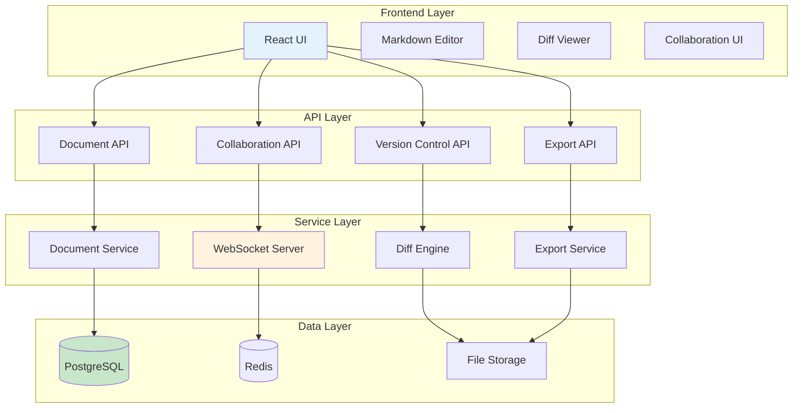

# Document Builder - Product Requirements Document

## 📋 Executive Summary

**Release Name**: Document Builder  
**Release Date**: Q2 2024  
**Primary Features**: Document Management + Version Control + Real-Time Collaboration + Export  
**Target Users**: Content Creators, Teams, Knowledge Workers, Researchers  

### Feature Overview
The Document Builder transforms Crawlplexity into a comprehensive document management platform featuring real-time collaboration, version control, and intelligent content organization. This system enables users to create, edit, and manage documents with powerful collaboration capabilities and seamless export options.

---

## 🎯 Core Features

### 1. Document Management System
- **Markdown-First Editor**: Native markdown editing with live preview
- **Thread Organization**: Hierarchical content structure with sections and subsections
- **Rich Media Support**: Images, charts, code blocks, and embedded content
- **Template System**: Pre-built templates for common document types

### 2. Version Control System
- **Git-Like Workflow**: Commit, branch, merge, and rollback capabilities
- **Visual Diffs**: Side-by-side comparison with syntax highlighting
- **Change Tracking**: Detailed logs of all modifications with author attribution
- **Conflict Resolution**: Smart merging for concurrent edits

### 3. Real-Time Collaboration
- **Live Editing**: Multiple users editing simultaneously
- **Presence Indicators**: Show who's currently editing
- **Cursor Tracking**: Real-time cursor position sharing
- **Comment System**: Inline comments and threaded discussions

### 4. Export & Sharing
- **Multiple Formats**: PDF, Word, HTML, Markdown export
- **Public Sharing**: Generate shareable links with configurable permissions
- **Embedding**: Embed documents in external websites
- **API Access**: Programmatic document access for integrations

---

## 🏗️ Technical Architecture

### System Overview



### Database Schema

```sql
-- Documents table
CREATE TABLE documents (
    id UUID PRIMARY KEY DEFAULT gen_random_uuid(),
    title VARCHAR(255) NOT NULL,
    content TEXT NOT NULL,
    markdown_content TEXT NOT NULL,
    metadata JSONB DEFAULT '{}',
    created_at TIMESTAMP DEFAULT NOW(),
    updated_at TIMESTAMP DEFAULT NOW(),
    created_by UUID REFERENCES users(id),
    is_public BOOLEAN DEFAULT FALSE,
    template_id UUID REFERENCES document_templates(id),
    status VARCHAR(50) DEFAULT 'draft'
);

-- Document versions table
CREATE TABLE document_versions (
    id UUID PRIMARY KEY DEFAULT gen_random_uuid(),
    document_id UUID REFERENCES documents(id) ON DELETE CASCADE,
    version_number INTEGER NOT NULL,
    content TEXT NOT NULL,
    markdown_content TEXT NOT NULL,
    diff_data JSONB,
    commit_message TEXT,
    created_at TIMESTAMP DEFAULT NOW(),
    created_by UUID REFERENCES users(id),
    UNIQUE(document_id, version_number)
);

-- Document threads (sections)
CREATE TABLE document_threads (
    id UUID PRIMARY KEY DEFAULT gen_random_uuid(),
    document_id UUID REFERENCES documents(id) ON DELETE CASCADE,
    title VARCHAR(255) NOT NULL,
    content TEXT,
    markdown_content TEXT,
    order_index INTEGER NOT NULL,
    parent_thread_id UUID REFERENCES document_threads(id),
    created_at TIMESTAMP DEFAULT NOW(),
    updated_at TIMESTAMP DEFAULT NOW()
);

-- Collaboration sessions
CREATE TABLE collaboration_sessions (
    id UUID PRIMARY KEY DEFAULT gen_random_uuid(),
    document_id UUID REFERENCES documents(id) ON DELETE CASCADE,
    user_id UUID REFERENCES users(id),
    session_token VARCHAR(255) UNIQUE NOT NULL,
    last_active TIMESTAMP DEFAULT NOW(),
    cursor_position JSONB,
    is_active BOOLEAN DEFAULT TRUE
);

-- Comments
CREATE TABLE document_comments (
    id UUID PRIMARY KEY DEFAULT gen_random_uuid(),
    document_id UUID REFERENCES documents(id) ON DELETE CASCADE,
    thread_id UUID REFERENCES document_threads(id),
    user_id UUID REFERENCES users(id),
    content TEXT NOT NULL,
    position JSONB,
    created_at TIMESTAMP DEFAULT NOW(),
    updated_at TIMESTAMP DEFAULT NOW()
);

-- Document templates
CREATE TABLE document_templates (
    id UUID PRIMARY KEY DEFAULT gen_random_uuid(),
    name VARCHAR(255) NOT NULL,
    description TEXT,
    template_content TEXT NOT NULL,
    category VARCHAR(100),
    is_public BOOLEAN DEFAULT FALSE,
    created_by UUID REFERENCES users(id),
    created_at TIMESTAMP DEFAULT NOW()
);

-- Document shares
CREATE TABLE document_shares (
    id UUID PRIMARY KEY DEFAULT gen_random_uuid(),
    document_id UUID REFERENCES documents(id) ON DELETE CASCADE,
    share_token VARCHAR(255) UNIQUE NOT NULL,
    permissions VARCHAR(50) DEFAULT 'read',
    expires_at TIMESTAMP,
    created_at TIMESTAMP DEFAULT NOW(),
    created_by UUID REFERENCES users(id)
);
```

---

## 🔧 API Specifications

### Document Management API

```typescript
interface DocumentAPI {
  // Create new document
  POST /api/documents
  {
    title: string;
    content?: string;
    template_id?: string;
    is_public?: boolean;
  }
  
  Response: {
    id: string;
    title: string;
    content: string;
    markdown_content: string;
    created_at: string;
    created_by: string;
  }
  
  // Get document
  GET /api/documents/:id
  Response: {
    id: string;
    title: string;
    content: string;
    markdown_content: string;
    metadata: object;
    created_at: string;
    updated_at: string;
    created_by: string;
    is_public: boolean;
    threads: Thread[];
    versions: Version[];
    collaborators: Collaborator[];
  }
  
  // Update document
  PUT /api/documents/:id
  {
    title?: string;
    content?: string;
    markdown_content?: string;
    metadata?: object;
  }
  
  // Delete document
  DELETE /api/documents/:id
  
  // List documents
  GET /api/documents?page=1&limit=20&filter=my
  Response: {
    documents: Document[];
    total: number;
    page: number;
    limit: number;
  }
}

// Version Control API
interface VersionAPI {
  // Get version history
  GET /api/documents/:id/versions
  Response: {
    versions: Version[];
    total: number;
  }
  
  // Create new version
  POST /api/documents/:id/versions
  {
    content: string;
    markdown_content: string;
    commit_message: string;
  }
  
  // Get specific version
  GET /api/documents/:id/versions/:versionNumber
  Response: {
    version: Version;
    diff: DiffResult;
  }
  
  // Compare versions
  GET /api/documents/:id/versions/compare?from=1&to=2
  Response: {
    diff: DiffResult;
    summary: DiffSummary;
  }
  
  // Restore version
  POST /api/documents/:id/versions/:versionNumber/restore
  {
    commit_message?: string;
  }
}

// Collaboration API
interface CollaborationAPI {
  // Join collaboration session
  POST /api/documents/:id/collaborate
  {
    session_token: string;
  }
  
  // Update cursor position
  PUT /api/documents/:id/collaborate/cursor
  {
    position: { line: number; ch: number };
  }
  
  // Add comment
  POST /api/documents/:id/comments
  {
    content: string;
    position?: { line: number; ch: number };
    thread_id?: string;
  }
  
  // Get comments
  GET /api/documents/:id/comments
  Response: {
    comments: Comment[];
  }
  
  // Update comment
  PUT /api/documents/:id/comments/:commentId
  {
    content: string;
  }
  
  // Delete comment
  DELETE /api/documents/:id/comments/:commentId
}

// Export API
interface ExportAPI {
  // Export document
  POST /api/documents/:id/export
  {
    format: 'pdf' | 'docx' | 'html' | 'markdown';
    include_comments?: boolean;
    include_versions?: boolean;
    include_metadata?: boolean;
  }
  
  Response: {
    export_id: string;
    status: 'pending' | 'processing' | 'completed' | 'failed';
    download_url?: string;
  }
  
  // Get export status
  GET /api/documents/:id/export/:exportId
  
  // Generate shareable link
  POST /api/documents/:id/share
  {
    expires_at?: string;
    permissions: 'read' | 'write' | 'comment';
  }
  
  Response: {
    share_token: string;
    share_url: string;
    expires_at: string;
  }
  
  // Get shared document
  GET /api/shared/:shareToken
  Response: {
    document: Document;
    permissions: string;
    expires_at: string;
  }
}

// Template API
interface TemplateAPI {
  // List templates
  GET /api/templates?category=all&public=true
  Response: {
    templates: Template[];
  }
  
  // Get template
  GET /api/templates/:id
  Response: {
    template: Template;
  }
  
  // Create template
  POST /api/templates
  {
    name: string;
    description: string;
    template_content: string;
    category: string;
    is_public: boolean;
  }
}
```

### WebSocket Events

```typescript
interface WebSocketEvents {
  // Document changes
  'document:update': {
    document_id: string;
    content: string;
    markdown_content: string;
    updated_at: string;
    user_id: string;
  };
  
  // Cursor movements
  'cursor:update': {
    document_id: string;
    user_id: string;
    position: { line: number; ch: number };
    username: string;
  };
  
  // Comments
  'comment:add': {
    document_id: string;
    comment: Comment;
  };
  
  'comment:update': {
    document_id: string;
    comment_id: string;
    content: string;
  };
  
  'comment:delete': {
    document_id: string;
    comment_id: string;
  };
  
  // User presence
  'presence:update': {
    document_id: string;
    users: Array<{
      user_id: string;
      username: string;
      last_active: string;
    }>;
  };
  
  // User joined/left
  'user:joined': {
    document_id: string;
    user_id: string;
    username: string;
  };
  
  'user:left': {
    document_id: string;
    user_id: string;
    username: string;
  };
}
```

---

## 🎨 User Experience Design

### Document Editor Interface

```typescript
interface DocumentEditorProps {
  document: Document;
  onSave: (content: string, markdown: string) => void;
  onVersionCreate: (commitMessage: string) => void;
  collaborators: Collaborator[];
  comments: Comment[];
}

// Main editor layout
const DocumentEditor: React.FC<DocumentEditorProps> = ({
  document,
  onSave,
  onVersionCreate,
  collaborators,
  comments
}) => {
  return (
    <div className="document-editor">
      {/* Header */}
      <DocumentHeader 
        title={document.title}
        collaborators={collaborators}
        onSave={onSave}
        onVersionCreate={onVersionCreate}
      />
      
      {/* Main content area */}
      <div className="editor-content">
        {/* Thread navigation */}
        <ThreadSidebar threads={document.threads} />
        
        {/* Markdown editor */}
        <MarkdownEditor
          content={document.markdown_content}
          onChange={onSave}
          comments={comments}
          collaborators={collaborators}
        />
        
        {/* Comments panel */}
        <CommentsPanel comments={comments} />
      </div>
      
      {/* Version history */}
      <VersionHistory documentId={document.id} />
    </div>
  );
};

// Document header component
const DocumentHeader: React.FC<{
  title: string;
  collaborators: Collaborator[];
  onSave: Function;
  onVersionCreate: Function;
}> = ({ title, collaborators, onSave, onVersionCreate }) => {
  const [showVersionDialog, setShowVersionDialog] = useState(false);
  const [commitMessage, setCommitMessage] = useState('');
  
  return (
    <div className="document-header">
      <div className="header-left">
        <input
          type="text"
          value={title}
          className="document-title"
          placeholder="Untitled Document"
        />
      </div>
      
      <div className="header-center">
        <div className="collaborators">
          {collaborators.map(collaborator => (
            <div key={collaborator.user_id} className="collaborator">
              <span className="avatar">{collaborator.username[0]}</span>
              <span className="username">{collaborator.username}</span>
            </div>
          ))}
        </div>
      </div>
      
      <div className="header-right">
        <button onClick={() => onSave()}>Save</button>
        <button onClick={() => setShowVersionDialog(true)}>
          Create Version
        </button>
      </div>
      
      {/* Version creation dialog */}
      {showVersionDialog && (
        <div className="version-dialog">
          <h3>Create New Version</h3>
          <textarea
            value={commitMessage}
            onChange={(e) => setCommitMessage(e.target.value)}
            placeholder="Describe your changes..."
            rows={3}
          />
          <div className="dialog-actions">
            <button onClick={() => setShowVersionDialog(false)}>Cancel</button>
            <button 
              onClick={() => {
                onVersionCreate(commitMessage);
                setShowVersionDialog(false);
                setCommitMessage('');
              }}
              disabled={!commitMessage.trim()}
            >
              Create Version
            </button>
          </div>
        </div>
      )}
    </div>
  );
};
```

### Markdown Editor Component

```typescript
// Markdown editor with collaboration
const MarkdownEditor: React.FC<{
  content: string;
  onChange: (content: string, markdown: string) => void;
  comments: Comment[];
  collaborators: Collaborator[];
}> = ({ content, onChange, comments, collaborators }) => {
  const [localContent, setLocalContent] = useState(content);
  const [cursorPosition, setCursorPosition] = useState({ line: 0, ch: 0 });
  
  // Debounced save
  const debouncedSave = useCallback(
    debounce((newContent: string) => {
      onChange(newContent, newContent); // Convert markdown to HTML if needed
    }, 1000),
    [onChange]
  );
  
  const handleChange = (newContent: string) => {
    setLocalContent(newContent);
    debouncedSave(newContent);
  };
  
  const handleCursorChange = (position: { line: number; ch: number }) => {
    setCursorPosition(position);
    // Broadcast cursor position to collaborators
    socket.emit('cursor:update', { position });
  };
  
  return (
    <div className="markdown-editor">
      <div className="editor-toolbar">
        <button onClick={() => insertText('**bold**')}>Bold</button>
        <button onClick={() => insertText('*italic*')}>Italic</button>
        <button onClick={() => insertText('# Heading')}>Heading</button>
        <button onClick={() => insertText('- List item')}>List</button>
        <button onClick={() => insertText('[Link](url)')}>Link</button>
        <button onClick={() => insertText('')}>Image</button>
      </div>
      
      <div className="editor-content">
        <textarea
          value={localContent}
          onChange={(e) => handleChange(e.target.value)}
          onKeyUp={(e) => {
            const textarea = e.target as HTMLTextAreaElement;
            const position = getCursorPosition(textarea);
            handleCursorChange(position);
          }}
          placeholder="Start writing your document..."
          className="markdown-textarea"
        />
        
        {/* Live preview */}
        <div className="markdown-preview">
          <ReactMarkdown>{localContent}</ReactMarkdown>
        </div>
      </div>
      
      {/* Comments overlay */}
      <CommentsOverlay comments={comments} />
      
      {/* Collaborator cursors */}
      <CollaboratorCursors collaborators={collaborators} />
    </div>
  );
};
```

---

## 🔍 Version Control Implementation

### Diff Engine

```typescript
class DiffEngine {
  /**
   * Generate diff between two markdown documents
   */
  generateDiff(oldContent: string, newContent: string): DiffResult {
    const oldLines = oldContent.split('\n');
    const newLines = newContent.split('\n');
    
    const diff = this.computeDiff(oldLines, newLines);
    
    return {
      additions: diff.additions,
      deletions: diff.deletions,
      modifications: diff.modifications,
      summary: this.generateSummary(diff),
      html: this.generateHtmlDiff(diff),
      raw: diff
    };
  }
  
  /**
   * Compute line-by-line diff using Myers algorithm
   */
  private computeDiff(oldLines: string[], newLines: string[]): LineDiff {
    // Implementation of Myers diff algorithm
    // Returns array of operations: 'add', 'delete', 'equal', 'modify'
  }
  
  /**
   * Generate human-readable summary
   */
  private generateSummary(diff: LineDiff): DiffSummary {
    const additions = diff.filter(op => op.type === 'add').length;
    const deletions = diff.filter(op => op.type === 'delete').length;
    const modifications = diff.filter(op => op.type === 'modify').length;
    
    return {
      additions,
      deletions,
      modifications,
      totalChanges: additions + deletions + modifications
    };
  }
  
  /**
   * Generate HTML diff for display
   */
  private generateHtmlDiff(diff: LineDiff): string {
    return diff.map(operation => {
      switch (operation.type) {
        case 'add':
          return `<div class="diff-add">+ ${operation.content}</div>`;
        case 'delete':
          return `<div class="diff-delete">- ${operation.content}</div>`;
        case 'equal':
          return `<div class="diff-equal">  ${operation.content}</div>`;
        case 'modify':
          return `
            <div class="diff-modify">
              <div class="diff-old">- ${operation.oldContent}</div>
              <div class="diff-new">+ ${operation.newContent}</div>
            </div>
          `;
      }
    }).join('\n');
  }
}
```

### Version Management

```typescript
class VersionManager {
  /**
   * Create new version
   */
  async createVersion(
    documentId: string,
    content: string,
    markdownContent: string,
    commitMessage: string,
    userId: string
  ): Promise<DocumentVersion> {
    // Get current version number
    const currentVersion = await this.getCurrentVersion(documentId);
    const newVersionNumber = currentVersion + 1;
    
    // Generate diff
    const diffEngine = new DiffEngine();
    const diff = diffEngine.generateDiff(
      currentVersion.content,
      content
    );
    
    // Create version record
    const version = await this.db.documentVersions.create({
      document_id: documentId,
      version_number: newVersionNumber,
      content,
      markdown_content: markdownContent,
      diff_data: diff.raw,
      commit_message: commitMessage,
      created_by: userId
    });
    
    // Update document
    await this.db.documents.update({
      where: { id: documentId },
      data: {
        content,
        markdown_content: markdownContent,
        updated_at: new Date()
      }
    });
    
    return version;
  }
  
  /**
   * Compare two versions
   */
  async compareVersions(
    documentId: string,
    fromVersion: number,
    toVersion: number
  ): Promise<DiffResult> {
    const [fromDoc, toDoc] = await Promise.all([
      this.db.documentVersions.findOne({
        where: { document_id: documentId, version_number: fromVersion }
      }),
      this.db.documentVersions.findOne({
        where: { document_id: documentId, version_number: toVersion }
      })
    ]);
    
    const diffEngine = new DiffEngine();
    return diffEngine.generateDiff(fromDoc.content, toDoc.content);
  }
  
  /**
   * Restore to previous version
   */
  async restoreVersion(
    documentId: string,
    versionNumber: number,
    userId: string
  ): Promise<void> {
    const version = await this.db.documentVersions.findOne({
      where: { document_id: documentId, version_number: versionNumber }
    });
    
    // Create new version with restored content
    await this.createVersion(
      documentId,
      version.content,
      version.markdown_content,
      `Restored to version ${versionNumber}`,
      userId
    );
  }
}
```

---

## 🤝 Collaboration System

### Real-Time Collaboration

```typescript
class CollaborationManager {
  private io: SocketIO.Server;
  private sessions: Map<string, CollaborationSession> = new Map();
  
  constructor(io: SocketIO.Server) {
    this.io = io;
    this.setupEventHandlers();
  }
  
  /**
   * Setup WebSocket event handlers
   */
  private setupEventHandlers() {
    this.io.on('connection', (socket) => {
      // Join document collaboration
      socket.on('join-document', async (data) => {
        const { documentId, userId, sessionToken } = data;
        
        await this.joinDocument(socket, documentId, userId, sessionToken);
      });
      
      // Handle cursor updates
      socket.on('cursor-update', (data) => {
        const { documentId, position } = data;
        this.broadcastCursorUpdate(documentId, socket.id, position);
      });
      
      // Handle document changes
      socket.on('document-change', async (data) => {
        const { documentId, content, markdownContent } = data;
        await this.handleDocumentChange(documentId, content, markdownContent, socket.id);
      });
      
      // Handle comments
      socket.on('add-comment', async (data) => {
        const { documentId, content, position } = data;
        await this.addComment(documentId, content, position, socket.id);
      });
      
      // Handle disconnection
      socket.on('disconnect', () => {
        this.handleDisconnect(socket.id);
      });
    });
  }
  
  /**
   * Join document collaboration session
   */
  private async joinDocument(
    socket: Socket,
    documentId: string,
    userId: string,
    sessionToken: string
  ) {
    // Validate session token
    const session = await this.validateSession(documentId, userId, sessionToken);
    if (!session) {
      socket.emit('error', { message: 'Invalid session' });
      return;
    }
    
    // Join socket room
    socket.join(documentId);
    
    // Add to active sessions
    this.sessions.set(socket.id, {
      documentId,
      userId,
      sessionToken,
      socket
    });
    
    // Send current document state
    const document = await this.getDocument(documentId);
    socket.emit('document-state', document);
    
    // Broadcast user joined
    socket.to(documentId).emit('user-joined', {
      userId,
      username: await this.getUsername(userId)
    });
    
    // Send current collaborators
    const collaborators = await this.getActiveCollaborators(documentId);
    socket.emit('collaborators-update', collaborators);
  }
  
  /**
   * Handle document changes
   */
  private async handleDocumentChange(
    documentId: string,
    content: string,
    markdownContent: string,
    socketId: string
  ) {
    // Update document in database
    await this.updateDocument(documentId, content, markdownContent);
    
    // Broadcast to other collaborators
    const session = this.sessions.get(socketId);
    if (session) {
      this.io.to(documentId).emit('document-update', {
        content,
        markdownContent,
        updatedAt: new Date(),
        userId: session.userId
      });
    }
  }
  
  /**
   * Broadcast cursor updates
   */
  private broadcastCursorUpdate(
    documentId: string,
    socketId: string,
    position: CursorPosition
  ) {
    const session = this.sessions.get(socketId);
    if (session) {
      this.io.to(documentId).emit('cursor-update', {
        userId: session.userId,
        username: session.username,
        position,
        timestamp: new Date()
      });
    }
  }
}
```

---

## 📊 Success Metrics & KPIs

### User Engagement Metrics
- **Document Creation Rate**: Number of documents created per user per month
- **Collaboration Rate**: Percentage of documents with multiple collaborators
- **Version Control Usage**: Average number of versions per document
- **Export Rate**: Number of documents exported per month
- **Session Duration**: Average time spent editing documents

### Quality Metrics
- **Document Completion Rate**: Percentage of documents marked as complete
- **Collaboration Effectiveness**: Time to complete collaborative documents
- **Version Control Efficiency**: Time saved through version management
- **User Satisfaction Score**: User ratings of collaboration experience

### Performance Metrics
- **Real-Time Sync Latency**: Average time for changes to sync across collaborators
- **Document Load Time**: Time to load document with full history
- **Export Generation Time**: Time to generate exports in various formats
- **WebSocket Connection Stability**: Uptime and reliability of real-time features

---

## 🚀 Implementation Timeline

### Phase 1: Core Infrastructure (Weeks 1-3)
- [ ] Database schema implementation
- [ ] Basic document CRUD operations
- [ ] Markdown editor integration
- [ ] Version control system
- [ ] Basic API endpoints

### Phase 2: Collaboration Features (Weeks 4-6)
- [ ] WebSocket server implementation
- [ ] Real-time collaboration system
- [ ] Cursor tracking and presence indicators
- [ ] Comment system
- [ ] Conflict resolution

### Phase 3: Advanced Features (Weeks 7-9)
- [ ] Thread organization system
- [ ] Template system
- [ ] Export functionality
- [ ] Public sharing features
- [ ] Advanced diff visualization

### Phase 4: Testing & Optimization (Weeks 10-12)
- [ ] Performance testing and optimization
- [ ] Security audit and testing
- [ ] User acceptance testing
- [ ] Documentation and training materials
- [ ] Production deployment

---

## 🔒 Security Considerations

### Access Control
- **Document Permissions**: Granular read/write/comment permissions
- **Session Management**: Secure session tokens with expiration
- **API Rate Limiting**: Prevent abuse of collaboration features
- **Data Encryption**: Encrypt sensitive document content

### Collaboration Security
- **Real-Time Validation**: Validate changes before broadcasting
- **Conflict Resolution**: Handle concurrent edit conflicts gracefully
- **Audit Logging**: Track all document changes and access
- **Backup Systems**: Automatic backup of document versions

---

## 📈 Future Enhancements

### Phase 2 Features
- **AI-Powered Suggestions**: Intelligent content recommendations
- **Advanced Templates**: Industry-specific document templates
- **Integration APIs**: Connect with external tools and services
- **Mobile Support**: Responsive design for mobile devices

### Phase 3 Features
- **Advanced Analytics**: Document usage and collaboration analytics
- **Workflow Automation**: Automated document review and approval
- **Multi-Language Support**: Internationalization and localization
- **Enterprise Features**: SSO, LDAP integration, advanced permissions

---

## 🔑 Key Implementation Notes

### Version Control Features
1. **Git-Like Workflow**: Commit, branch, merge, and rollback capabilities
2. **Visual Diffs**: Side-by-side comparison with syntax highlighting
3. **Change Tracking**: Detailed logs of all modifications with author attribution
4. **Conflict Resolution**: Smart merging for concurrent edits

### Collaboration System
1. **Real-Time Sync**: WebSocket-based live collaboration
2. **Presence Indicators**: Show who's currently editing
3. **Comment System**: Inline comments and threaded discussions
4. **Conflict Handling**: Automatic conflict detection and resolution

### Export & Sharing
1. **Multiple Formats**: PDF, Word, HTML, Markdown export
2. **Public Links**: Generate shareable URLs with configurable permissions
3. **Embedding**: Embed documents in external websites
4. **API Access**: Programmatic access for integrations

### Future Integration Points
1. **Deep Research Integration**: Future integration with Deep Research Engine
2. **External Tools**: Integration with popular document and collaboration tools
3. **Analytics**: Advanced usage analytics and insights
4. **Mobile Apps**: Native mobile applications for document editing

---

## 📝 Conclusion

The Document Builder provides a comprehensive document management platform with powerful collaboration capabilities, version control, and export features. By implementing real-time collaboration, sophisticated version control, and seamless export options, this feature transforms Crawlplexity into a complete document creation and management solution.

Key success factors include:
- Seamless real-time collaboration that enhances team productivity
- Version control that preserves document history and enables experimentation
- Export capabilities that support various use cases and workflows
- Scalable architecture that supports enterprise-level usage

This feature set positions Crawlplexity as a comprehensive document management platform suitable for teams, content creators, and knowledge workers who need powerful collaboration and version control capabilities.

**Note**: This Document Builder is designed to work independently but can be enhanced in the future with integration to the Deep Research Engine for seamless research-to-document workflows. 