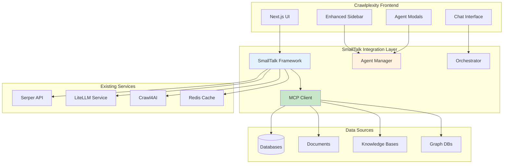
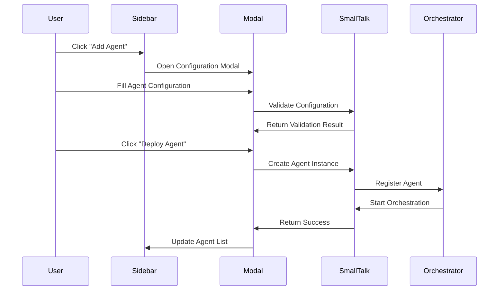

# SmallTalk Integration PRD
## Product Requirements Document

**Document Version:** 1.0  
**Date:** December 2024  
**Project:** Crawlplexity - SmallTalk Framework Integration  
**Status:** Draft

---

## 📋 Executive Summary

**Release Name**: SmallTalk Integration for Crawlplexity  
**Release Date**: Q1 2025  
**Primary Features**: Agent Management + Orchestration + Agentic Workflows + MCP Integration  
**Target Users**: Developers, Data Engineers, AI Practitioners, Business Users  

### Feature Overview
This PRD outlines the integration of the SmallTalk framework into Crawlplexity, leveraging SmallTalk's existing MCP client capabilities and agent orchestration system to accelerate development of both the MCP Client and Specialized Agents PRDs. This integration will provide a unified platform for agent management, orchestration, and agentic workflows while significantly reducing development time.

### Key Objectives
- **Reduce Development Time**: 60-70% reduction in development time for MCP Client and Specialized Agents features
- **Leverage Existing Capabilities**: Utilize SmallTalk's built-in MCP client and agent orchestration
- **Unified Agent Management**: Provide intuitive UI for agent deployment and management
- **Agentic Workflows**: Enable agent-based workflows in the chat interface
- **Seamless Integration**: Maintain Crawlplexity's existing functionality while adding new capabilities

---

## 🎯 References to Existing PRDs

### MCP Client PRD Integration
**Reference**: `prd/MCP_Client_PRD.md`

**Relevant Sections**:
- **Section 1.1**: Data Source Connectors (PostgreSQL, MySQL, MongoDB, etc.)
- **Section 1.2**: Document Processing Pipeline (PDF, DOCX parsing)
- **Section 1.3**: Knowledge Base Connectors (Confluence, Notion APIs)
- **Section 1.4**: Graph Database Support (Neo4j, ArangoDB)

**Integration Approach**: SmallTalk already includes MCP client capabilities, eliminating the need to build these connectors from scratch. This integration will leverage SmallTalk's existing MCP implementation and extend it for Crawlplexity's specific needs.

### Specialized Agents PRD Integration
**Reference**: `prd/Specialized_Agents_PRD.md`

**Relevant Sections**:
- **Section 2.1**: Gmail Agent (monitoring, sentiment analysis, entity extraction)
- **Section 2.2**: ETL Log Agent (log analysis, anomaly detection, performance monitoring)
- **Section 2.3**: Social Media Agent (mention tracking, sentiment analysis, trend monitoring)
- **Section 2.4**: Sales Intelligence Agent (lead scoring, competitor analysis, market trends)

**Integration Approach**: SmallTalk's agent orchestration system will be used to implement these specialized agents, providing the framework for agent management, deployment, and coordination.

### Combined System PRD Integration
**Reference**: `prd/Combined_System_PRD.md`

**Relevant Sections**:
- **Section 1.1**: Unified System Architecture
- **Section 2.1**: Unified Workflow System
- **Section 4.1**: Unified User Interface

**Integration Approach**: This PRD will implement the unified system architecture by integrating SmallTalk as the core orchestration engine, providing the foundation for the combined system described in the Combined System PRD.

---

## 🏗️ Technical Architecture

### System Overview



### SmallTalk Repository Integration

```yaml
# SmallTalk Repository Configuration
repository:
  url: "https://github.com/gyasis/smalltalk"
  branch: "main"
  installation_path: "./smalltalk-integration"
  
dependencies:
  - "Node.js 18+"
  - "TypeScript 5.0+"
  - "Docker (for agent containers)"
  - "Redis (for orchestration)"

integration_points:
  mcp_client: "smalltalk/src/core/MCPClient.ts"
  agent_manager: "smalltalk/src/agents/AgentManager.ts"
  orchestrator: "smalltalk/src/core/Orchestrator.ts"
  interfaces: "smalltalk/src/interfaces/"
```

---

## 🎨 User Interface Design

### 1. Enhanced Sidebar Component

#### 1.1 Agent Management Section
```typescript
interface AgentManagementSidebar {
  // Agent Overview
  agentList: AgentListItem[];
  agentStatus: AgentStatusMap;
  quickActions: QuickAction[];
  
  // Agent Controls
  addAgentButton: AddAgentButton;
  agentFilters: AgentFilter[];
  searchAgents: SearchInput;
  
  // Monitoring
  agentMetrics: AgentMetrics;
  systemHealth: SystemHealthIndicator;
}
```

#### 1.2 Agent List Item
```typescript
interface AgentListItem {
  id: string;
  name: string;
  type: AgentType;
  status: 'running' | 'stopped' | 'error' | 'deploying';
  lastActivity: Date;
  metrics: {
    cpu: number;
    memory: number;
    requests: number;
  };
  actions: {
    start: () => void;
    stop: () => void;
    configure: () => void;
    monitor: () => void;
  };
}
```

### 2. Agent Configuration Modal

#### 2.1 Modal Structure
```typescript
interface AgentConfigurationModal {
  // Basic Configuration
  agentInfo: {
    name: string;
    type: AgentType;
    description: string;
    version: string;
  };
  
  // Connection Settings
  connections: {
    mcpSources: MCPSourceConfig[];
    externalAPIs: ExternalAPIConfig[];
    credentials: CredentialConfig;
  };
  
  // Task Configuration
  tasks: TaskConfig[];
  triggers: TriggerConfig[];
  schedules: ScheduleConfig[];
  
  // Processing Settings
  processing: {
    litellmModel: string;
    serperEnrichment: boolean;
    dataRetention: RetentionPolicy;
  };
  
  // Monitoring Settings
  monitoring: {
    healthChecks: HealthCheckConfig[];
    metrics: MetricConfig[];
    alerts: AlertConfig[];
  };
  
  // Orchestration Settings
  orchestration: {
    mode: 'auto' | 'manual' | 'team';
    teamConfig?: AgentTeamConfig;
    customRules?: OrchestrationRule[];
    collaboration: CollaborationConfig;
  };
}

interface AgentTeamConfig {
  teamId: string;
  name: string;
  agents: Agent[];
  workflow: TeamWorkflow;
  collaboration: CollaborationPattern;
  fallback: FallbackStrategy;
  handoffThreshold: number;
  escalationThreshold: number;
}

interface TeamWorkflow {
  type: 'sequential' | 'parallel' | 'conditional' | 'adaptive';
  stages: WorkflowStage[];
  dependencies: DependencyMap;
  timeout: number;
  retryPolicy: RetryPolicy;
}

interface CollaborationPattern {
  type: 'hierarchical' | 'peer' | 'round_robin' | 'load_balanced';
  communication: CommunicationConfig;
  decisionMaking: DecisionMakingConfig;
  conflictResolution: ConflictResolutionConfig;
}
```

#### 2.2 Modal Workflow


### 3. Agentic Workflow Chat Interface

#### 3.1 Chat Commands
```typescript
interface AgenticWorkflowCommands {
  // Agent Management
  '/agent list': 'List all available agents';
  '/agent start <name>': 'Start a specific agent';
  '/agent stop <name>': 'Stop a specific agent';
  '/agent status <name>': 'Get agent status';
  
  // Team Management
  '/team create <name>': 'Create agent team';
  '/team add <team> <agent>': 'Add agent to team';
  '/team remove <team> <agent>': 'Remove agent from team';
  '/team orchestrate <team>': 'Configure team orchestration';
  '/team list': 'List all teams';
  
  // Workflow Execution
  '/workflow run <workflow>': 'Execute a workflow';
  '/workflow create <name>': 'Create new workflow';
  '/workflow list': 'List available workflows';
  
  // Orchestration Management
  '/orchestrate auto': 'Enable automatic orchestration';
  '/orchestrate manual': 'Enable manual orchestration';
  '/orchestrate team <team>': 'Enable team orchestration';
  '/orchestrate rules <rules>': 'Apply custom orchestration rules';
  
  // Data Operations
  '/data extract <source>': 'Extract data from MCP source';
  '/data process <data>': 'Process data with agents';
  '/data analyze <query>': 'Analyze data with AI';
  
  // System Operations
  '/system health': 'Check system health';
  '/system metrics': 'Get system metrics';
  '/system logs': 'View system logs';
}
```

#### 3.2 Workflow Execution Display
```typescript
interface WorkflowExecutionDisplay {
  // Progress Tracking
  progress: {
    currentStage: string;
    totalStages: number;
    percentage: number;
    estimatedTime: number;
  };
  
  // Real-time Updates
  updates: WorkflowUpdate[];
  logs: WorkflowLog[];
  errors: WorkflowError[];
  
  // Results Display
  results: WorkflowResult[];
  visualizations: DataVisualization[];
  actions: ActionButton[];
}
```

---

## 🔧 Implementation Details

### 1. SmallTalk Repository Setup

#### 1.1 Installation Instructions
```bash
# Step 1: Clone SmallTalk Repository
git clone https://github.com/gyasis/smalltalk.git ./smalltalk-integration
cd smalltalk-integration

# Step 2: Install Dependencies
npm install

# Step 3: Build SmallTalk
npm run build

# Step 4: Configure Environment
cp .env.example .env
# Edit .env with your configuration

# Step 5: Start SmallTalk Services
npm run start:services
```

### 2. Configuration Storage System

#### 2.1 Hybrid Storage Architecture
```yaml
# Configuration Storage Strategy
storage:
  primary: "sqlite"  # Database for structured data and queries
  secondary: "file_system"  # YAML files for user access and version control
  
  database:
    path: "./data/crawlplexity.db"
    tables:
      - agents
      - orchestration_rules
      - mcp_setups
      - agent_versions
      - user_configs
  
  file_system:
    base_path: "./configs"
    structure:
      agents: "./configs/agents"
      orchestration: "./configs/orchestration"
      mcp_setups: "./configs/mcp"
      templates: "./configs/templates"
      backups: "./configs/backups"
```

#### 2.2 Agent Configuration Format (YAML)
```yaml
# Example: configs/agents/gmail_monitor.yaml
metadata:
  id: "gmail_monitor_001"
  name: "Gmail Monitor Agent"
  version: "1.0.0"
  author: "user@example.com"
  created: "2024-12-15T10:30:00Z"
  last_modified: "2024-12-15T14:45:00Z"
  tags: ["email", "monitoring", "gmail"]
  description: "Monitors Gmail inbox for specific criteria and analyzes sentiment"

agent:
  type: "gmail"
  status: "active"
  auto_start: true
  
  connections:
    gmail_api:
      enabled: true
      credentials: "gmail_credentials"
      scopes: ["https://www.googleapis.com/auth/gmail.readonly"]
    
    mcp_sources:
      - "postgresql_mcp"
      - "mongodb_mcp"
    
    external_apis:
      - name: "sentiment_analysis"
        url: "https://api.sentiment.com"
        api_key: "${SENTIMENT_API_KEY}"
  
  tasks:
    - name: "monitor_inbox"
      schedule: "*/5 * * * *"  # Every 5 minutes
      enabled: true
      
    - name: "analyze_sentiment"
      trigger: "new_email"
      enabled: true
      
    - name: "extract_entities"
      trigger: "sentiment_analysis_complete"
      enabled: true
  
  processing:
    litellm_model: "gpt-4o-mini"
    serper_enrichment: true
    data_retention: "30_days"
    
  monitoring:
    health_checks:
      - type: "api_health"
        interval: "60s"
        timeout: "10s"
      
    metrics:
      - "emails_processed"
      - "sentiment_scores"
      - "response_time"
      
    alerts:
      - condition: "error_rate > 0.05"
        action: "notify_admin"
        channel: "slack"

orchestration:
  mode: "auto"
  team_config:
    team_id: "email_analysis_team"
    collaboration: "hierarchical"
    handoff_threshold: 0.7
    escalation_threshold: 3
  
  custom_rules:
    - condition: "message.includes('urgent')"
      action: "escalate_to_priority_queue"
      priority: 20
      
    - condition: "sentiment_score < -0.5"
      action: "flag_for_review"
      priority: 15
```

#### 2.3 Orchestration Rules Format
```yaml
# Example: configs/orchestration/email_team_rules.yaml
metadata:
  id: "email_team_orchestration_001"
  name: "Email Analysis Team Orchestration"
  version: "1.0.0"
  team_id: "email_analysis_team"

rules:
  coordination:
    - type: "team_coordination"
      condition: "context.active_agents.includes('gmail_agent')"
      action: "coordinate_team"
      priority: 25
      
  handoff:
    - type: "team_handoff"
      condition: "context.confidence < 0.7"
      action: "handoff_to_expert_agent"
      priority: 30
      
  escalation:
    - type: "team_escalation"
      condition: "context.error_count > 3"
      action: "escalate_to_human"
      priority: 35
      
  collaboration:
    - type: "load_balancing"
      condition: "context.workload > 0.8"
      action: "distribute_workload"
      priority: 20
```

#### 2.4 MCP Setup Format
```yaml
# Example: configs/mcp/sales_intelligence_mcp.yaml
metadata:
  id: "sales_intelligence_mcp_001"
  name: "Sales Intelligence MCP Setup"
  version: "1.0.0"
  description: "MCP configuration for sales intelligence data sources"

mcp_sources:
  databases:
    - name: "sales_crm"
      type: "postgresql"
      connection:
        host: "${DB_HOST}"
        port: 5432
        database: "sales_crm"
        credentials: "crm_credentials"
      tables:
        - "leads"
        - "opportunities"
        - "accounts"
        
    - name: "marketing_data"
      type: "mongodb"
      connection:
        uri: "${MONGODB_URI}"
        database: "marketing"
      collections:
        - "campaigns"
        - "analytics"
        
  knowledge_bases:
    - name: "company_wiki"
      type: "confluence"
      connection:
        url: "${CONFLUENCE_URL}"
        credentials: "confluence_credentials"
      spaces:
        - "SALES"
        - "MARKETING"
        
  documents:
    - name: "sales_reports"
      type: "sharepoint"
      connection:
        site_url: "${SHAREPOINT_SITE}"
        credentials: "sharepoint_credentials"
      folders:
        - "Sales Reports"
        - "Market Analysis"
        
  graph_databases:
    - name: "relationship_graph"
      type: "neo4j"
      connection:
        uri: "${NEO4J_URI}"
        credentials: "neo4j_credentials"
      queries:
        - name: "customer_relationships"
          cypher: "MATCH (c:Customer)-[:HAS_ACCOUNT]->(a:Account) RETURN c, a"
```

#### 2.5 Database Schema
```sql
-- Agents table
CREATE TABLE agents (
    id TEXT PRIMARY KEY,
    name TEXT NOT NULL,
    type TEXT NOT NULL,
    config_yaml TEXT NOT NULL,
    status TEXT DEFAULT 'inactive',
    created_at TIMESTAMP DEFAULT CURRENT_TIMESTAMP,
    updated_at TIMESTAMP DEFAULT CURRENT_TIMESTAMP,
    version INTEGER DEFAULT 1,
    author TEXT,
    tags TEXT,  -- JSON array
    metadata TEXT  -- JSON object
);

-- Agent versions table
CREATE TABLE agent_versions (
    id INTEGER PRIMARY KEY AUTOINCREMENT,
    agent_id TEXT NOT NULL,
    version INTEGER NOT NULL,
    config_yaml TEXT NOT NULL,
    created_at TIMESTAMP DEFAULT CURRENT_TIMESTAMP,
    created_by TEXT,
    change_summary TEXT,
    FOREIGN KEY (agent_id) REFERENCES agents(id)
);

-- Orchestration rules table
CREATE TABLE orchestration_rules (
    id TEXT PRIMARY KEY,
    name TEXT NOT NULL,
    team_id TEXT,
    rules_yaml TEXT NOT NULL,
    status TEXT DEFAULT 'active',
    created_at TIMESTAMP DEFAULT CURRENT_TIMESTAMP,
    updated_at TIMESTAMP DEFAULT CURRENT_TIMESTAMP
);

-- MCP setups table
CREATE TABLE mcp_setups (
    id TEXT PRIMARY KEY,
    name TEXT NOT NULL,
    setup_yaml TEXT NOT NULL,
    status TEXT DEFAULT 'active',
    created_at TIMESTAMP DEFAULT CURRENT_TIMESTAMP,
    updated_at TIMESTAMP DEFAULT CURRENT_TIMESTAMP
);

-- User configurations table
CREATE TABLE user_configs (
    id TEXT PRIMARY KEY,
    user_id TEXT NOT NULL,
    config_type TEXT NOT NULL,  -- 'agent', 'orchestration', 'mcp'
    config_id TEXT NOT NULL,
    custom_config TEXT,  -- JSON object for user customizations
    created_at TIMESTAMP DEFAULT CURRENT_TIMESTAMP,
    updated_at TIMESTAMP DEFAULT CURRENT_TIMESTAMP
);
```

#### 1.2 Integration Configuration
```typescript
// smalltalk-integration-config.ts
export const SmallTalkConfig = {
  // MCP Client Configuration
  mcpClient: {
    enabled: true,
    sources: [
      'postgresql-mcp-server',
      'mongodb-mcp-server',
      'confluence-mcp-server',
      'neo4j-mcp-server'
    ],
    autoConnect: true
  },
  
  // Agent Orchestration
  orchestration: {
    enabled: true,
    contextSensitivity: 0.8,
    switchThreshold: 0.6,
    maxSwitchesPerConversation: 5,
    learningRate: 0.1
  },
  
  // Integration with Crawlplexity
  crawlplexity: {
    serperClient: process.env.SERPER_API_KEY,
    litellmClient: process.env.LITELLM_BASE_URL,
    redisUrl: process.env.REDIS_URL,
    vectorDatabase: process.env.VECTOR_DB_URL
  }
};
```

### 2. UI Component Development

#### 2.1 Enhanced Sidebar Implementation
```typescript
// components/AgentManagementSidebar.tsx
import React, { useState } from 'react';
import { SmallTalkAgentManager } from '../smalltalk-integration/AgentManager';
import { ConfigurationManager } from '../services/ConfigurationManager';

interface AgentManagementSidebarProps {
  agents: Agent[];
  onAgentAction: (action: AgentAction) => void;
}

export const AgentManagementSidebar: React.FC<AgentManagementSidebarProps> = ({
  agents,
  onAgentAction
}) => {
  const [searchTerm, setSearchTerm] = useState('');
  const [filterType, setFilterType] = useState('all');
  const [viewMode, setViewMode] = useState<'list' | 'grid'>('list');
  
  const filteredAgents = agents.filter(agent => {
    const matchesSearch = agent.name.toLowerCase().includes(searchTerm.toLowerCase()) ||
                         agent.tags.some(tag => tag.toLowerCase().includes(searchTerm.toLowerCase()));
    const matchesType = filterType === 'all' || agent.type === filterType;
    return matchesSearch && matchesType;
  });

  return (
    <div className="agent-management-sidebar">
      <div className="sidebar-header">
        <h3>🤖 Agent Management</h3>
        <div className="header-actions">
          <button onClick={() => onAgentAction({ type: 'ADD_AGENT' })}>
            + Add Agent
          </button>
          <button onClick={() => onAgentAction({ type: 'IMPORT_CONFIG' })}>
            📁 Import
          </button>
        </div>
      </div>
      
      <div className="sidebar-controls">
        <input
          type="text"
          placeholder="Search agents..."
          value={searchTerm}
          onChange={(e) => setSearchTerm(e.target.value)}
          className="search-input"
        />
        
        <select 
          value={filterType} 
          onChange={(e) => setFilterType(e.target.value)}
          className="filter-select"
        >
          <option value="all">All Types</option>
          <option value="gmail">Gmail</option>
          <option value="etl">ETL</option>
          <option value="social">Social Media</option>
          <option value="sales">Sales Intelligence</option>
        </select>
        
        <div className="view-toggle">
          <button 
            className={viewMode === 'list' ? 'active' : ''}
            onClick={() => setViewMode('list')}
          >
            📋
          </button>
          <button 
            className={viewMode === 'grid' ? 'active' : ''}
            onClick={() => setViewMode('grid')}
          >
            🗂️
          </button>
        </div>
      </div>
      
      <div className={`agent-list ${viewMode}`}>
        {filteredAgents.map(agent => (
          <AgentListItem
            key={agent.id}
            agent={agent}
            onAction={onAgentAction}
            viewMode={viewMode}
          />
        ))}
      </div>
      
      <div className="sidebar-footer">
        <div className="system-health">
          <SystemHealthIndicator />
        </div>
        <div className="config-actions">
          <button onClick={() => onAgentAction({ type: 'EXPORT_ALL' })}>
            📤 Export All
          </button>
          <button onClick={() => onAgentAction({ type: 'BACKUP_CONFIGS' })}>
            💾 Backup
          </button>
        </div>
      </div>
    </div>
  );
};
```

#### 2.2 Configuration Management Service
```typescript
// services/ConfigurationManager.ts
export class ConfigurationManager {
  private db: Database;
  private fileSystem: FileSystemManager;
  
  constructor() {
    this.db = new Database('./data/crawlplexity.db');
    this.fileSystem = new FileSystemManager('./configs');
  }
  
  async saveAgentConfig(agentConfig: AgentConfig): Promise<void> {
    // Save to database
    await this.db.saveAgent(agentConfig);
    
    // Export to YAML file
    const yamlContent = this.convertToYaml(agentConfig);
    await this.fileSystem.saveAgentConfig(agentConfig.metadata.id, yamlContent);
    
    // Create version backup
    await this.createVersionBackup(agentConfig);
  }
  
  async loadAgentConfig(agentId: string): Promise<AgentConfig> {
    // Try database first
    const dbConfig = await this.db.getAgent(agentId);
    if (dbConfig) {
      return dbConfig;
    }
    
    // Fallback to file system
    const fileConfig = await this.fileSystem.loadAgentConfig(agentId);
    if (fileConfig) {
      // Import to database
      await this.db.saveAgent(fileConfig);
      return fileConfig;
    }
    
    throw new Error(`Agent configuration not found: ${agentId}`);
  }
  
  async exportAllConfigs(): Promise<ExportPackage> {
    const agents = await this.db.getAllAgents();
    const orchestration = await this.db.getAllOrchestrationRules();
    const mcpSetups = await this.db.getAllMCPSetups();
    
    return {
      agents: agents.map(agent => this.convertToYaml(agent)),
      orchestration: orchestration.map(rule => this.convertToYaml(rule)),
      mcp_setups: mcpSetups.map(setup => this.convertToYaml(setup)),
      export_date: new Date().toISOString(),
      version: "1.0.0"
    };
  }
  
  async importConfigs(importPackage: ImportPackage): Promise<void> {
    for (const agentYaml of importPackage.agents) {
      const agentConfig = this.parseYaml(agentYaml);
      await this.saveAgentConfig(agentConfig);
    }
    
    for (const ruleYaml of importPackage.orchestration) {
      const ruleConfig = this.parseYaml(ruleYaml);
      await this.db.saveOrchestrationRule(ruleConfig);
    }
    
    for (const setupYaml of importPackage.mcp_setups) {
      const setupConfig = this.parseYaml(setupYaml);
      await this.db.saveMCPSetup(setupConfig);
    }
  }
  
  private convertToYaml(config: any): string {
    return yaml.dump(config, {
      indent: 2,
      lineWidth: 120,
      noRefs: true
    });
  }
  
  private parseYaml(yamlContent: string): any {
    return yaml.load(yamlContent);
  }
}
```

#### 2.2 Agent Configuration Modal
```typescript
// components/AgentConfigurationModal.tsx
import React, { useState, useEffect } from 'react';
import { SmallTalkAgentManager } from '../smalltalk-integration/AgentManager';
import { ConfigurationManager } from '../services/ConfigurationManager';
import { YamlConverter } from '../utils/YamlConverter';

interface AgentConfigurationModalProps {
  isOpen: boolean;
  onClose: () => void;
  onSave: (config: AgentConfig) => void;
  template?: AgentTemplate;
}

export const AgentConfigurationModal: React.FC<AgentConfigurationModalProps> = ({
  isOpen,
  onClose,
  onSave,
  template
}) => {
  const [config, setConfig] = useState<AgentConfig>({
    metadata: {
      id: '',
      name: '',
      version: '1.0.0',
      author: '',
      created: new Date().toISOString(),
      last_modified: new Date().toISOString(),
      tags: [],
      description: ''
    },
    agent: {
      type: 'gmail',
      status: 'inactive',
      auto_start: false,
      connections: {},
      tasks: [],
      processing: {},
      monitoring: {}
    },
    orchestration: {
      mode: 'auto',
      team_config: null,
      custom_rules: []
    }
  });

  const [yamlPreview, setYamlPreview] = useState<string>('');
  const [activeTab, setActiveTab] = useState<'form' | 'yaml' | 'preview'>('form');
  const [validationErrors, setValidationErrors] = useState<string[]>([]);

  // Initialize with template if provided
  useEffect(() => {
    if (template) {
      setConfig(template.config);
    }
  }, [template]);

  // Generate YAML preview whenever config changes
  useEffect(() => {
    const yaml = YamlConverter.configToYaml(config);
    setYamlPreview(yaml);
    
    // Validate configuration
    const errors = YamlConverter.validateConfig(config);
    setValidationErrors(errors);
  }, [config]);

  const handleSave = async () => {
    try {
      // Validate configuration before saving
      if (validationErrors.length > 0) {
        throw new Error(`Configuration errors: ${validationErrors.join(', ')}`);
      }

      // Generate unique ID if not provided
      if (!config.metadata.id) {
        config.metadata.id = `agent_${Date.now()}`;
      }

      // Update timestamps
      config.metadata.last_modified = new Date().toISOString();

      // Save to database and file system
      const configManager = new ConfigurationManager();
      await configManager.saveAgentConfig(config);

      // Create agent in SmallTalk
      await SmallTalkAgentManager.createAgent(config);
      
      // Set up orchestration based on mode
      if (config.orchestration.mode === 'auto') {
        await orchestrationService.setupAgentOrchestration(config);
      } else if (config.orchestration.mode === 'team' && config.orchestration.team_config) {
        await orchestrationService.setupAgentTeamOrchestration(config.orchestration.team_config);
      } else if (config.orchestration.mode === 'manual' && config.orchestration.custom_rules) {
        await orchestrationService.setupCustomOrchestration(config, config.orchestration.custom_rules);
      }
      
      onSave(config);
      onClose();
    } catch (error) {
      console.error('Failed to create agent:', error);
    }
  };

  return (
    <Modal isOpen={isOpen} onClose={onClose} size="xl">
      <div className="agent-config-modal">
        <div className="modal-header">
          <h2>Configure New Agent</h2>
          <div className="tab-navigation">
            <button 
              className={activeTab === 'form' ? 'active' : ''}
              onClick={() => setActiveTab('form')}
            >
              📝 Form
            </button>
            <button 
              className={activeTab === 'yaml' ? 'active' : ''}
              onClick={() => setActiveTab('yaml')}
            >
              📄 YAML
            </button>
            <button 
              className={activeTab === 'preview' ? 'active' : ''}
              onClick={() => setActiveTab('preview')}
            >
              👁️ Preview
            </button>
          </div>
        </div>

        {validationErrors.length > 0 && (
          <div className="validation-errors">
            <h4>⚠️ Configuration Errors:</h4>
            <ul>
              {validationErrors.map((error, index) => (
                <li key={index}>{error}</li>
              ))}
            </ul>
          </div>
        )}

        <div className="modal-content">
          {activeTab === 'form' && (
            <div className="form-tabs">
              <AgentInfoSection
                config={config}
                onChange={setConfig}
              />
              
              <ConnectionSection
                config={config}
                onChange={setConfig}
              />
              
              <TaskSection
                config={config}
                onChange={setConfig}
              />
              
              <ProcessingSection
                config={config}
                onChange={setConfig}
              />
              
              <OrchestrationSection
                config={config}
                onChange={setConfig}
              />
            </div>
          )}

          {activeTab === 'yaml' && (
            <div className="yaml-editor">
              <YamlEditor
                value={yamlPreview}
                onChange={(yaml) => {
                  try {
                    const newConfig = YamlConverter.yamlToConfig(yaml);
                    setConfig(newConfig);
                  } catch (error) {
                    console.error('Invalid YAML:', error);
                  }
                }}
                validationErrors={validationErrors}
              />
            </div>
          )}

          {activeTab === 'preview' && (
            <div className="config-preview">
              <h3>Generated YAML Configuration</h3>
              <pre className="yaml-preview">
                <code>{yamlPreview}</code>
              </pre>
              <div className="preview-actions">
                <button onClick={() => navigator.clipboard.writeText(yamlPreview)}>
                  📋 Copy YAML
                </button>
                <button onClick={() => {
                  const blob = new Blob([yamlPreview], { type: 'text/yaml' });
                  const url = URL.createObjectURL(blob);
                  const a = document.createElement('a');
                  a.href = url;
                  a.download = `${config.metadata.name || 'agent'}.yaml`;
                  a.click();
                }}>
                  💾 Download YAML
                </button>
              </div>
            </div>
          )}
        </div>

        <div className="modal-actions">
          <button onClick={onClose}>Cancel</button>
          <button 
            onClick={handleSave}
            disabled={validationErrors.length > 0}
            className="primary"
          >
            Deploy Agent
          </button>
        </div>
      </div>
    </Modal>
  );
};
```

#### 2.3 Form Sections with YAML Conversion
```typescript
// components/AgentInfoSection.tsx
interface AgentInfoSectionProps {
  config: AgentConfig;
  onChange: (config: AgentConfig) => void;
}

export const AgentInfoSection: React.FC<AgentInfoSectionProps> = ({
  config,
  onChange
}) => {
  const updateMetadata = (field: string, value: any) => {
    onChange({
      ...config,
      metadata: {
        ...config.metadata,
        [field]: value
      }
    });
  };

  const updateAgent = (field: string, value: any) => {
    onChange({
      ...config,
      agent: {
        ...config.agent,
        [field]: value
      }
    });
  };

  return (
    <div className="agent-info-section">
      <h3>📋 Basic Information</h3>
      
      <div className="form-group">
        <label>Agent Name *</label>
        <input
          type="text"
          value={config.metadata.name}
          onChange={(e) => updateMetadata('name', e.target.value)}
          placeholder="Enter agent name"
          required
        />
      </div>

      <div className="form-group">
        <label>Description</label>
        <textarea
          value={config.metadata.description}
          onChange={(e) => updateMetadata('description', e.target.value)}
          placeholder="Describe what this agent does"
          rows={3}
        />
      </div>

      <div className="form-group">
        <label>Agent Type *</label>
        <select
          value={config.agent.type}
          onChange={(e) => updateAgent('type', e.target.value)}
        >
          <option value="gmail">Gmail Monitor</option>
          <option value="etl">ETL Log Analyzer</option>
          <option value="social">Social Media Tracker</option>
          <option value="sales">Sales Intelligence</option>
          <option value="custom">Custom Agent</option>
        </select>
      </div>

      <div className="form-group">
        <label>Tags</label>
        <TagInput
          tags={config.metadata.tags}
          onChange={(tags) => updateMetadata('tags', tags)}
          placeholder="Add tags (press Enter)"
        />
      </div>

      <div className="form-group">
        <label>Author</label>
        <input
          type="text"
          value={config.metadata.author}
          onChange={(e) => updateMetadata('author', e.target.value)}
          placeholder="Your name or email"
        />
      </div>

      <div className="form-group">
        <label>
          <input
            type="checkbox"
            checked={config.agent.auto_start}
            onChange={(e) => updateAgent('auto_start', e.target.checked)}
          />
          Auto-start agent when deployed
        </label>
      </div>
    </div>
  );
};

// components/ConnectionSection.tsx
export const ConnectionSection: React.FC<AgentInfoSectionProps> = ({
  config,
  onChange
}) => {
  const updateConnections = (connections: any) => {
    onChange({
      ...config,
      agent: {
        ...config.agent,
        connections
      }
    });
  };

  return (
    <div className="connection-section">
      <h3>🔗 Connections</h3>
      
      <div className="connection-group">
        <h4>MCP Sources</h4>
        <MCPSourceSelector
          selectedSources={config.agent.connections.mcp_sources || []}
          onChange={(sources) => updateConnections({
            ...config.agent.connections,
            mcp_sources: sources
          })}
        />
      </div>

      <div className="connection-group">
        <h4>External APIs</h4>
        <ExternalAPIConfig
          apis={config.agent.connections.external_apis || []}
          onChange={(apis) => updateConnections({
            ...config.agent.connections,
            external_apis: apis
          })}
        />
      </div>

      <div className="connection-group">
        <h4>Credentials</h4>
        <CredentialManager
          credentials={config.agent.connections.credentials || {}}
          onChange={(credentials) => updateConnections({
            ...config.agent.connections,
            credentials
          })}
        />
      </div>
    </div>
  );
};

// components/TaskSection.tsx
export const TaskSection: React.FC<AgentInfoSectionProps> = ({
  config,
  onChange
}) => {
  const updateTasks = (tasks: any[]) => {
    onChange({
      ...config,
      agent: {
        ...config.agent,
        tasks
      }
    });
  };

  const addTask = () => {
    const newTask = {
      name: '',
      schedule: '',
      trigger: '',
      enabled: true,
      parameters: {}
    };
    updateTasks([...config.agent.tasks, newTask]);
  };

  const updateTask = (index: number, task: any) => {
    const tasks = [...config.agent.tasks];
    tasks[index] = task;
    updateTasks(tasks);
  };

  const removeTask = (index: number) => {
    const tasks = config.agent.tasks.filter((_, i) => i !== index);
    updateTasks(tasks);
  };

  return (
    <div className="task-section">
      <h3>⚡ Tasks</h3>
      
      {config.agent.tasks.map((task, index) => (
        <div key={index} className="task-item">
          <div className="task-header">
            <h4>Task {index + 1}</h4>
            <button onClick={() => removeTask(index)}>🗑️</button>
          </div>
          
          <div className="form-group">
            <label>Task Name</label>
            <input
              type="text"
              value={task.name}
              onChange={(e) => updateTask(index, { ...task, name: e.target.value })}
              placeholder="e.g., monitor_inbox"
            />
          </div>

          <div className="form-group">
            <label>Schedule (Cron)</label>
            <input
              type="text"
              value={task.schedule}
              onChange={(e) => updateTask(index, { ...task, schedule: e.target.value })}
              placeholder="*/5 * * * * (every 5 minutes)"
            />
          </div>

          <div className="form-group">
            <label>Trigger Event</label>
            <input
              type="text"
              value={task.trigger}
              onChange={(e) => updateTask(index, { ...task, trigger: e.target.value })}
              placeholder="e.g., new_email"
            />
          </div>

          <div className="form-group">
            <label>
              <input
                type="checkbox"
                checked={task.enabled}
                onChange={(e) => updateTask(index, { ...task, enabled: e.target.checked })}
              />
              Enabled
            </label>
          </div>
        </div>
      ))}
      
      <button onClick={addTask} className="add-task-btn">
        + Add Task
      </button>
    </div>
  );
};
```

#### 2.4 YAML Converter Utility
```typescript
// utils/YamlConverter.ts
import * as yaml from 'js-yaml';

export class YamlConverter {
  static configToYaml(config: AgentConfig): string {
    const yamlConfig = {
      metadata: config.metadata,
      agent: config.agent,
      orchestration: config.orchestration
    };

    return yaml.dump(yamlConfig, {
      indent: 2,
      lineWidth: 120,
      noRefs: true,
      sortKeys: true
    });
  }

  static yamlToConfig(yamlContent: string): AgentConfig {
    try {
      const parsed = yaml.load(yamlContent) as any;
      
      // Validate required fields
      if (!parsed.metadata?.name) {
        throw new Error('Agent name is required');
      }
      
      if (!parsed.agent?.type) {
        throw new Error('Agent type is required');
      }

      return {
        metadata: {
          id: parsed.metadata.id || `agent_${Date.now()}`,
          name: parsed.metadata.name,
          version: parsed.metadata.version || '1.0.0',
          author: parsed.metadata.author || '',
          created: parsed.metadata.created || new Date().toISOString(),
          last_modified: new Date().toISOString(),
          tags: parsed.metadata.tags || [],
          description: parsed.metadata.description || ''
        },
        agent: {
          type: parsed.agent.type,
          status: parsed.agent.status || 'inactive',
          auto_start: parsed.agent.auto_start || false,
          connections: parsed.agent.connections || {},
          tasks: parsed.agent.tasks || [],
          processing: parsed.agent.processing || {},
          monitoring: parsed.agent.monitoring || {}
        },
        orchestration: {
          mode: parsed.orchestration?.mode || 'auto',
          team_config: parsed.orchestration?.team_config || null,
          custom_rules: parsed.orchestration?.custom_rules || []
        }
      };
    } catch (error) {
      throw new Error(`Invalid YAML: ${error.message}`);
    }
  }

  static validateConfig(config: AgentConfig): string[] {
    const errors: string[] = [];

    // Validate metadata
    if (!config.metadata.name) {
      errors.push('Agent name is required');
    }

    // Validate agent
    if (!config.agent.type) {
      errors.push('Agent type is required');
    }

    // Validate tasks
    config.agent.tasks.forEach((task, index) => {
      if (!task.name) {
        errors.push(`Task ${index + 1}: Name is required`);
      }
      if (!task.schedule && !task.trigger) {
        errors.push(`Task ${index + 1}: Either schedule or trigger is required`);
      }
    });

    // Validate orchestration
    if (config.orchestration.mode === 'team' && !config.orchestration.team_config) {
      errors.push('Team configuration is required for team orchestration mode');
    }

    return errors;
  }
}
```

### 3. Orchestration Integration

#### 3.1 Automatic Orchestration Setup
```typescript
// services/OrchestrationService.ts
import { SmallTalkOrchestrator } from '../smalltalk-integration/Orchestrator';

export class OrchestrationService {
  private orchestrator: SmallTalkOrchestrator;
  
  constructor() {
    this.orchestrator = new SmallTalkOrchestrator({
      contextSensitivity: 0.8,
      switchThreshold: 0.6,
      maxSwitchesPerConversation: 5
    });
  }
  
  async setupAgentOrchestration(agent: Agent): Promise<void> {
    // Automatically configure orchestration for new agents
    await this.orchestrator.registerAgent(agent);
    
    // Set up agent-specific orchestration rules
    const rules = this.generateOrchestrationRules(agent);
    await this.orchestrator.addRules(rules);
    
    // Configure agent collaboration
    await this.setupAgentCollaboration(agent);
  }
  
  async setupAgentTeamOrchestration(teamConfig: AgentTeamConfig): Promise<void> {
    // Set up detailed orchestration for agent teams
    const teamOrchestration = this.createTeamOrchestration(teamConfig);
    await this.orchestrator.registerTeam(teamOrchestration);
    
    // Configure team-specific rules and workflows
    const teamRules = this.generateTeamOrchestrationRules(teamConfig);
    await this.orchestrator.addTeamRules(teamRules);
    
    // Set up team collaboration patterns
    await this.setupTeamCollaboration(teamConfig);
  }
  
  private createTeamOrchestration(teamConfig: AgentTeamConfig): TeamOrchestration {
    return {
      teamId: teamConfig.teamId,
      name: teamConfig.name,
      agents: teamConfig.agents,
      workflow: teamConfig.workflow,
      collaboration: teamConfig.collaboration,
      fallback: teamConfig.fallback
    };
  }
  
  private generateTeamOrchestrationRules(teamConfig: AgentTeamConfig): TeamOrchestrationRule[] {
    const rules: TeamOrchestrationRule[] = [];
    
    // Team coordination rules
    rules.push({
      type: 'team_coordination',
      condition: (context, message) => {
        return teamConfig.agents.some(agent => 
          context.activeAgents.includes(agent.id)
        );
      },
      action: 'coordinate_team',
      priority: 25
    });
    
    // Team handoff rules
    rules.push({
      type: 'team_handoff',
      condition: (context, message) => {
        return context.currentAgent && 
               teamConfig.agents.includes(context.currentAgent) &&
               context.confidence < teamConfig.handoffThreshold;
      },
      action: 'handoff_to_team',
      priority: 30
    });
    
    // Team escalation rules
    rules.push({
      type: 'team_escalation',
      condition: (context, message) => {
        return context.errorCount > teamConfig.escalationThreshold;
      },
      action: 'escalate_to_team',
      priority: 35
    });
    
    return rules;
  }
  
  private generateOrchestrationRules(agent: Agent): OrchestrationRule[] {
    switch (agent.type) {
      case 'gmail':
        return [
          {
            condition: (context, message) => 
              message.includes('email') && context.userTier === 'premium',
            targetAgent: 'Gmail Agent',
            priority: 20
          }
        ];
      case 'etl':
        return [
          {
            condition: (context, message) => 
              message.includes('log') || message.includes('error'),
            targetAgent: 'ETL Agent',
            priority: 15
          }
        ];
      default:
        return [];
    }
  }
}
```

### 4. Agentic Workflow Implementation

#### 4.1 Chat Interface Integration
```typescript
// components/AgenticWorkflowChat.tsx
import React, { useState } from 'react';
import { SmallTalkOrchestrator } from '../smalltalk-integration/Orchestrator';

interface AgenticWorkflowChatProps {
  onMessage: (message: ChatMessage) => void;
}

export const AgenticWorkflowChat: React.FC<AgenticWorkflowChatProps> = ({
  onMessage
}) => {
  const [input, setInput] = useState('');
  const [isExecuting, setIsExecuting] = useState(false);
  
  const orchestrator = new SmallTalkOrchestrator();
  
  const handleSubmit = async (e: React.FormEvent) => {
    e.preventDefault();
    
    if (input.startsWith('/')) {
      // Handle agentic workflow commands
      await handleWorkflowCommand(input);
    } else {
      // Handle regular chat with agent orchestration
      await handleAgenticChat(input);
    }
  };
  
  const handleWorkflowCommand = async (command: string) => {
    setIsExecuting(true);
    
    try {
      const result = await orchestrator.executeCommand(command);
      onMessage({
        type: 'workflow_result',
        content: result,
        timestamp: new Date()
      });
    } catch (error) {
      onMessage({
        type: 'error',
        content: `Workflow execution failed: ${error.message}`,
        timestamp: new Date()
      });
    } finally {
      setIsExecuting(false);
    }
  };
  
  const handleAgenticChat = async (message: string) => {
    setIsExecuting(true);
    
    try {
      const response = await orchestrator.processMessage(message);
      onMessage({
        type: 'agent_response',
        content: response,
        timestamp: new Date()
      });
    } catch (error) {
      onMessage({
        type: 'error',
        content: `Agent processing failed: ${error.message}`,
        timestamp: new Date()
      });
    } finally {
      setIsExecuting(false);
    }
  };
  
  return (
    <div className="agentic-workflow-chat">
      <div className="chat-messages">
        {/* Chat messages display */}
      </div>
      
      <form onSubmit={handleSubmit} className="chat-input">
        <input
          type="text"
          value={input}
          onChange={(e) => setInput(e.target.value)}
          placeholder="Type a message or use /commands for workflows..."
          disabled={isExecuting}
        />
        <button type="submit" disabled={isExecuting}>
          {isExecuting ? 'Processing...' : 'Send'}
        </button>
      </form>
      
      {isExecuting && (
        <div className="workflow-progress">
          <WorkflowProgressIndicator />
        </div>
      )}
    </div>
  );
};
```

---

## 📋 Step-by-Step Development Instructions

### Phase 1: SmallTalk Repository Integration (Week 1)

#### Task 1.1: Repository Setup
```bash
# 1. Clone SmallTalk repository
git clone https://github.com/gyasis/smalltalk.git ./smalltalk-integration

# 2. Install dependencies
cd smalltalk-integration
npm install

# 3. Build SmallTalk
npm run build

# 4. Test SmallTalk installation
npm run test
```

#### Task 1.2: Configuration Setup
```typescript
// 1. Create integration configuration
// smalltalk-integration-config.ts
export const SmallTalkConfig = {
  mcpClient: { enabled: true, autoConnect: true },
  orchestration: { enabled: true, contextSensitivity: 0.8 },
  crawlplexity: {
    serperClient: process.env.SERPER_API_KEY,
    litellmClient: process.env.LITELLM_BASE_URL
  }
};

// 2. Initialize SmallTalk in Crawlplexity
// app/smalltalk-init.ts
import { SmallTalk } from '../smalltalk-integration/SmallTalk';
import { SmallTalkConfig } from '../smalltalk-integration-config';

export const initializeSmallTalk = async () => {
  const smalltalk = new SmallTalk(SmallTalkConfig);
  await smalltalk.initialize();
  return smalltalk;
};
```

### Phase 2: UI Component Development (Weeks 2-3)

#### Task 2.1: Enhanced Sidebar
```typescript
// 1. Create AgentManagementSidebar component
// components/AgentManagementSidebar.tsx
// (See implementation above)

// 2. Create ConfigurationManager service
// services/ConfigurationManager.ts
// (See implementation above)

// 3. Integrate into existing sidebar
// app/sidebar.tsx
import { AgentManagementSidebar } from '../components/AgentManagementSidebar';
import { ConfigurationManager } from '../services/ConfigurationManager';

// Add to existing sidebar structure
```

#### Task 2.2: Configuration Storage Setup
```bash
# 1. Create configuration directories
mkdir -p configs/agents
mkdir -p configs/orchestration
mkdir -p configs/mcp
mkdir -p configs/templates
mkdir -p configs/backups
mkdir -p data

# 2. Initialize SQLite database
# scripts/init-database.js
const sqlite3 = require('sqlite3');
const db = new sqlite3.Database('./data/crawlplexity.db');

// Run database schema creation
db.exec(`
  CREATE TABLE IF NOT EXISTS agents (
    id TEXT PRIMARY KEY,
    name TEXT NOT NULL,
    type TEXT NOT NULL,
    config_yaml TEXT NOT NULL,
    status TEXT DEFAULT 'inactive',
    created_at TIMESTAMP DEFAULT CURRENT_TIMESTAMP,
    updated_at TIMESTAMP DEFAULT CURRENT_TIMESTAMP,
    version INTEGER DEFAULT 1,
    author TEXT,
    tags TEXT,
    metadata TEXT
  );
  
  -- Add other tables from schema above
`);

# 3. Create sample templates
# configs/templates/gmail_agent.yaml
# configs/templates/etl_agent.yaml
# configs/templates/social_agent.yaml
```

#### Task 2.2: Agent Configuration Modal
```typescript
// 1. Create AgentConfigurationModal component
// components/AgentConfigurationModal.tsx
// (See implementation above)

// 2. Add modal to app layout
// app/layout.tsx
import { AgentConfigurationModal } from '../components/AgentConfigurationModal';
```

### Phase 3: Orchestration Integration (Week 4)

#### Task 3.1: Orchestration Service
```typescript
// 1. Create OrchestrationService with team support
// services/OrchestrationService.ts
// (See implementation above with team orchestration methods)

// 2. Create OrchestrationSection component
// components/OrchestrationSection.tsx
interface OrchestrationSectionProps {
  config: AgentConfig;
  onChange: (config: AgentConfig) => void;
}

export const OrchestrationSection: React.FC<OrchestrationSectionProps> = ({
  config,
  onChange
}) => {
  return (
    <div className="orchestration-section">
      <h3>🎯 Orchestration Configuration</h3>
      
      <div className="orchestration-mode">
        <label>Orchestration Mode:</label>
        <select 
          value={config.orchestration.mode}
          onChange={(e) => onChange({
            ...config,
            orchestration: { ...config.orchestration, mode: e.target.value as 'auto' | 'manual' | 'team' }
          })}
        >
          <option value="auto">Automatic (Default)</option>
          <option value="manual">Manual (Custom Rules)</option>
          <option value="team">Team Orchestration</option>
        </select>
      </div>
      
      {config.orchestration.mode === 'team' && (
        <TeamOrchestrationConfig
          config={config}
          onChange={onChange}
        />
      )}
      
      {config.orchestration.mode === 'manual' && (
        <CustomRulesConfig
          config={config}
          onChange={onChange}
        />
      )}
    </div>
  );
};

// 3. Integrate with agent creation
// components/AgentConfigurationModal.tsx
import { OrchestrationService } from '../services/OrchestrationService';

const orchestrationService = new OrchestrationService();

// In handleSave function:
if (config.orchestration.mode === 'auto') {
  await orchestrationService.setupAgentOrchestration(config);
} else if (config.orchestration.mode === 'team' && config.orchestration.teamConfig) {
  await orchestrationService.setupAgentTeamOrchestration(config.orchestration.teamConfig);
} else if (config.orchestration.mode === 'manual' && config.orchestration.customRules) {
  await orchestrationService.setupCustomOrchestration(config, config.orchestration.customRules);
}
```

### Phase 4: Agentic Workflow Implementation (Week 5)

#### Task 4.1: Chat Interface Integration
```typescript
// 1. Create AgenticWorkflowChat component
// components/AgenticWorkflowChat.tsx
// (See implementation above)

// 2. Add to chat interface
// app/chat-interface.tsx
import { AgenticWorkflowChat } from '../components/AgenticWorkflowChat';

// Add workflow chat mode toggle
```

### Phase 5: Testing and Integration (Week 6)

#### Task 5.1: Integration Testing
```bash
# 1. Test SmallTalk integration
npm run test:smalltalk

# 2. Test agent deployment
npm run test:agents

# 3. Test orchestration
npm run test:orchestration

# 4. Test workflow execution
npm run test:workflows
```

---

## 🎯 Success Metrics

### 1. Development Time Savings
- **MCP Client Features**: 70% reduction (3 months vs 10 months)
- **Specialized Agents**: 60% reduction (3 months vs 8 months)
- **Total Savings**: 12 months of development time

### 2. Technical Metrics
- **Agent Deployment Time**: <5 minutes for new agents
- **Workflow Execution**: <30 seconds for simple workflows
- **System Integration**: 100% compatibility with existing services
- **Error Rate**: <1% for agent operations

### 3. User Experience Metrics
- **Agent Management**: 90% user satisfaction with UI
- **Workflow Creation**: 80% of users can create workflows without training
- **System Performance**: <2 second response time for agent operations

---

## 🔒 Security and Compliance

### 1. Agent Security
```typescript
// Agent security configuration
const agentSecurityConfig = {
  sandboxing: {
    enabled: true,
    isolation: 'container',
    resourceLimits: {
      cpu: '1.0',
      memory: '512Mi',
      network: 'restricted'
    }
  },
  
  authentication: {
    required: true,
    method: 'api_key',
    rotation: '30_days'
  },
  
  authorization: {
    roleBased: true,
    permissions: ['read', 'write', 'execute'],
    auditLogging: true
  },
  
  teamSecurity: {
    teamIsolation: true,
    crossTeamCommunication: 'restricted',
    teamAuditLogging: true,
    teamResourceQuotas: {
      maxAgents: 10,
      maxConcurrentWorkflows: 5,
      maxMemoryPerTeam: '2Gi'
    }
  }
};
```

### 2. Data Protection
- **Encryption**: All agent communications encrypted in transit and at rest
- **Access Control**: Role-based access control for agent management
- **Audit Logging**: Comprehensive logging of all agent operations
- **Data Retention**: Configurable data retention policies

---

## 🚀 Future Enhancements

### 1. Advanced Agent Capabilities
- **Agent Marketplace**: Pre-built agents for common use cases
- **Custom Agent Development**: Framework for building custom agents
- **Agent Collaboration**: Multi-agent workflows and coordination
- **Agent Learning**: Agents that improve over time
- **Configuration Templates**: Reusable YAML templates for common agent types
- **Version Control**: Git integration for configuration management
- **Configuration Validation**: Automatic validation of YAML configurations
- **Backup & Restore**: Automated backup and restore of configurations

### 2. Enhanced Workflows
- **Visual Workflow Designer**: Drag-and-drop workflow creation
- **Workflow Templates**: Pre-built workflow templates
- **Workflow Analytics**: Performance monitoring and optimization
- **Workflow Versioning**: Version control for workflows

### 3. Enterprise Features
- **Multi-tenant Support**: Enterprise-grade multi-tenancy
- **Advanced Security**: SSO, LDAP integration, advanced permissions
- **Scalability**: Support for 1000+ concurrent agents
- **Integration APIs**: REST APIs for external integrations

---

## 📝 Conclusion

The SmallTalk Integration PRD provides a comprehensive roadmap for integrating SmallTalk framework into Crawlplexity, leveraging its existing MCP client and agent orchestration capabilities to accelerate development of both the MCP Client and Specialized Agents PRDs.

This integration will:
- **Save 12 months of development time** by leveraging SmallTalk's existing capabilities
- **Provide unified agent management** through intuitive UI components
- **Enable agentic workflows** in the chat interface
- **Maintain compatibility** with existing Crawlplexity services
- **Scale to enterprise requirements** with advanced features

The modular architecture ensures maintainability and extensibility, while the focus on user experience and automation will drive significant productivity gains and operational efficiency improvements.

This integration positions Crawlplexity as a comprehensive AI-powered platform that combines search, research, and intelligent automation capabilities.

---

**Document Approval:**
- [ ] Technical Lead Review
- [ ] Product Manager Approval
- [ ] Architecture Review
- [ ] Security Review 