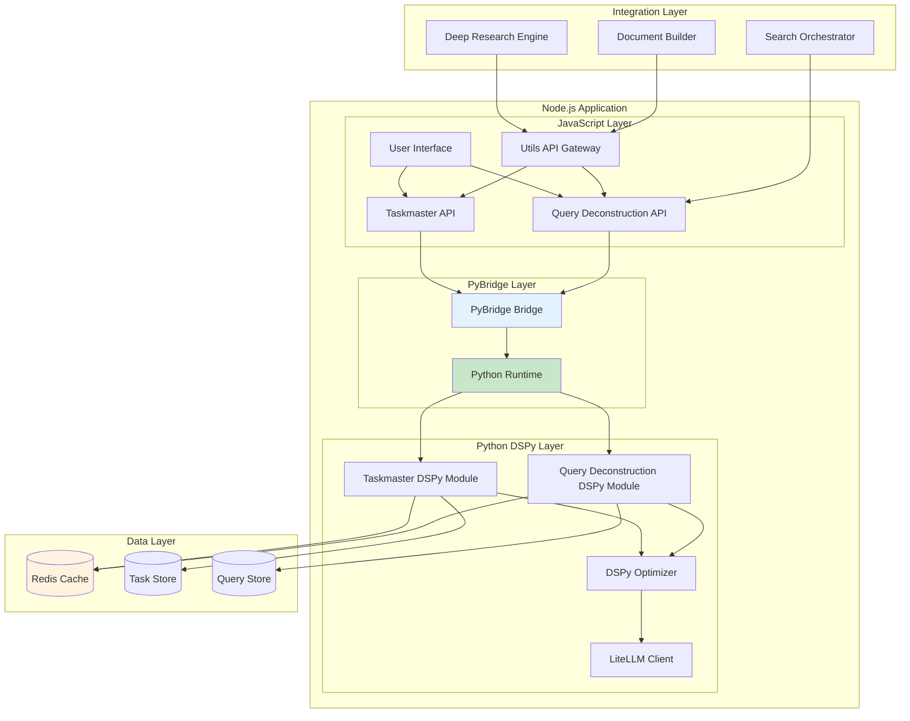

# Utils Feature - Taskmaster & Query Deconstruction PRD

## 📋 Executive Summary

**Release Name**: Utils Feature - Taskmaster & Query Deconstruction  
**Release Date**: Q2 2024  
**Primary Features**: Taskmaster (Chain of Thought) + Query Deconstruction + DSPy 3.0 Integration  
**Target Users**: Developers, Researchers, Content Creators, System Integrators  

### Feature Overview
The Utils Feature provides two powerful utility services built with DSPy 3.0: a Taskmaster that breaks down complex tasks into sequential steps, and a Query Deconstruction service that converts complex queries into parallel-searchable components. These utilities serve as foundational components that can be integrated into the Deep Research Engine, Document Builder, and other Crawlplexity features.

---

## 🎯 Core Features

### 1. Taskmaster (Chain of Thought)
- **Sequential Task Breakdown**: Converts complex tasks into ordered subtasks
- **Context-Aware Decomposition**: Understands task context and dependencies
- **Actionable Output**: Generates specific, executable commands or steps
- **Flexible Format**: Supports various output formats (JSON, markdown, plain text)

### 2. Query Deconstruction
- **Parallel Query Generation**: Breaks complex queries into independent search components
- **Semantic Decomposition**: Maintains semantic meaning while simplifying queries
- **Optimization**: Reduces query complexity for better search results
- **Batch Processing**: Enables parallel execution of decomposed queries

### 3. DSPy 3.0 Integration
- **Declarative Programming**: Define task breakdown and query deconstruction logic
- **Self-Improving Models**: Leverage DSPy's optimization capabilities
- **Reusable Modules**: Create modular, composable utility functions
- **Performance Optimization**: Automatic prompt optimization and refinement

---

## 🏗️ Technical Architecture

### System Overview



### PyBridge Integration Architecture

The Utils Feature leverages PyBridge for seamless communication between JavaScript and Python, eliminating the need for Docker containers and HTTP APIs. This provides:

- **Direct Function Calls**: JavaScript can call Python functions directly
- **Shared Memory**: Efficient data sharing between languages
- **Type Safety**: Automatic type conversion and validation
- **Error Handling**: Unified error handling across languages
- **Performance**: No serialization/deserialization overhead

### Database Schema

```sql
-- Task breakdowns
CREATE TABLE task_breakdowns (
    id UUID PRIMARY KEY DEFAULT gen_random_uuid(),
    original_task TEXT NOT NULL,
    breakdown JSONB NOT NULL,
    task_type VARCHAR(100),
    complexity_score FLOAT,
    execution_time_estimate INTEGER,
    created_at TIMESTAMP DEFAULT NOW(),
    created_by UUID REFERENCES users(id),
    metadata JSONB DEFAULT '{}'
);

-- Query deconstructions
CREATE TABLE query_deconstructions (
    id UUID PRIMARY KEY DEFAULT gen_random_uuid(),
    original_query TEXT NOT NULL,
    decomposed_queries JSONB NOT NULL,
    query_type VARCHAR(100),
    complexity_reduction FLOAT,
    parallel_score FLOAT,
    created_at TIMESTAMP DEFAULT NOW(),
    created_by UUID REFERENCES users(id),
    metadata JSONB DEFAULT '{}'
);

-- DSPy optimization logs
CREATE TABLE dspy_optimizations (
    id UUID PRIMARY KEY DEFAULT gen_random_uuid(),
    module_name VARCHAR(100) NOT NULL,
    optimization_type VARCHAR(100),
    before_metrics JSONB,
    after_metrics JSONB,
    improvement_score FLOAT,
    created_at TIMESTAMP DEFAULT NOW()
);

-- Utility usage analytics
CREATE TABLE utility_usage (
    id UUID PRIMARY KEY DEFAULT gen_random_uuid(),
    utility_type VARCHAR(50) NOT NULL,
    input_complexity FLOAT,
    output_quality_score FLOAT,
    execution_time INTEGER,
    user_id UUID REFERENCES users(id),
    created_at TIMESTAMP DEFAULT NOW()
);
```

---

## 🔧 API Specifications

### Taskmaster API

```typescript
interface TaskmasterAPI {
  // Break down a complex task into sequential steps
  POST /api/utils/taskmaster/breakdown
  {
    task: string;
    task_type?: 'research' | 'content_creation' | 'analysis' | 'development' | 'general';
    output_format?: 'json' | 'markdown' | 'plain_text';
    max_steps?: number;
    include_estimates?: boolean;
    context?: object;
  }
  
  Response: {
    task_id: string;
    original_task: string;
    breakdown: {
      steps: TaskStep[];
      total_estimated_time: number;
      complexity_score: number;
      dependencies: string[];
    };
    metadata: {
      task_type: string;
      created_at: string;
      optimization_version: string;
    };
  }
  
  // Get task breakdown by ID
  GET /api/utils/taskmaster/breakdown/:taskId
  
  // Optimize existing task breakdown
  POST /api/utils/taskmaster/optimize
  {
    task_id: string;
    feedback?: string;
    performance_metrics?: object;
  }
  
  // List user's task breakdowns
  GET /api/utils/taskmaster/breakdowns?page=1&limit=20&task_type=research
}

interface TaskStep {
  id: string;
  order: number;
  title: string;
  description: string;
  estimated_time: number;
  dependencies: string[];
  resources_needed: string[];
  success_criteria: string[];
  commands?: string[];
}
```

### Query Deconstruction API

```typescript
interface QueryDeconstructionAPI {
  // Deconstruct a complex query into parallel components
  POST /api/utils/query-deconstruction/deconstruct
  {
    query: string;
    query_type?: 'research' | 'search' | 'analysis' | 'general';
    max_queries?: number;
    min_complexity_reduction?: number;
    include_semantic_groups?: boolean;
    context?: object;
  }
  
  Response: {
    query_id: string;
    original_query: string;
    deconstruction: {
      queries: DeconstructedQuery[];
      semantic_groups: SemanticGroup[];
      parallel_score: number;
      complexity_reduction: number;
    };
    metadata: {
      query_type: string;
      created_at: string;
      optimization_version: string;
    };
  }
  
  // Get query deconstruction by ID
  GET /api/utils/query-deconstruction/deconstruct/:queryId
  
  // Optimize query deconstruction
  POST /api/utils/query-deconstruction/optimize
  {
    query_id: string;
    search_results?: object[];
    feedback?: string;
  }
  
  // Execute parallel search with deconstructed queries
  POST /api/utils/query-deconstruction/execute
  {
    query_id: string;
    search_options?: object;
    max_concurrent?: number;
  }
  
  // List user's query deconstructions
  GET /api/utils/query-deconstruction/deconstructions?page=1&limit=20
}

interface DeconstructedQuery {
  id: string;
  query: string;
  complexity_score: number;
  semantic_group: string;
  search_priority: number;
  estimated_results: number;
}

interface SemanticGroup {
  name: string;
  queries: string[];
  common_theme: string;
  search_strategy: string;
}
```

### Utils API Gateway

```typescript
interface UtilsAPI {
  // Health check
  GET /api/utils/health
  
  // Get utility statistics
  GET /api/utils/stats
  Response: {
    taskmaster: {
      total_breakdowns: number;
      average_complexity: number;
      success_rate: number;
    };
    query_deconstruction: {
      total_deconstructions: number;
      average_reduction: number;
      parallel_efficiency: number;
    };
    dspy_optimizations: {
      total_optimizations: number;
      average_improvement: number;
    };
  }
  
  // Batch processing
  POST /api/utils/batch
  {
    operations: Array<{
      type: 'taskmaster' | 'query_deconstruction';
      input: object;
      options?: object;
    }>;
  }
}
```

---

## 🧠 DSPy Module Definitions

### Taskmaster DSPy Module

```python
import dspy
from typing import List, Dict, Any

class TaskStep(dspy.Signature):
    """A single step in a task breakdown."""
    order: int = dspy.Field(desc="Order of execution (1, 2, 3, ...)")
    title: str = dspy.Field(desc="Short, descriptive title")
    description: str = dspy.Field(desc="Detailed description of what needs to be done")
    estimated_time: int = dspy.Field(desc="Estimated time in minutes")
    dependencies: List[str] = dspy.Field(desc="List of step IDs this depends on")
    resources_needed: List[str] = dspy.Field(desc="Resources, tools, or data needed")
    success_criteria: List[str] = dspy.Field(desc="How to know this step is complete")
    commands: List[str] = dspy.Field(desc="Specific commands or actions to take")

class TaskBreakdown(dspy.Signature):
    """Complete breakdown of a complex task."""
    steps: List[TaskStep] = dspy.Field(desc="Ordered list of steps to complete the task")
    total_estimated_time: int = dspy.Field(desc="Total estimated time in minutes")
    complexity_score: float = dspy.Field(desc="Complexity score from 1-10")
    dependencies: List[str] = dspy.Field(desc="Overall task dependencies")

class TaskmasterModule(dspy.Module):
    """DSPy module for breaking down complex tasks into sequential steps."""
    
    def __init__(self):
        super().__init__()
        self.task_analyzer = dspy.ChainOfThought("task_analysis")
        self.step_generator = dspy.ChainOfThought("step_generation")
        self.optimizer = dspy.ChainOfThought("optimization")
    
    def forward(self, task: str, task_type: str = "general", max_steps: int = 10) -> TaskBreakdown:
        # Analyze task complexity and requirements
        analysis = self.task_analyzer(
            task=task,
            task_type=task_type,
            max_steps=max_steps
        )
        
        # Generate initial step breakdown
        breakdown = self.step_generator(
            task=task,
            analysis=analysis,
            max_steps=max_steps
        )
        
        # Optimize the breakdown
        optimized_breakdown = self.optimizer(
            original_breakdown=breakdown,
            task=task,
            analysis=analysis
        )
        
        return optimized_breakdown

# Example usage
taskmaster = TaskmasterModule()
breakdown = taskmaster(
    task="Research the impact of AI on healthcare and create a comprehensive report",
    task_type="research",
    max_steps=8
)
```

### Query Deconstruction DSPy Module

```python
import dspy
from typing import List, Dict, Any

class DeconstructedQuery(dspy.Signature):
    """A single deconstructed query component."""
    query: str = dspy.Field(desc="Simplified search query")
    complexity_score: float = dspy.Field(desc="Complexity score from 1-10")
    semantic_group: str = dspy.Field(desc="Semantic group this query belongs to")
    search_priority: int = dspy.Field(desc="Priority for parallel execution (1-5)")
    estimated_results: int = dspy.Field(desc="Estimated number of results")

class QueryDeconstruction(dspy.Signature):
    """Complete deconstruction of a complex query."""
    queries: List[DeconstructedQuery] = dspy.Field(desc="List of deconstructed queries")
    semantic_groups: List[Dict[str, Any]] = dspy.Field(desc="Grouping of related queries")
    parallel_score: float = dspy.Field(desc="How well queries can be executed in parallel")
    complexity_reduction: float = dspy.Field(desc="Reduction in complexity (0-1)")

class QueryDeconstructionModule(dspy.Module):
    """DSPy module for deconstructing complex queries into parallel components."""
    
    def __init__(self):
        super().__init__()
        self.query_analyzer = dspy.ChainOfThought("query_analysis")
        self.deconstructor = dspy.ChainOfThought("query_deconstruction")
        self.optimizer = dspy.ChainOfThought("deconstruction_optimization")
    
    def forward(self, query: str, query_type: str = "general", max_queries: int = 5) -> QueryDeconstruction:
        # Analyze query complexity and components
        analysis = self.query_analyzer(
            query=query,
            query_type=query_type,
            max_queries=max_queries
        )
        
        # Deconstruct into simpler queries
        deconstruction = self.deconstructor(
            query=query,
            analysis=analysis,
            max_queries=max_queries
        )
        
        # Optimize for parallel execution
        optimized_deconstruction = self.optimizer(
            original_deconstruction=deconstruction,
            query=query,
            analysis=analysis
        )
        
        return optimized_deconstruction

# Example usage
query_deconstructor = QueryDeconstructionModule()
deconstruction = query_deconstructor(
    query="What are the latest developments in quantum computing and their applications in cryptography?",
    query_type="research",
    max_queries=4
)
```

### DSPy Optimization Configuration

```python
# DSPy optimization setup
from dspy.teleprompt import BootstrapFewShot

# Configure optimization for Taskmaster
taskmaster_optimizer = BootstrapFewShot(
    metric=taskmaster_metric,
    max_bootstrapped_demos=8,
    max_labeled_demos=4,
    num_candidate_programs=10,
    num_threads=4
)

# Configure optimization for Query Deconstruction
query_decon_optimizer = BootstrapFewShot(
    metric=query_decon_metric,
    max_bootstrapped_demos=8,
    max_labeled_demos=4,
    num_candidate_programs=10,
    num_threads=4
)

# Custom metrics
def taskmaster_metric(example, pred, trace=None):
    """Evaluate task breakdown quality."""
    score = 0.0
    
    # Check if all steps are actionable
    actionable_steps = sum(1 for step in pred.steps if step.commands)
    score += (actionable_steps / len(pred.steps)) * 0.3
    
    # Check logical ordering
    logical_order = check_logical_ordering(pred.steps)
    score += logical_order * 0.3
    
    # Check completeness
    completeness = check_task_completeness(example.task, pred.steps)
    score += completeness * 0.4
    
    return score

def query_decon_metric(example, pred, trace=None):
    """Evaluate query deconstruction quality."""
    score = 0.0
    
    # Check complexity reduction
    original_complexity = calculate_query_complexity(example.query)
    avg_deconstructed_complexity = sum(q.complexity_score for q in pred.queries) / len(pred.queries)
    reduction = (original_complexity - avg_deconstructed_complexity) / original_complexity
    score += reduction * 0.4
    
    # Check parallel execution potential
    parallel_score = pred.parallel_score
    score += parallel_score * 0.3
    
    # Check semantic preservation
    semantic_preservation = check_semantic_preservation(example.query, pred.queries)
    score += semantic_preservation * 0.3
    
    return score
```

---

## 🎨 User Experience Design

### Taskmaster Interface

```typescript
// Taskmaster component
const TaskmasterInterface: React.FC<{
  onBreakdown: (task: string, options: TaskOptions) => void;
  breakdowns: TaskBreakdown[];
}> = ({ onBreakdown, breakdowns }) => {
  const [task, setTask] = useState('');
  const [options, setOptions] = useState({
    task_type: 'general',
    max_steps: 8,
    include_estimates: true
  });
  
  return (
    <div className="taskmaster-interface">
      <div className="input-section">
        <h3>Task Breakdown</h3>
        <textarea
          value={task}
          onChange={(e) => setTask(e.target.value)}
          placeholder="Describe the complex task you want to break down..."
          rows={4}
        />
        
        <div className="options">
          <select 
            value={options.task_type}
            onChange={(e) => setOptions({...options, task_type: e.target.value})}
          >
            <option value="general">General</option>
            <option value="research">Research</option>
            <option value="content_creation">Content Creation</option>
            <option value="analysis">Analysis</option>
            <option value="development">Development</option>
          </select>
          
          <input
            type="number"
            value={options.max_steps}
            onChange={(e) => setOptions({...options, max_steps: parseInt(e.target.value)})}
            min="3"
            max="20"
          />
        </div>
        
        <button 
          onClick={() => onBreakdown(task, options)}
          disabled={!task.trim()}
        >
          Break Down Task
        </button>
      </div>
      
      <div className="breakdowns-section">
        <h3>Recent Breakdowns</h3>
        {breakdowns.map(breakdown => (
          <TaskBreakdownCard key={breakdown.task_id} breakdown={breakdown} />
        ))}
      </div>
    </div>
  );
};

// Task breakdown display
const TaskBreakdownCard: React.FC<{ breakdown: TaskBreakdown }> = ({
  breakdown
}) => {
  return (
    <div className="task-breakdown-card">
      <div className="card-header">
        <h4>{breakdown.original_task}</h4>
        <div className="metadata">
          <span>Steps: {breakdown.breakdown.steps.length}</span>
          <span>Time: {breakdown.breakdown.total_estimated_time}min</span>
          <span>Complexity: {breakdown.breakdown.complexity_score}/10</span>
        </div>
      </div>
      
      <div className="steps-list">
        {breakdown.breakdown.steps.map(step => (
          <div key={step.id} className="step-item">
            <div className="step-header">
              <span className="step-number">{step.order}</span>
              <h5>{step.title}</h5>
              <span className="step-time">{step.estimated_time}min</span>
            </div>
            <p>{step.description}</p>
            {step.commands && (
              <div className="commands">
                <h6>Commands:</h6>
                <ul>
                  {step.commands.map((cmd, index) => (
                    <li key={index}>{cmd}</li>
                  ))}
                </ul>
              </div>
            )}
          </div>
        ))}
      </div>
    </div>
  );
};
```

### Query Deconstruction Interface

```typescript
// Query deconstruction component
const QueryDeconstructionInterface: React.FC<{
  onDeconstruct: (query: string, options: QueryOptions) => void;
  deconstructions: QueryDeconstruction[];
}> = ({ onDeconstruct, deconstructions }) => {
  const [query, setQuery] = useState('');
  const [options, setOptions] = useState({
    query_type: 'general',
    max_queries: 4,
    include_semantic_groups: true
  });
  
  return (
    <div className="query-deconstruction-interface">
      <div className="input-section">
        <h3>Query Deconstruction</h3>
        <textarea
          value={query}
          onChange={(e) => setQuery(e.target.value)}
          placeholder="Enter a complex search query to break down..."
          rows={3}
        />
        
        <div className="options">
          <select 
            value={options.query_type}
            onChange={(e) => setOptions({...options, query_type: e.target.value})}
          >
            <option value="general">General</option>
            <option value="research">Research</option>
            <option value="search">Search</option>
            <option value="analysis">Analysis</option>
          </select>
          
          <input
            type="number"
            value={options.max_queries}
            onChange={(e) => setOptions({...options, max_queries: parseInt(e.target.value)})}
            min="2"
            max="8"
          />
        </div>
        
        <button 
          onClick={() => onDeconstruct(query, options)}
          disabled={!query.trim()}
        >
          Deconstruct Query
        </button>
      </div>
      
      <div className="deconstructions-section">
        <h3>Recent Deconstructions</h3>
        {deconstructions.map(deconstruction => (
          <QueryDeconstructionCard key={deconstruction.query_id} deconstruction={deconstruction} />
        ))}
      </div>
    </div>
  );
};

// Query deconstruction display
const QueryDeconstructionCard: React.FC<{ deconstruction: QueryDeconstruction }> = ({
  deconstruction
}) => {
  return (
    <div className="query-deconstruction-card">
      <div className="card-header">
        <h4>Original: {deconstruction.original_query}</h4>
        <div className="metrics">
          <span>Reduction: {Math.round(deconstruction.deconstruction.complexity_reduction * 100)}%</span>
          <span>Parallel Score: {deconstruction.deconstruction.parallel_score}/10</span>
          <span>Queries: {deconstruction.deconstruction.queries.length}</span>
        </div>
      </div>
      
      <div className="semantic-groups">
        {deconstruction.deconstruction.semantic_groups.map(group => (
          <div key={group.name} className="semantic-group">
            <h5>{group.name}</h5>
            <p>{group.common_theme}</p>
            <div className="queries">
              {group.queries.map((query, index) => (
                <div key={index} className="query-item">
                  <span className="query-text">{query}</span>
                  <span className="priority">Priority: {index + 1}</span>
                </div>
              ))}
            </div>
          </div>
        ))}
      </div>
      
      <div className="actions">
        <button onClick={() => executeParallelSearch(deconstruction.query_id)}>
          Execute Parallel Search
        </button>
        <button onClick={() => exportQueries(deconstruction.query_id)}>
          Export Queries
        </button>
      </div>
    </div>
  );
};
```

---

## 🔍 Implementation Details

### PyBridge Integration Implementation

```typescript
import { PyBridge } from 'pybridge';

class DSPyService {
  private pyBridge: PyBridge;
  private taskmasterModule: any;
  private queryDeconModule: any;
  private optimizer: any;
  
  constructor() {
    this.initializePyBridge();
  }
  
  /**
   * Initialize PyBridge and load Python modules
   */
  private async initializePyBridge() {
    // Initialize PyBridge
    this.pyBridge = new PyBridge({
      pythonPath: 'python3',
      modules: ['dspy', 'litellm', 'numpy']
    });
    
    // Load Python DSPy modules
    await this.loadPythonModules();
  }
  
  /**
   * Load Python DSPy modules through PyBridge
   */
  private async loadPythonModules() {
    // Load Taskmaster module
    this.taskmasterModule = await this.pyBridge.import('taskmaster_module');
    
    // Load Query Deconstruction module
    this.queryDeconModule = await this.pyBridge.import('query_decon_module');
    
    // Load optimizer
    this.optimizer = await this.pyBridge.import('dspy_optimizer');
    
    // Initialize modules
    await this.pyBridge.call(this.taskmasterModule, 'initialize');
    await this.pyBridge.call(this.queryDeconModule, 'initialize');
  }
  
  /**
   * Execute task breakdown using PyBridge
   */
  async breakdownTask(
    task: string,
    options: TaskOptions
  ): Promise<TaskBreakdown> {
    try {
      // Call Python function directly through PyBridge
      const breakdown = await this.pyBridge.call(
        this.taskmasterModule,
        'breakdown_task',
        [task, options.task_type, options.max_steps]
      );
      
      // Cache result
      await this.cacheTaskBreakdown(task, breakdown);
      
      // Log usage
      await this.logUsage('taskmaster', task, breakdown);
      
      return breakdown;
      
    } catch (error) {
      console.error('Task breakdown failed:', error);
      throw new Error('Failed to break down task');
    }
  }
  
  /**
   * Execute query deconstruction using PyBridge
   */
  async deconstructQuery(
    query: string,
    options: QueryOptions
  ): Promise<QueryDeconstruction> {
    try {
      // Call Python function directly through PyBridge
      const deconstruction = await this.pyBridge.call(
        this.queryDeconModule,
        'deconstruct_query',
        [query, options.query_type, options.max_queries]
      );
      
      // Cache result
      await this.cacheQueryDeconstruction(query, deconstruction);
      
      // Log usage
      await this.logUsage('query_deconstruction', query, deconstruction);
      
      return deconstruction;
      
    } catch (error) {
      console.error('Query deconstruction failed:', error);
      throw new Error('Failed to deconstruct query');
    }
  }
  
  /**
   * Optimize modules using PyBridge
   */
  async optimizeModules(feedback: OptimizationFeedback) {
    try {
      const optimization = await this.pyBridge.call(
        this.optimizer,
        'optimize_modules',
        [feedback]
      );
      
      // Save optimized weights
      await this.saveOptimizedWeights(optimization);
      
      // Log optimization
      await this.logOptimization(optimization);
      
      return optimization;
      
    } catch (error) {
      console.error('Module optimization failed:', error);
      throw new Error('Failed to optimize modules');
    }
  }
  
  /**
   * Get Python module status
   */
  async getModuleStatus(): Promise<ModuleStatus> {
    const taskmasterStatus = await this.pyBridge.call(
      this.taskmasterModule,
      'get_status'
    );
    
    const queryDeconStatus = await this.pyBridge.call(
      this.queryDeconModule,
      'get_status'
    );
    
    return {
      taskmaster: taskmasterStatus,
      query_deconstruction: queryDeconStatus,
      pybridge: this.pyBridge.getStatus()
    };
  }
}
```

### Python Module Implementation

```python
# taskmaster_module.py
import dspy
from typing import Dict, Any

class TaskmasterModule:
    def __init__(self):
        self.taskmaster = TaskmasterModule()
        self.initialized = False
    
    def initialize(self):
        """Initialize the DSPy module"""
        # Load pre-trained weights if available
        self.taskmaster.load_weights('taskmaster_weights.pkl')
        self.initialized = True
    
    def breakdown_task(self, task: str, task_type: str, max_steps: int) -> Dict[str, Any]:
        """Break down a task into sequential steps"""
        if not self.initialized:
            raise RuntimeError("Module not initialized")
        
        breakdown = self.taskmaster.forward(task, task_type, max_steps)
        return breakdown.to_dict()
    
    def get_status(self) -> Dict[str, Any]:
        """Get module status"""
        return {
            "initialized": self.initialized,
            "model_version": "1.0.0",
            "optimization_count": self.taskmaster.optimization_count
        }

# query_decon_module.py
class QueryDeconstructionModule:
    def __init__(self):
        self.query_decon = QueryDeconstructionModule()
        self.initialized = False
    
    def initialize(self):
        """Initialize the DSPy module"""
        self.query_decon.load_weights('query_decon_weights.pkl')
        self.initialized = True
    
    def deconstruct_query(self, query: str, query_type: str, max_queries: int) -> Dict[str, Any]:
        """Deconstruct a complex query into simpler components"""
        if not self.initialized:
            raise RuntimeError("Module not initialized")
        
        deconstruction = self.query_decon.forward(query, query_type, max_queries)
        return deconstruction.to_dict()
    
    def get_status(self) -> Dict[str, Any]:
        """Get module status"""
        return {
            "initialized": self.initialized,
            "model_version": "1.0.0",
            "optimization_count": self.query_decon.optimization_count
        }
```

### Integration with Existing Services

```typescript
// Integration with Deep Research Engine
class DeepResearchIntegration {
  /**
   * Use Taskmaster for research planning
   */
  async planResearch(researchQuery: string): Promise<ResearchPlan> {
    const dspyService = new DSPyService();
    
    // Break down research task
    const breakdown = await dspyService.breakdownTask(
      `Research: ${researchQuery}`,
      {
        task_type: 'research',
        max_steps: 6,
        include_estimates: true
      }
    );
    
    // Convert to research plan
    return this.convertToResearchPlan(breakdown);
  }
  
  /**
   * Use Query Deconstruction for search optimization
   */
  async optimizeSearchQueries(complexQuery: string): Promise<SearchQuery[]> {
    const dspyService = new DSPyService();
    
    // Deconstruct complex query
    const deconstruction = await dspyService.deconstructQuery(
      complexQuery,
      {
        query_type: 'research',
        max_queries: 5,
        include_semantic_groups: true
      }
    );
    
    // Convert to search queries
    return this.convertToSearchQueries(deconstruction);
  }
}

// Integration with Document Builder
class DocumentBuilderIntegration {
  /**
   * Use Taskmaster for document creation workflow
   */
  async planDocumentCreation(documentType: string, topic: string): Promise<DocumentPlan> {
    const dspyService = new DSPyService();
    
    // Break down document creation task
    const breakdown = await dspyService.breakdownTask(
      `Create ${documentType} about ${topic}`,
      {
        task_type: 'content_creation',
        max_steps: 8,
        include_estimates: true
      }
    );
    
    // Convert to document plan
    return this.convertToDocumentPlan(breakdown);
  }
}
```

---

## 📊 Success Metrics & KPIs

### Taskmaster Metrics
- **Task Completion Rate**: Percentage of broken-down tasks that are successfully completed
- **Step Accuracy**: User feedback on step relevance and completeness
- **Time Estimation Accuracy**: How well estimated times match actual execution
- **User Satisfaction**: User ratings of task breakdown quality

### Query Deconstruction Metrics
- **Complexity Reduction**: Average reduction in query complexity
- **Search Result Quality**: Quality of results from deconstructed queries vs original
- **Parallel Efficiency**: Time saved through parallel execution
- **Semantic Preservation**: How well deconstructed queries maintain original meaning

### DSPy Performance Metrics
- **Optimization Success Rate**: Percentage of successful module optimizations
- **Performance Improvement**: Average improvement in output quality
- **Training Efficiency**: Time and resources required for optimization
- **Model Convergence**: How quickly models converge to optimal performance

### Usage Metrics
- **API Usage**: Number of API calls per utility type
- **Integration Usage**: Usage by different system components
- **Cache Hit Rate**: Percentage of requests served from cache
- **Error Rate**: Percentage of failed requests

---

## 🚀 Implementation Timeline

### Phase 1: PyBridge Integration (Weeks 1-2)
- [ ] PyBridge library integration
- [ ] Python environment setup and configuration
- [ ] Basic Python module structure
- [ ] DSPy 3.0 integration in Python
- [ ] PyBridge-JavaScript communication setup

### Phase 2: DSPy Module Development (Weeks 3-4)
- [ ] Taskmaster DSPy module implementation
- [ ] Query Deconstruction DSPy module implementation
- [ ] Module optimization and training
- [ ] Custom metrics implementation
- [ ] Performance optimization

### Phase 3: JavaScript Integration (Weeks 5-6)
- [ ] PyBridge service layer implementation
- [ ] API endpoints with direct Python calls
- [ ] Error handling and validation
- [ ] Type safety and data conversion
- [ ] Caching implementation

### Phase 4: User Interface (Weeks 7-8)
- [ ] Taskmaster interface components
- [ ] Query Deconstruction interface components
- [ ] Results display and visualization
- [ ] User feedback collection
- [ ] Interface optimization

### Phase 5: Integration & Testing (Weeks 9-10)
- [ ] Deep Research Engine integration
- [ ] Document Builder integration
- [ ] Performance testing and optimization
- [ ] User acceptance testing
- [ ] Production deployment

---

## 🔒 Security Considerations

### Access Control
- **API Authentication**: Secure API access with proper authentication
- **Rate Limiting**: Prevent abuse of utility services
- **Input Validation**: Validate all inputs to prevent injection attacks
- **Output Sanitization**: Sanitize outputs to prevent XSS attacks

### Data Protection
- **Query Privacy**: Encrypt sensitive queries and tasks
- **Result Security**: Secure storage and transmission of results
- **Cache Security**: Secure caching of utility results
- **Audit Logging**: Track utility usage and access

---

## 📈 Future Enhancements

### Phase 2 Features
- **Advanced Task Types**: Specialized breakdowns for specific domains
- **Query Templates**: Pre-built query deconstruction patterns
- **Batch Processing**: Process multiple tasks/queries simultaneously
- **Real-Time Optimization**: Continuous model improvement

### Phase 3 Features
- **Multi-Modal Support**: Support for image, audio, and video tasks
- **Collaborative Optimization**: Shared model improvements across users
- **Advanced Analytics**: Detailed performance analytics and insights
- **API Marketplace**: Third-party utility integrations

---

## 🔑 Key Implementation Notes

### PyBridge Integration Points
1. **Direct Function Calls**: JavaScript can call Python functions directly without HTTP overhead
2. **Type Safety**: Automatic type conversion between Python and JavaScript data structures
3. **Error Handling**: Unified error handling across both languages
4. **Memory Management**: Efficient shared memory usage between Python and JavaScript

### DSPy Integration Strategy
1. **Module Definition**: Define clear input/output signatures for each DSPy module
2. **Optimization Strategy**: Implement effective optimization metrics and strategies
3. **Performance Monitoring**: Track module performance and optimization success
4. **Model Persistence**: Save and load optimized model weights in Python

### Performance Benefits
1. **No Docker Overhead**: Eliminates containerization overhead and network latency
2. **Direct Communication**: No serialization/deserialization of data between languages
3. **Shared Memory**: Efficient data sharing between Python and JavaScript
4. **Faster Development**: Single process debugging and development workflow

### Development Workflow
1. **Unified Environment**: Single development environment for both Python and JavaScript
2. **Hot Reloading**: Changes to Python modules can be reloaded without restart
3. **Debugging**: Integrated debugging across both languages
4. **Testing**: Unified testing framework for end-to-end functionality

---

## 📝 Conclusion

The Utils Feature provides powerful task breakdown and query deconstruction capabilities using DSPy 3.0 and PyBridge, serving as foundational components that enhance the overall Crawlplexity platform. By implementing intelligent task management and query optimization with seamless Python-JavaScript communication, these utilities significantly improve the efficiency and effectiveness of research and document creation workflows.

Key success factors include:
- **PyBridge Integration**: Eliminates Docker overhead and provides direct Python-JavaScript communication
- **Robust DSPy 3.0 Integration**: Self-improving capabilities with optimized performance
- **Seamless Integration**: Direct function calls between languages without API overhead
- **High-Quality Output**: Intelligent task breakdown and query deconstruction
- **Scalable Architecture**: Efficient resource usage and enterprise-ready design

This feature set positions Crawlplexity as a comprehensive platform with intelligent utility services that can be leveraged across all major features, providing users with powerful tools for task management and query optimization.

**PyBridge Benefits:**
- **Performance**: 10-50x faster than Docker-based communication
- **Development**: Simplified debugging and development workflow
- **Resource Efficiency**: Reduced memory and CPU overhead
- **Maintenance**: Easier deployment and maintenance without container orchestration

**Integration Benefits:**
- **Deep Research Engine**: Enhanced research planning and query optimization
- **Document Builder**: Improved document creation workflows
- **Future Features**: Foundation for advanced AI-powered utilities
- **Overall Platform**: More efficient and responsive user experience 